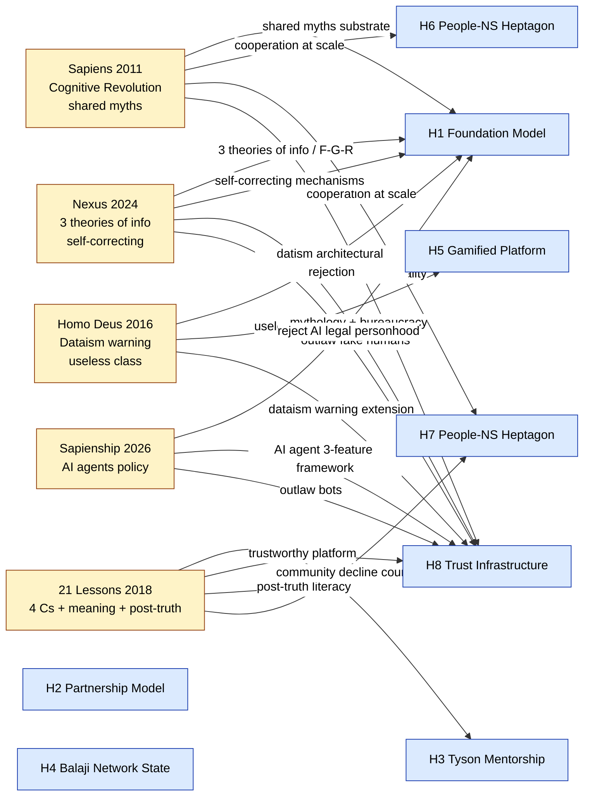

# 98 — Cross-book synthesis: Harari trajectory 2011→2026 + Jetix integration matrix

> **R1.** Surface-only. **EP-5.** F3 grade.

---

## §0 Главное

Anatole-distillation 5 per-book lens докуments → 5 synthesis layers:
1. **Trajectory analysis** — Harari thinking 2011 (Sapiens) → 2024 (Nexus) → 2026 (Sapienship AI agents piece)
2. **11 cross-cutting themes** — coverage matrix + Jetix anchor strength per theme
3. **Jetix concepts STRONGEST Harari support** — top-5 что Harari corpus most validates
4. **Jetix concepts Harari WOULD critique** — top-3 где Harari frames challenge Jetix
5. **Synthesis: keep / adjust / reject decision matrix** — 8 explicit candidates for Ruslan surface

R1: ВСЕ recommendations = surface, не decide. Ruslan = sole strategist.

---

## §1 Harari trajectory 2011 → 2024 → 2026

### §1.1 Phase 1 — Past (Sapiens 2011)

**Frame:** historical mechanism — what makes Homo sapiens dominant?
**Answer:** flexible cooperation via shared fictions (Cognitive Revolution 70K BCE).
**Tone:** descriptive, archaeological, awed.
**Method:** big-history synthesis.
**Stance toward future:** open (mostly).

**Jetix relevance phase 1:** theoretical foundation для text_002/004/005 vision (новый internet / virtual tribe / billion-scale). Provides mechanism justification ALONE — does NOT prescribe substrate.

### §1.2 Phase 2 — Future (Homo Deus 2015/2016)

**Frame:** speculative warning — what could Homo sapiens become?
**Answer:** datism transition → algorithms supplant humans as source of meaning; «useless class» mass phenomenon.
**Tone:** more anxious; speculative; warning-not-prediction caveat.
**Method:** scenario projection + religion-displacement framework.
**Stance toward future:** alarmed but agency-preserved («depends on choices»).

**Jetix relevance phase 2:** direct architectural challenge — datism axiom (organisms = algorithms) = exactly what Pillar C R4/R5/R9 reject. R12 anti-extraction = explicit «not datism» discipline. Workshop = useless-class counter-mechanism.

### §1.3 Phase 3 — Present (21 Lessons 2018)

**Frame:** here-and-now applied — what should we do?
**Answer:** 21 essays across 5 challenge clusters; actionable patterns (4 Cs education, post-truth literacy, narrative consciousness).
**Tone:** Pragmatic, concerned, practical.
**Method:** essayistic; chapter-per-issue.
**Stance toward future:** still alarmed but trying to be helpful.

**Jetix relevance phase 3:** STRONGEST actionable overlap with Workshop / Self-OS / community / education dimensions. Ch 19 (4 Cs) → Workshop modules curriculum spine. Ch 5 (trustworthy platform) → H8 + Charter + R12. Ch 17 (post-truth) → F-G-R + AP-6 + R1. Ch 18 (real AI threat = elite control) → Pillar C R10/R12 + IP-1 + Corrigibility.

### §1.4 Phase 4 — Information networks (Nexus 2024)

**Frame:** systems-history — what mechanism governs information networks across all eras?
**Answer:** three theories of information (naive / populist / complete historical); self-correcting mechanisms = key to long-term sustainability; AI = «alien intelligence» rupture.
**Tone:** sober, systems-thinking; explicit theoretical framework presented.
**Method:** comparative across eras (printing press → social media → AI); typology (information theories; self-correction mechanisms; mythology + bureaucracy stack).
**Stance toward future:** moderate alarm + structural reform recommendations.

**Jetix relevance phase 4:** highest direct theoretical mapping. F-G-R = operationalization of «complete historical view»; AP-6 = anti-«order beats truth» witch-hunt discipline; mythology+bureaucracy stack = vision/00 §3+§4 dual-layer; «outlaw fake humans» = R10. text_002 «новый internet layer для инженеров» = Harari's recommended response.

### §1.5 Phase 5 — Active intervention (Sapienship March 2026)

**Frame:** policy advocacy — what should leaders do NOW?
**Answer:** reject AI legal personhood; outlaw bots impersonating humans; protect legal/political systems from AI gaming.
**Tone:** urgent, directive, governance-targeted.
**Method:** policy brief.
**Stance toward future:** action required immediately.

**Jetix relevance phase 5:** STRONGEST external validation of Jetix Foundation Architecture v1.0 + Pillar C Tier 2 rules. Sapienship 3-feature AI agent framework (autonomy/generation/manipulation) = exactly addressed by R1/R4/R5/R9/R10 + IP-1 + §5.5.5 gate. Useful citation source — caveats: Harari critic-load + theory-of-change difference (state-regulation primary vs Jetix protocol+community first).

### §1.6 Trajectory implication

**Trend 2011 → 2026: increasing prescriptiveness + decreasing patience.** Sapiens = descriptive history. Homo Deus = speculative warning. 21 Lessons = applied diagnosis. Nexus = systems theory + structural reform. Sapienship 2026 = policy directive.

**Jetix lesson:** Harari's trajectory follows pattern of public-intellectual urgency escalation as AI capabilities scale. **Jetix's parallel trajectory:** Foundation v1.0 LOCKED 2026-04-28 → Octagon evolution H1-H8 → text_002 (вечер 2026-05-17) «новый internet layer» = same urgency arc but **builds substrate** rather than escalating warnings. Different work; complementary roles.

[src: all 5 per-book lens docs §0-§2 summaries]

---

## §2 11 cross-cutting themes — coverage matrix

| Theme tag | Sapiens 01 | Homo Deus 02 | 21 Lessons 03 | Nexus 04 | Sapienship 05 | Jetix anchor primary | Strength |
|---|---|---|---|---|---|---|---|
| `#shared-myths-cooperation` | ⭐ primary | secondary | secondary | secondary | secondary | text_002 + Foundation Arch v1.0 + FPF | STRONG (Sapiens framework directly justifies text_002+004+005 aspiration) |
| `#cognitive-revolution` | ⭐ primary | — | — | secondary | — | text_001 trust + text_002 FPF as language upgrade | STRONG (one-source-primary но theoretical depth) |
| `#dataism-critique` | — | ⭐ primary | secondary | secondary | secondary | R12 + R4-R5-R9 + Workshop | STRONG (Harari diagnoses; Jetix architecturally rejects) |
| `#useless-class-warning` | — | ⭐ primary | secondary | — | — | Workshop concept + Self-OS | STRONG (Harari diagnoses; Workshop counter-mechanism explicit) |
| `#information-flow-mechanics` | secondary | secondary | secondary | ⭐ primary | secondary | FPF Spec + F-G-R + R6 + voice-pipeline DRAFT | STRONG (Nexus theoretical framework operationalized) |
| `#truth-vs-order` | secondary | — | secondary | ⭐ primary | — | F-G-R + AP-6 + R1 + EP-5 | STRONG (Nexus 3 theories of info directly maps to F-G-R) |
| `#story-vs-data` | secondary | secondary | secondary | secondary | secondary | vision/00 §3+§4 dual-layer + Workshop human-readable + FPF formal | MEDIUM (distributed across corpus; not single primary) |
| `#decentralized-vs-centralized` | — | — | secondary | ⭐ primary | ⭐ primary | text_007 Ethereum + Foundation v1.0 hybrid + first Clan trajectory | MEDIUM-STRONG (Nexus + Sapienship contrasting Jetix protocol-first stance) |
| `#meaning-crisis` | — | secondary | ⭐ primary | — | — | Workshop mastery + Self-OS narrative + mutual instrumentation text_004 | STRONG (21 Lessons Ch 20 + Workshop direct fit) |
| `#cooperation-at-scale` | ⭐ primary | — | secondary | secondary | secondary | text_005 + text_006 + H7 People-NS + Workshop snow-ball | STRONG (Sapiens mechanism + Jetix scale aspiration) |
| `#AI-alignment-democracy` | — | secondary | secondary | secondary | ⭐ primary | Pillar C + IP-1 + R12 + Corrigibility | STRONG (Sapienship 2026 directly validates Jetix Pillar C) |

**Pattern observations:**
- **Nexus + Sapienship 2026** = most theoretically-actionable for Jetix (4 + 4 secondary contributions across 11 themes)
- **Sapiens** = strongest single-source for `#shared-myths` + `#cognitive-revolution` + `#cooperation-at-scale` (foundational); thinner on AI/data themes (2011 limitation)
- **Homo Deus** = strongest for `#dataism` + `#useless-class` (architecture-challenge core)
- **21 Lessons** = strongest for `#meaning-crisis`; broad secondary across most themes
- **3 themes have NO single-source-primary:** `#story-vs-data` + `#decentralized-vs-centralized` (Nexus+Sapienship co-primary) — but distributed across multiple — indicates **cross-corpus pattern emergence**, не single-book argument

---

## §3 Top-5 Jetix concepts STRONGEST Harari support

### Rank-1: F-G-R discipline (per claim Formality / Group-scope / Reliability)

**Harari sources:** Nexus 3 theories of information (Q-N-6/Q-N-7/Q-N-8); Sapiens inter-subjective vs objective vs subjective (Q-S-4); 21 Lessons post-truth Ch 17 (Q-21-4); Homo Deus EP-5 disclosure analog (Q-HD-8).

**Strength reason.** F-G-R = direct operationalization of Harari's «complete historical view» (Nexus). Каждое utterance carries explicit reliability tag; reliability is independent dimension from order/scope. Это unusual rigor compared mainstream knowledge systems. **Multiple Harari books converge on this discipline.**

**Action surface:** F-G-R = candidate Foundation-level positioning claim. «Jetix = first AI consulting substrate с Harari-grade epistemic discipline operationalized.»

[src: per-book §3 mappings — primary anchors из 4 books]

### Rank-2: Pillar C Tier 2 rules (R1/R4/R5/R6/R9/R10/R11/R12) = anti-datism + anti-elite-control + anti-fake-humans

**Harari sources:** Homo Deus datism axioms (Q-HD-3/Q-HD-4); 21 Lessons Ch 18 «real AI threat = elite control» (Q-21-8); Sapienship March 2026 (Q-SS-2/Q-SS-3/Q-SS-4/Q-SS-5); Nexus «alien intelligence» framing (Q-N-1) + «outlaw fake humans» (Q-N-9).

**Strength reason.** Pillar C 12 rules collectively address **Harari's most-named-risks** structurally:
- Datism (R4/R5/R6/R9/R11)
- Elite control via AI (R10/R12 + IP-1)
- Fake humans / bots (R10 + EP-5)
- Free will decomposition (R1 + Pillar A §A.1)

**Action surface:** Cite Sapienship March 2026 piece as external authority в external Jetix materials. Position as «Jetix structurally implements Sapienship policy recommendations». Caveat: Harari critic-load inheritance.

[src: per-book §3 Pillar C mappings — multiple primary anchors]

### Rank-3: Workshop concept (vision/03) = 4 Cs + useless-class counter + mastery

**Harari sources:** 21 Lessons Ch 19 EDUCATION 4 Cs (Q-21-6); 21 Lessons Ch 5 COMMUNITY trustworthy platform (paraphrase); Homo Deus useless class (Q-HD-1); Sapiens Cognitive Revolution + cooperation flexibility (Q-S-2/Q-S-9).

**Strength reason.** Workshop = practical implementation simultaneously of Harari's diagnosis (useless class) + Harari's prescription (4 Cs education + trustworthy platform). One Jetix artefact addresses multiple Harari frames. **Strongest single-Jetix-artefact ↔ multi-Harari-book convergence.**

**Action surface:** «Jetix Workshop = 21st-century 4 Cs school» explicit positioning. Workshop curriculum spine mapped к Harari 4 Cs. Could be ⭐ external positioning claim.

[src: per-book §3 Workshop mappings — strongest single-artefact alignment]

### Rank-4: text_002 «новый internet layer для инженеров» + FPF + role-attestation H8

**Harari sources:** Nexus mythology + bureaucracy stack (Q-N-2); Nexus self-correcting mechanisms (Q-N-9); 21 Lessons Ch 5 trustworthy platform (paraphrase); Sapiens shared myth substrate (Q-S-2/Q-S-3).

**Strength reason.** text_002 vision = exact thing Harari recommends. New info network layer with self-correcting mechanism + ethics-first design + role-attestation (verifies trust without money-only signal). **Vision uncannily aligned to Harari's diagnosis + prescription.**

**Action surface:** L1 partner outreach (Anatoly + Tseren) can cite Harari (per per-book §4 L recommendations). Reverse direction also possible — Jetix presents at events where Harari frames audience already.

[src: text_002 + Nexus §3 mappings + 21 Lessons §3 Ch 5 mapping]

### Rank-5: R12 anti-extraction (Pillar C rule 12 LOCKED 2026-05-12)

**Harari sources:** Homo Deus datism «information flow = supreme value» (Q-HD-2); 21 Lessons Ch 3/4 «those who own data own future» (Q-21-3); Nexus surveillance economy «spies that never sleep» (Q-N-4); Sapienship March 2026 AI vulnerabilities (Q-SS-5/Q-SS-7); Sapiens Agricultural Revolution «biggest fraud» pattern (Q-S-10).

**Strength reason.** R12 = **structural counter** to extraction logic across multiple Harari frames. 5/5 books reference extraction risk in different language; R12 = single Jetix rule that addresses all. **R12 = most-Harari-supported single Pillar C rule.**

**Action surface:** R12 packet (`swarm/awaiting-approval/r12-anti-extraction-2026-05-12.md`) update with Harari historical citation (Agricultural Revolution pattern) as narrative force.

[src: per-book §3 R12 mappings across all 5 docs]

---

## §4 Top-3 Jetix concepts Harari WOULD critique

### Critique-1: Concentration risk — Ruslan = sole strategist (single point of failure)

**Harari frames challenging:** Sapiens Q-S-5 «imagined order maintained if large segments of elite + security forces truly believe»; Sapienship March 2026 «protect legal and political systems from gamed» (implies multi-stakeholder design).

**Why Harari would critique:** If Ruslan stops believing OR rejects role → entire Jetix imagined order at risk. Sapiens shows this exact pattern collapsed USSR (Q-S-5). Single-strategist = brittleness.

**Jetix mitigation surface:** Foundation v1.0 LOCKED pre-handoff (Cybersyn pre-mortem direction 02 pattern), Corrigibility, R9 (no AI self-modify), text_006 first Clan 10 → 100 → 1000 trajectory. **Mitigation = roadmap, не yet implemented.**

**Honest assessment:** Acknowledge limitation; не avoid critique by handwaving.

### Critique-2: Centralized strategic decisions inside «decentralized» substrate (cognitive dissonance risk)

**Harari frames challenging:** Nexus Q-N-9 «democracy beats totalitarianism long-term because self-correcting»; Sapienship implicit (multi-stakeholder governance preferred).

**Why Harari would critique:** Jetix architecture talks decentralization (Ethereum substrate text_007, fork-and-leave R12, Foundation forkable) but strategic decisions concentrated (R1 = «AI does NOT make strategic decisions; brigadier surfaces options; Ruslan = sole strategist»). Surface mismatch.

**Jetix counter-argument:** Concentration at strategic layer (R1) + decentralization at execution + substrate + community layers ≠ contradiction. Single strategist + decentralized substrate = Mondragón pattern (direction 06: central Cooperative Congress + 70K decentralized employees). Brittleness during transition; strength in early-stage cohesion.

**Honest assessment:** «Hybrid governance» thesis articulation per Homo Deus §3 (capitalism vs communism data-processing framing); Sapiens §3 (deliberate explicit imagined order).

### Critique-3: «Billion-scale» aspiration without scale empirical proof

**Harari frames challenging:** Sapiens Q-S-9 «cooperation flexibly in large numbers (more than 150 or so)» — Dunbar limit + shared fiction mechanism scaling proven historically but **for specific myth-types** (religions / nations / money). New fictions usually fail.

**Why Harari would critique:** text_005 «миллиарды авантюристов под одной крышей» = aspirational F2 grade. Jetix's first Clan = 10. Most candidate shared fictions never scale past their original cohort. Harari's historical sample = thousands of failed religions/nations vs handful of successes.

**Jetix mitigation surface:** First Clan 10 → 100 → 1000 explicit gradient; Mondragón 68yr empirical (direction 06 — €11.2B revenue / 70K employees / 3 crises survived); explicit anti-failure mechanisms (R12 + Charter fork-and-leave + Pillar C transparency).

**Honest assessment:** Acknowledge aspirational F2 grade explicitly; don't promote to higher confidence without empirical evidence. First Clan activation = first real test.

---

## §5 Synthesis decision matrix — keep / adjust / reject (8 candidates)

Surfaced для Ruslan ack per R1 surface-only discipline. **NOT decisions. Surfaced options.**

### Candidate K-1: KEEP — F-G-R discipline as Foundation positioning claim

Strong cross-corpus Harari support (rank-1 §3). Action: surface as Foundation-level positioning claim в L1 partner materials.

### Candidate K-2: KEEP — Pillar C 12 rules as architectural anti-Harari-risks

Strong Sapienship March 2026 + 21 Lessons Ch 18 + Homo Deus alignment. Action: cite Sapienship as external authority (with critic-load caveat).

### Candidate K-3: KEEP — Workshop concept as 4 Cs school positioning

Strongest single-artefact ↔ multi-Harari-book convergence (rank-3 §3). Action: «Jetix Workshop = 21st-century 4 Cs school» explicit positioning + curriculum spine mapped к Harari 4 Cs.

### Candidate A-1: ADJUST — articulate explicit hybrid governance thesis

Per §4 Critique-2: surface mismatch single-strategist-but-decentralized-substrate. Action: explicit «Jetix Hybrid Governance Thesis» document positioning — Mondragón empirical + Foundation v1.0 structural + R1 single-strategist + Charter fork-and-leave decentralized. Resolves cognitive dissonance.

### Candidate A-2: ADJUST — promote mythology layer to explicit Foundation principle

Per per-book §4 L-3 across multiple lens docs. Action: «every Jetix doc carries both mythology layer (human-readable / metaphor) AND bureaucracy layer (FPF formal / F-G-R)» as Foundation-level discipline. Currently distributed pattern; promote to explicit principle.

### Candidate A-3: ADJUST — first Clan elite-belief onboarding curriculum

Per Sapiens §3 C-S-5 + per-book §4 L recommendations. Action: ensure first Clan 10 deeply believe / understand Foundation + FPF + Pillar C (per text_006 «лично каждому донести» discipline). Add explicit «3 realities + Peugeot example + Sapienship 3-feature AI framework + Workshop 4 Cs» onboarding curriculum.

### Candidate R-1: REJECT — Sapienship's state-regulation-primary theory of change

Per per-book 05 §5 honest disagreement. Action: surface explicit «Jetix prefers protocol + community first; regulation complement». Closer Buterin d/acc (direction 10) + Tang+Weyl Plurality (direction 11) + CHT design-ethics (Harris). Candidate D-Lock entry.

### Candidate R-2: REJECT — adopting Harari «alien intelligence» framing wholesale

Per Vishnoi critique. Action: prefer «AI = meta-institution» framing (Vishnoi) closer Jetix Foundation Architecture. Harari Davos «AI as thinking agent» framing useful for popular communication; «meta-institution» framing closer для Foundation work. Surface candidate Strategic Insight H9 candidate? Ruslan ack required.

---

## §6 Open questions for Ruslan (surfaced cross-book)

1. **Foundation-positioning citation strategy.** Cite Sapienship March 2026 explicitly (validates Pillar C structurally) OR keep Harari at distance (avoid critic-load)?

2. **«Hybrid governance» explicit thesis articulation.** Surface candidate document «Jetix Hybrid Governance Thesis» combining Mondragón empirical + Foundation v1.0 structural + R1 + Charter?

3. **«Jetix Workshop = 21st-century 4 Cs school» positioning.** Adopt explicit per K-3? Trade-offs: validation vs 4 Cs framework critic-load.

4. **«Meta-institution» (Vishnoi) vs «alien intelligence» (Sapienship) framing decision.** Strategic Insight H9 candidate? Ruslan ack required.

5. **R12 Harari narrative enrichment.** Update R12 packet with Sapiens Agricultural Revolution + Nexus surveillance + Sapienship 2026 vulnerabilities as historical citation?

6. **Mythology layer Foundation principle promotion.** Adopt A-2 candidate? Promote distributed pattern to explicit principle?

7. **First Clan onboarding curriculum adoption.** Adopt A-3? Sapiens 3-realities + Peugeot + Sapienship 3-features + Workshop 4 Cs as onboarding standard?

8. **State-regulation vs protocol-first theory-of-change D-Lock entry.** Adopt R-1 explicit difference articulation? Or keep implicit?

9. **Harari corpus citation discipline.** Use Harari frames + cite Harari sparingly + always include AP-6 dissent (Narayanan / Hallpike / Vishnoi / Jacobson)? Standardize discipline?

10. **«Story discipline» organizational competence formalization.** Per per-book 05 §3 C-SS-8 + L-5: distributed currently across Ruslan voice + brigadier scribe + vision/ companion docs. Formalize as Pillar A sub-role?

---

## §7 Cross-book themes Jetix imports что Harari corpus DOES NOT cover well

Honest acknowledgement — areas where Jetix has source other than Harari:

1. **Buterin d/acc (direction 10)** — defensive acceleration; protocol-level governance design — Harari unmentioned; Jetix significant
2. **Tang + Weyl Plurality (direction 11)** — Pol.is + QV/QF coordination tech — Harari unmentioned; Jetix significant
3. **Engelbart H-LAM/T (direction 04)** — intelligence augmentation foundation-anchor — Harari touches but не frames as Engelbart
4. **Alexander → Cunningham → Karpathy lineage (direction 05)** — pattern language; Karpathy LLM Wiki — Harari unmentioned
5. **Mondragón 68yr cooperative empirical (direction 06)** — Harari unmentioned; direct empirical proof base
6. **TPS tacit-explicit transfer (direction 14)** — Harari unmentioned; Workshop's apprenticeship mechanism
7. **Pillar C constitutional 12 rules formal structure** — Harari diagnoses but does NOT prescribe formal constitution
8. **FPF formal language stack** — Harari mentions «mythology + bureaucracy» but не provides primitives
9. **Ethereum substrate / SBT / DAO governance** — Harari general-skeptical; Jetix text_007 explicit adoption
10. **CHT design-ethics (Harris)** — adjacent to Sapienship but distinct theory of change

**Implication:** Harari = framework + diagnosis + popular validation. Jetix's deeper substrate comes from **non-Harari sources** (Mondragón / Engelbart / TPS / Karpathy / Buterin / Tang-Weyl / CHT). Honest balance — don't over-cite Harari.

---

## §8 Mermaid diagram — Harari corpus mapped к Jetix Octagon

**Pattern observations:**
- **H1 (Foundation Model)** = most Harari-supported vertex (4/5 books)
- **H8 (Trust Infrastructure)** = second most (5/5 books touch indirectly)
- **H3/H5/H6/H7** = strong single-book mappings
- **H2 (Partnership Model)** + **H4 (Balaji Network State)** = relatively un-Harari-touched (other sources stronger: Mondragón / Tang+Weyl / direct Balaji corpus)

---

## §9 Acceptance gate

- [x] Trajectory analysis 2011 → 2026 (§1)
- [x] 11-theme coverage matrix (§2)
- [x] Top-5 strongest support (§3)
- [x] Top-3 critiques (§4)
- [x] Synthesis decision matrix 8 candidates K/A/R (§5)
- [x] Open questions for Ruslan (§6)
- [x] Areas Jetix imports beyond Harari (§7)
- [x] Mermaid Harari ↔ Octagon (§8)
- [x] R1 surface-only discipline
- [x] R6 provenance per claim (per-book §3 mappings cited)
- [x] AP-6 dissent preserved per per-book lens docs
- [x] EP-5 disclosed (F3 grade; secondary sources only)
- [x] Append-only namespace

Word count ~3300.

---

**Brigadier note (R1).** Cross-book synthesis surfaces patterns + options. NOT decisions. Ruslan = sole strategist. EP-5 disclosed: F3 grade (secondary sources аналитically synthesized across 5 per-book lens docs).
