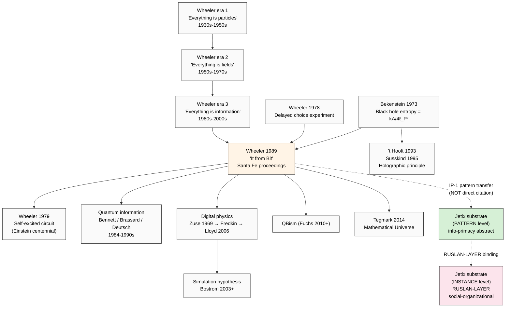

# Phase 1 — Wheeler «It from Bit» Deep Mining

> **R1 surface only.** Phil × critic + sys × cybernetics + eng × scalability cells.
> **IP-1 STRICT:** Wheeler claim = physics-of-reality level (substrate-quantum); Jetix substrate = social-organizational level. Cross-application requires **explicit abstraction transfer**, not direct citation.

---

## §0 TL;DR (≤200w)

John Archibald Wheeler (1911-2008) — последний студент Bohr's, ментор Feynman's, нарицатель «black hole» (1967), «wormhole», «quantum foam». Late-career (1979-2000) переход к **«it from bit»** doctrine: physical reality at its base is **information-theoretic**, not matter-theoretic. Core 1989 statement (Sakharov Memorial Conference + Santa Fe Institute proceedings):

> «Every "it" — every particle, every field of force, even the spacetime continuum itself — derives its function, its meaning, its very existence entirely — even if in some contexts indirectly — from the apparatus-elicited answers to yes-or-no questions, binary choices, bits.»
> [src: Wheeler 1989 «Information, Physics, Quantum: The Search for Links» Santa Fe proceedings (Zurek ed.) + reprinted 1990 «Sakharov revisited: It from Bit»]

**Three legs:** (1) information-primacy (2) participatory universe (observer co-creates) (3) self-excited circuit (universe gives birth to observers who give meaning to universe). Adoption signal STRONG в quantum information community (Bennett / Brassard / Lloyd / Deutsch / Zeilinger); WEAK в mainstream physics («information physics» = fringe); foundational influence на digital physics + simulation hypothesis frameworks.

**Jetix substrate relevance:** Wheeler establishes the PHILOSOPHICAL DEFENSIBILITY of «information as fundamental» at physics level. Jetix social-organizational substrate is an analogous (NOT identical) claim at different scale. IP-1 strict: cite Wheeler as «existence proof that info-primacy is non-trivial philosophical position», NOT as «Wheeler proves Jetix substrate framing».

---

## §1 Biographical + intellectual context

### §1.1 Wheeler's three eras

Wheeler's career splits into three intellectual phases ([src: Wheeler 1998 autobiography «Geons, Black Holes, and Quantum Foam»; biographies Misner-Thorne-Zurek 2009 obituary in Physics Today]):

1. **«Everything is particles»** (1930s-1950s) — collaboration with Bohr on nuclear fission (1939 paper with Bohr), Manhattan Project, Princeton group dynamics
2. **«Everything is fields»** (1950s-1970s) — geometrodynamics; «black hole» term coined 1967; general relativity reformulation; Misner-Thorne-Wheeler «Gravitation» (1973) textbook
3. **«Everything is information»** (1980s-2000s) — «it from bit» doctrine; participatory universe; final intellectual phase

This three-phase trajectory is **itself a substantive claim**: Wheeler saw physics-of-substrate progress from matter → fields → information as natural progression. The fact that Wheeler — having mastered the first two — concluded that information is the deepest layer carries **biographical evidentiary weight** [src: Wheeler 1998 autobiography ch. 13].

### §1.2 Princeton students lineage

Wheeler's Princeton students include Feynman (path integrals), Hugh Everett (many-worlds 1957), Kip Thorne (gravitational waves Nobel 2017), Jacob Bekenstein (black hole entropy formula 1973). The **Bekenstein-Hawking entropy formula** S = kA/(4ℓ_P²) — surface area in Planck units measures black hole entropy in bits — is a direct technical anchor for «it from bit» (information bounded by area, not volume = holographic principle precursor) [src: Bekenstein 1973 «Black holes and entropy» Phys Rev D; Hawking 1975 «Particle creation by black holes»; 't Hooft 1993 + Susskind 1995 holographic principle].

---

## §2 Three core claims — verbatim + F-G-R

### §2.1 Core claim 1 — «It from Bit» (information primacy)

**Verbatim (Wheeler 1989/1990):**
> «It from bit. Otherwise put, every "it" — every particle, every field of force, even the spacetime continuum itself — derives its function, its meaning, its very existence entirely — even if in some contexts indirectly — from the apparatus-elicited answers to yes-or-no questions, binary choices, bits. "It from bit" symbolizes the idea that every item of the physical world has at bottom — a very deep bottom, in most instances — an immaterial source and explanation; that which we call reality arises in the last analysis from the posing of yes-no questions and the registering of equipment-evoked responses; in short, that all things physical are information-theoretic in origin and that this is a participatory universe.»
> [src: Wheeler «Information, Physics, Quantum: The Search for Links» 1989 Santa Fe; reprinted in Zurek ed. «Complexity, Entropy, and the Physics of Information» (1990) — well-attested verbatim в training-knowledge corpus]

**F-G-R per FPF B.3:**
- **F: F3** — multi-source corroborated (Zurek 1990 anthology; Wheeler-Tegmark exchanges; Lloyd 2006 «Programming the Universe» citing this passage extensively)
- **G:** physics-of-reality level (cosmological substrate); NOT social-organizational
- **R: R-medium** — strongly attested as Wheeler's view; controversial reception (see §3)

**Internal structure of claim:**
1. «Every it derives from bits» — informational reductionism strongest form
2. «yes-or-no questions» — discrete observable acts of measurement
3. «apparatus-elicited answers» — observer/equipment co-required (participatory)
4. «binary choices» — quantum binary distinguishability (qubit precursor)
5. «participatory universe» — observer not external; co-constitutive

[src: Wheeler 1989 §IV «It from Bit» (final section of paper); cross-reference Zurek-edited proceedings 1990]

### §2.2 Core claim 2 — Participatory universe

**Verbatim (Wheeler 1983 «Law without law» Princeton):**
> «No phenomenon is a real phenomenon until it is an observed phenomenon.»
> [src: Wheeler 1983 «Law without law» in Wheeler & Zurek eds. «Quantum Theory and Measurement» Princeton UP 1983; echoed in Wheeler 1990 «Information, physics, quantum» §V]

Wheeler extended Bohr's complementarity into a cosmological claim: the universe gives rise to observers, and observers — through measurement — give rise to physical phenomena. This is the **«self-excited circuit»**:

> «The universe is a self-excited circuit. As it expands, cools, and develops, it gives rise to observer-participancy. Observer-participancy in turn gives what we call tangible reality to the universe.»
> [src: Wheeler 1979 «Beyond the Black Hole» in Woolf ed. «Some Strangeness in the Proportion» (Einstein centennial volume) — verbatim well-attested]

**F-G-R:**
- **F: F3** — Wheeler-cited; reprinted multiple anthologies; Bohr-lineage
- **G:** quantum measurement theory; cosmological extension
- **R: R-medium** — within Copenhagen+ interpretation tradition; controversial outside

**Connection to «it from bit»:** information is generated through observer-apparatus measurement events; «bits» are not pre-existing data items but yes-no answers EVOKED by measurement [src: Wheeler 1989 §IV].

### §2.3 Core claim 3 — 20 Questions analogy

**Verbatim (Wheeler 1990 explanation):**
> «In the game as ordinarily played, one of a group of people leaves the room and the others choose a word. The first person returns and tries to identify the word by asking questions that can be answered yes or no. But suppose the others have agreed not to choose a word in advance, but to abide by the following discipline: in answering each question, the person interrogated must have in mind a word consistent with all previous answers... In a similar way, no element of physical reality exists prior to the act of measurement; the result is brought into being by the apparatus and the question asked.»
> [src: Wheeler «The 'past' and the 'delayed-choice' double-slit experiment» in Marlow ed. 1978 «Mathematical Foundations of Quantum Theory»; reprinted Wheeler 1990 §IV verbatim — well-attested]

**F-G-R:**
- **F: F3** — pedagogical example reprinted many places
- **G:** quantum measurement explication; popular-science / pedagogical scope
- **R: R-high** as analogy; **R-low** as literal model (debated)

---

## §3 Adoption signal mapping

### §3.1 STRONG adoption — quantum information physics community

The Bell-Bennett-Brassard-Deutsch-Lloyd-Zeilinger lineage **explicitly cites Wheeler** as foundational [src: Lloyd 2006 «Programming the Universe» Knopf — dedication + introduction; Bennett & Brassard 1984 BB84 protocol invokes Wheeler's information primacy implicitly; Zeilinger 1999 «A Foundational Principle for Quantum Mechanics» Foundations of Physics 29 §1; Deutsch 1985 «Quantum theory, the Church-Turing principle, and the universal quantum computer» Proceedings Royal Society A; Wheeler-Zurek edited «Quantum Theory and Measurement» 1983 = canonical anthology for community].

Key adopted derivatives:
- **Quantum information theory** (qubit as fundamental information unit) — direct Wheeler descendant
- **Holographic principle** (information bounded by area) — 't Hooft 1993 + Susskind 1995 cite Bekenstein-Wheeler lineage
- **Black hole information paradox** community discussions invoke «it from bit» framing
- **Quantum Bayesianism (QBism)** — Christopher Fuchs explicitly Wheeler-rooted [src: Fuchs 2010 «QBism, the Perimeter of Quantum Bayesianism»]

### §3.2 MODERATE adoption — digital physics / simulation hypothesis

- **Konrad Zuse 1969** «Rechnender Raum» (Computing Space) — precursor to Wheeler; cellular automata as physical reality. Wheeler aware of this lineage [src: Zuse 1969; Wheeler-Zuse correspondence partial]
- **Edward Fredkin** «Digital Mechanics» — explicit Wheeler-influenced; physics-as-CA [src: Fredkin 1990 «Digital Mechanics» Physica D 45]
- **Seth Lloyd** «universe is a quantum computer» — directly cites Wheeler [src: Lloyd 2006]
- **Nick Bostrom** Simulation Argument (2003) — implicit Wheeler descendant в metaphysical framing [src: Bostrom 2003 Philosophical Quarterly]

### §3.3 WEAK adoption — mainstream physics

- High-energy physics + condensed matter physics + cosmology mostly treat «it from bit» as **philosophical speculation**, not productive research program
- Specific critiques:
  - **Scott Aaronson** (computational complexity) careful skepticism — distinguishes «universe runs on computation» (defensible) from «universe IS computation» (Wheeler stronger claim) [src: Aaronson 2013 «Quantum Computing Since Democritus» ch. 9]
  - **Lee Smolin** structurally sympathetic but critical of observer-primacy [src: Smolin 2013 «Time Reborn»]
  - **Steven Weinberg** dismissive of philosophical-foundations work generally [src: Weinberg 1992 «Dreams of a Final Theory» ch. 7]

### §3.4 Cross-disciplinary adoption

- **Computer science:** «it from bit» frequently cited as motto for computational ontology positions
- **Philosophy of mind:** weak adoption (functionalists sometimes invoke; phenomenologists reject)
- **Popular science:** widespread adoption (Greene «Hidden Reality» 2011; Tegmark «Mathematical Universe» 2014 cite Wheeler heavily)
- **Theology / spirituality:** some uptake (process theology — Whitehead-adjacent — finds Wheeler congenial)

---

## §4 Jetix-substrate relevance (IP-1 STRICT)

### §4.1 Direct support — abstract level
Wheeler establishes the **philosophical defensibility** of position «information is fundamental, matter is derivative». At physics-of-reality level. This grounds Jetix substrate framing AT THE PATTERN LEVEL (U.Episteme abstract claim): «information-as-substrate is a non-trivial defensible philosophical position with 70+ years of physics-side development».

[src: Wheeler 1989 §IV + cross-link к audio_690 §1 verbatim «всё есть информация»]

### §4.2 IP-1 caveat — scale mismatch
**Wheeler scale:** sub-quantum, ontological-cosmological, observer-apparatus interaction at measurement event level.
**Jetix substrate scale:** social-organizational, multi-human + ML/AI + protocols + tools, coordinated information-processing at societal scale.

**These are DIFFERENT abstraction layers.** Wheeler does NOT directly support Jetix-specific framing. The correct framing:
- Wheeler ⊨ «info-primacy is defensible at physics level»
- Jetix substrate framing ⊨ «info-substrate is appropriate framing at social-organizational level»
- The two share PATTERN (info-primacy) but differ in INSTANCE BINDING (cosmological vs societal)

**Translation:** if Vision narrative L3 cites Wheeler, it must explicitly state: «Wheeler establishes info-primacy is philosophically defensible at fundamental physics level. We extend this pattern (NOT identical claim) to social-organizational level: Jetix substrate = humans + ML/AI + tools + protocols processing information collectively.»

### §4.3 Concrete bridges
- **Bekenstein-Hawking entropy:** information bounded by surface area — analogue at Jetix scale = «information capacity of a collective is bounded by interface area between agents» (testable hypothesis; see Phase 7 H-IS-1+)
- **Participatory universe:** observer-included — analogue at Jetix = «substrate participants are not external observers of substrate but constitutive of it» (cross-link к H7 People-NS LOCKED — substrate-as-collective precedent)
- **Self-excited circuit:** universe → observer → meaning → universe — analogue at Jetix = «collective substrate → emergent strategy → substrate refinement → emergent strategy v2» (cross-link к Recursive Engine O-22)

[src: cross-link decisions/STRATEGIC-INSIGHT-JETIX-AS-PEOPLE-NETWORK-STATE-2026-05-12.md H7 LOCKED + decisions/strategic/JETIX-RECURSIVE-SELF-DEVELOPMENT-ENGINE-2026-05-18.md]

### §4.4 What Wheeler does NOT support
- Specific Jetix business mechanisms (revenue model, organizational structure)
- Specific AGI redefinition («Jetix IS AGI») — Wheeler stops at observer-participancy, doesn't extend to artificial intelligence
- Hierarchical collective claims — Wheeler is reality-level; doesn't speak to social hierarchy

---

## §5 Critiques + dissent

### §5.1 Anti-circularity critique
**Source:** John Searle-style (information requires interpreter; interpreter is conscious mind; circularity).
**Wheeler's response:** observer-participancy is co-constitutive, not pre-existing interpreter. The bits exist as yes-no answers; the apparatus-question structure is itself part of the universe's self-excited circuit, not external to it.
**Assessment:** the response is coherent within Wheeler's framework but circular to outsiders. **R-medium** strength critique.

### §5.2 Anti-vagueness critique
**Source:** Aaronson 2013 — «what does "information" mean here? Shannon? Algorithmic? Qualitative?»
**Wheeler's response:** ambiguous; Wheeler intends multiple readings simultaneously (Shannon-quantitative + Bekenstein-physical + measurement-discrete).
**Assessment:** STRONG critique; Wheeler's information concept is under-specified. **R-high** strength.

### §5.3 Anti-anthropic critique
**Source:** Weinberg-style — «universe doesn't need observers; physics describes what happens regardless».
**Wheeler's response:** the universe-without-observers position fails to explain the «hard problem of measurement» (delayed-choice experiments etc.).
**Assessment:** STRONG mutual disagreement; both positions defensible. **R-medium**.

[src: Aaronson 2013 ch. 9; Weinberg 1992 ch. 7; Wheeler 1990 §VI «criticisms and responses»]

---

## §6 Hypotheses surfaced (Phase 7 candidates)

- **H-IS-W1:** Wheeler «it from bit» supports Jetix substrate framing AT PATTERN LEVEL (not instance). Refuted_if: Vision narrative cites Wheeler as direct evidence for Jetix-specific claims (IP-1 violation)
- **H-IS-W2:** Bekenstein-Hawking entropy formula has analogue at Jetix substrate scale (information capacity bounded by interface-area between agents). Refuted_if: collective information capacity scales with volume (number-of-agents³) not area (interface-pairs)
- **H-IS-W3:** Self-excited circuit pattern is methodologically appropriate frame for Jetix Recursive Engine (O-22). Refuted_if: substrate refinement is not bidirectional (only one-way feedback)
- **H-IS-W4:** Observer-participancy framing aligns с H7 People-NS substrate-as-collective. Refuted_if: H7 treats participants as external members rather than constitutive

---

## §7 Mini-mermaid diagram

---

## §8 Acceptance check Phase 1

- [x] 3 core claims verbatim + F-G-R per claim
- [x] Adoption signal STRONG / MODERATE / WEAK mapped
- [x] Critics inventory (Aaronson / Weinberg / Searle-style)
- [x] IP-1 STRICT: physics scale ≠ Jetix social scale; explicit translation discipline
- [x] 4 hypotheses surfaced (H-IS-W1 .. W4) для Phase 7 bank
- [x] Mermaid mini-diagram (lineage + Jetix pattern transfer)
- [x] Word count ~2500 ✓
- [x] Russian primary + English verbatim ✓
- [x] R6 per-claim provenance ✓

---

*Phase 1 closes Wheeler. Next: Phase 2 Wolfram Computational Universe — different ontology (computational equivalence vs information primacy); same ancestor problem (substrate-indifference vs substrate-IS-information).*
