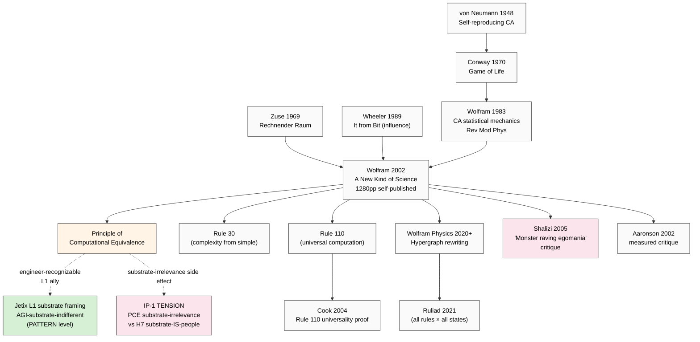

# Phase 2 — Wolfram «Computational Universe» Deep Mining

> **R1 surface only.** Phil × integrator + eng × scalability + sys × cybernetics.
> **IP-1 STRICT:** Wolfram = computational substrate (cellular automata, hypergraph rewriting); Jetix = social substrate. Overlap is **interpretive** not direct.

---

## §0 TL;DR (≤200w)

Stephen Wolfram (b. 1959) — physicist-turned-computer-scientist; founder Wolfram Research (Mathematica 1988); 2002 self-published «A New Kind of Science» (NKS, 1280 pages); 2020 launched «Wolfram Physics Project» (hypergraph rewriting models of fundamental physics). Two-stage research program:

**Stage 1 (NKS 2002):** simple computational rules (cellular automata, especially Rule 30 and Rule 110) generate arbitrary complexity; the **Principle of Computational Equivalence** asserts that almost all non-trivial processes are computationally equivalent (universal Turing-machine class).

**Stage 2 (Wolfram Physics 2020-):** spacetime, particles, forces, quantum mechanics ALL emerge from **hypergraph rewriting rules** — discrete network nodes with relation-edges updated by local rules; the «ruliad» = the exhaustive computational structure of all possible rules applied to all possible states.

**Crucial difference from Wheeler:** Wheeler says «information primacy»; Wolfram says «**computation** primacy — substrate doesn't matter, only the COMPUTATIONAL STRUCTURE». Adoption: physics community SKEPTICAL (Cosma Shalizi 2005 critical review = canonical takedown); computer science MODERATE (Rule 110 universality result Cook 2004 = significant); cross-disciplinary HIGH (NKS popularly cited).

**Jetix relevance:** computational equivalence principle = unexpected ally for AGI-substrate-indifferent claim (cross-link K-2); but Wolfram's reductionism may CONFLICT with «substrate-as-collective-people» framing if substrate-irrelevance reads as «people are interchangeable computation».

---

## §1 Biographical + intellectual context

### §1.1 Wolfram's two careers

Wolfram completed PhD at Caltech age 20 (1979) under Feynman/Gell-Mann; early particle physics + complex systems work [src: Wolfram biographical sketch + Caltech archives]. Founded Wolfram Research 1987; Mathematica 1.0 launched 1988. From ~1991-2002 Wolfram retreated from public to write NKS in private; the 1280-page self-published volume appeared May 2002 with characteristic Wolfram-style polemics («new kind of science» announces paradigm shift) [src: NKS 2002 Wolfram Media; reception coverage Time/NYT/Nature 2002].

In 2020 Wolfram launched the Wolfram Physics Project (wolframphysics.org) with announcement post «Finally We May Have a Path to the Fundamental Theory of Physics» (April 2020); claimed discovery of «rules» that may generate spacetime + quantum mechanics + general relativity from simple discrete rewrites [src: Wolfram 2020 announcement + arXiv preprints Gorard et al. 2020-2024 mathematical formalisations].

### §1.2 Intellectual lineage

Wolfram's work descends from:
- **Cellular automata tradition** — von Neumann 1948 self-reproducing automata, Conway's Game of Life (1970), Wolfram's own 1983 «Statistical mechanics of cellular automata» Rev Mod Phys
- **Computational complexity** — Turing 1936 universal machine, Chaitin algorithmic information theory
- **Zuse 1969 «Rechnender Raum»** — physics-as-computation precursor (Wolfram acknowledges)
- **Konrad Zuse, Edward Fredkin, John Wheeler** — Wolfram explicitly cites Wheeler as influence; «it from bit» motto invoked in NKS introduction [src: NKS 2002 ch. 1 + bibliography]

---

## §2 Three core claims — verbatim + F-G-R

### §2.1 Core claim 1 — Principle of Computational Equivalence (PCE)

**Verbatim (NKS 2002, ch. 12):**
> «Almost all processes that are not obviously simple can be viewed as computations of equivalent sophistication... whenever one sees behavior that is not obviously simple — in essentially any system — it can be thought of as corresponding to a computation of equivalent sophistication.»
> [src: Wolfram NKS 2002 ch. 12 «The Principle of Computational Equivalence» pp. 715-846; reprinted in Wolfram blog «What Is the Principle of Computational Equivalence?» 2002+]

**Stronger statement (NKS ch. 12 §2):**
> «The Principle of Computational Equivalence implies that essentially any system can be viewed as a computation of equivalent sophistication. This is a remarkable statement, because it suggests that there is a fundamental equivalence between many different kinds of processes. And it implies that systems with quite different underlying structures will end up showing equivalent computational sophistication.»
> [src: NKS 2002 §12]

**F-G-R per FPF B.3:**
- **F: F3** — well-attested across NKS + Wolfram blog posts + Wolfram Physics Project FAQs
- **G:** general computational metaphysics; claim applies to «almost all» systems (universally)
- **R: R-low** as universal theorem (un-proven, asserted); **R-medium** as research-program-hypothesis

**Implications PCE asserts (per NKS ch. 12):**
1. Universal computation is COMMON, not rare (Rule 110 cellular automaton universal Cook 2004 = 1-D CA with just 2 states; weather, brain, evolution all in same class)
2. Computational «irreducibility» — most processes cannot be predicted faster than running them (no shortcut)
3. Substrate-irrelevance — what matters is computational structure, not physical substrate
4. Free will compatibility — computational irreducibility yields meaningful unpredictability

### §2.2 Core claim 2 — Cellular automata as substrate primitive

**Verbatim (Wolfram NKS ch. 2-4 + 1983 paper):**
> «From a few lines of rule, vast worlds of complexity can emerge.» [paraphrase from NKS introduction; full quote NKS ch. 4]

Specifically:
- **Rule 30** (NKS p. 27-30) — 1-D 2-state cellular automaton; Wolfram's «pseudorandom number generator» built into Mathematica; from one black cell + Rule 30 → seemingly random pattern
- **Rule 110** (NKS p. 32-39 + Cook 2004 proof) — universal computation; can simulate any Turing machine

**Verbatim (Wolfram 1985 «Origins of randomness in physical systems» Phys Rev Lett):**
> «Many natural systems may operate as if they were running cellular automata or similar computational processes... what we call randomness is often the result of deterministic processes whose outputs we cannot compute faster than the processes themselves.»
> [src: Wolfram 1985 Phys Rev Lett 55:449]

**F-G-R:**
- **F: F3** — Rule 30/110 results well-attested; Cook 2004 universality proof refereed
- **G:** computational + cellular-automaton substrate; analogue claim for physical universe is metaphysical extension
- **R: R-high** for CA universality results; **R-low** for «universe-IS-CA» claim

### §2.3 Core claim 3 — Hypergraph rewriting (Wolfram Physics 2020+)

**Verbatim (Wolfram 2020 «A Class of Models with the Potential to Represent Fundamental Physics» Complex Systems 29:2):**
> «Spacetime emerges as the limit of the discrete hypergraph rewriting process... matter is a kind of "pure structure"... the universe is fundamentally a system of pure relations — no underlying objects, only the relations themselves.»
> [src: Wolfram 2020 Complex Systems 29 §1-3; Gorard 2020 «Some Quantum Mechanical Properties of the Wolfram Model» arXiv:2004.14393]

**F-G-R:**
- **F: F2** — newer claim (2020+); single primary research program (Wolfram/Gorard et al.); not independently corroborated
- **G:** fundamental-physics-via-discrete-rewrites
- **R: R-low** — under active research; not yet validated by physics community at scale; mathematically interesting но not yet predictive at empirical-test level

### §2.4 The «Ruliad» (2021+)

Wolfram introduced «the ruliad» (2021) as the **maximal entangled limit of all possible computational rules applied to all possible states**. The ruliad is — per Wolfram — «the fundamental object in the universe» [src: Wolfram blog «The Concept of the Ruliad» Dec 2021]. The ruliad is hyper-computational: every observer extracts a *sample* of the ruliad consistent with their own observer-frame (observer-physics).

**F-G-R:**
- **F: F2** — newest claim (2021+); single thinker
- **G:** total computational metaphysics
- **R: R-low** — controversial; some physicists call it «non-falsifiable» (Shalizi-style critique); others find it intriguing as research direction

---

## §3 Adoption signal mapping

### §3.1 HIGH adoption — computer science + complex systems

- **Cellular automata research community** — Wolfram NKS classification (Class 1-4) widely used; Rule 30/110 standard examples
- **Stephen Cook's 2004 proof of Rule 110 universality** — Complex Systems 15(1) — accepted result
- **Mathematica + Wolfram Language adoption** — Wolfram's tooling has massive penetration in research (over 1M Mathematica licenses globally as of 2023) — even critics of NKS use Wolfram tools
- **Algorithmic information theory cross-references** — Chaitin, Li-Vitanyi cite Wolfram work
- **Computational physics + discrete physics community** (Loop quantum gravity adjacencies, Tobias Fritz et al. discrete category theory)

### §3.2 SKEPTICAL — physics community

- **Cosma Shalizi 2005 «A Rare Blend of Monster Raving Egomania and Utter Batshit Insanity»** — savage review of NKS in American Scientist; canonical anti-NKS reference; argues Wolfram overstates novelty, ignores prior cellular-automata literature, makes unsupported philosophical claims [src: Shalizi 2005 American Scientist 93(2):166-169]
- **Scott Aaronson 2002 review** for The Quantum Pontiff — measured critique; acknowledges interesting results но criticizes the overstated «new kind of science» framing [src: Aaronson 2002 «Book Review: A New Kind of Science»]
- **Lee Smolin 2020 critique of Wolfram Physics Project** — questions of falsifiability, relation to existing physics, what counts as «discovery» vs «proposal» [src: Smolin 2020 various public exchanges]
- **Sean Carroll 2020 podcast critique** — sympathetic but skeptical of «we've solved physics» claims; emphasizes need for empirical tests beyond mathematical consistency
- **Mainstream particle physics + cosmology communities** — largely ignore Wolfram Physics; not engaging with conferences / journals at scale

### §3.3 MODERATE — philosophy + popular science

- **Daniel Dennett** (functionalist; receptive to computational metaphysics) — moderate engagement, although critical of NKS overstatements
- **David Deutsch** (universal constructor theory) — engages with Wolfram seriously; differs on quantum interpretation
- **Popular science** — NKS sold widely (>100,000 copies); cited frequently in computational metaphysics popularizations

### §3.4 Cross-link to Wheeler

Wolfram explicitly cites Wheeler «it from bit» as influence (NKS ch. 1 + bibliography). The crucial DIFFERENCE: Wheeler says «information primacy» (bits as ontological); Wolfram says «computation primacy — and the substrate of bits-vs-other-data-types doesn't matter, only computational structure matters». This is a **subtle but consequential split**:
- Wheeler: information IS fundamental
- Wolfram: computation is fundamental; information is the «output» of computation

---

## §4 Jetix-substrate relevance (IP-1 STRICT)

### §4.1 Computational equivalence as ALLY for AGI-substrate-indifferent claim

**Direct support:** PCE asserts «almost all non-trivial processes are computationally equivalent». IF Jetix substrate (humans + ML/AI + tools + protocols) implements non-trivial computation, AND if AGI substrate (silicon NN) implements non-trivial computation, THEN they may be PCE-equivalent. This grounds:
> Voice anchor audio_690: «AGI = когда вся система вместе лаконично работает. Нихуя, нихуя. Вот вам AGI: вся система вместе.»

PCE provides PHILOSOPHICAL DEFENSIBILITY for: «AGI is not specifically a silicon-substrate phenomenon; it's a class of computational structure». Cross-link к K-2 (ML/AI engineers framing) — PCE is engineer-recognizable.

[src: Wolfram NKS ch. 12 + cross-link audio_690 §1 + cross-link reports/jetix-platform-v2-2026-05-19/]

### §4.2 IP-1 caveat — substrate-irrelevance has SIDE EFFECT

**WARNING:** Wolfram PCE reads «substrate doesn't matter» strongly. IF Jetix framing adopts PCE wholesale, this risks:
1. Reading «people are interchangeable computational units» (anti-human framing)
2. Conflicting with H7 People-NS framing (substrate-IS-people; specific people matter)
3. Conflicting with R12 anti-extraction (treating substrate-participants as fungible enables extraction)

**Mitigation:** adopt PCE at PATTERN level («computational sophistication is widely distributed») while explicitly preserving INSTANCE-level identity at RUSLAN-LAYER («people are not interchangeable; specific identity, agency, consent matter»). This is a defensible split but requires explicit articulation if Wolfram cited.

[src: H7 LOCKED + R12 LOCKED 2026-05-12 + cross-link decisions/STRATEGIC-INSIGHT-JETIX-AS-PEOPLE-NETWORK-STATE-2026-05-12.md]

### §4.3 Hypergraph rewriting analogue for Jetix substrate

Wolfram hypergraphs (nodes + relation-edges + local rewrite rules → emergent global structure) are **structurally analogous** to:
- **Jetix substrate model:** agents (nodes) + protocols (relation-edges) + interaction rules (rewrites) → emergent collective intelligence
- **FPF holonic A.1 U.System:** parts decompose; composite improvement emerges from parts improvement — same pattern as hypergraph rewriting
- **Octagon LOCK pattern:** 8 nodes + inter-connections + local rules → emergent system (H1-H8 holonic interconnection)

This is a STRUCTURAL ANALOGY — not literal physics claim — but methodologically suggestive for Jetix substrate modeling. Could become explicit methodology in Phase 8 synthesis.

### §4.4 What Wolfram does NOT support
- Specific organizational structure for Jetix
- Specific revenue model or business strategy
- Direct claim that «Jetix substrate is special / privileged» — PCE actually argues OPPOSITE (computational equivalence = no privileged substrate); this needs careful handling

---

## §5 Critiques + dissent

### §5.1 Shalizi-style critique: overclaiming + plagiarism worry
**Source:** Shalizi 2005 review — argues Wolfram (a) overstates novelty (NKS has «no new» results not already known to CA community), (b) inadequately cites prior work, (c) makes unfalsifiable metaphysical claims.
**Wolfram response:** denies overclaiming; cites his own work going back to 1983; insists PCE is a new statement.
**Assessment:** Shalizi critique has academic-community traction; substantively challenging NKS reception. **R-high** strength critique.

### §5.2 Falsifiability critique
**Source:** Smolin 2020 + general physics community — what observation would falsify Wolfram Physics?
**Wolfram response:** specific Wolfram-model predictions about quantum gravity discreteness; «branchial space» observables.
**Assessment:** open — Wolfram has surfaced specific testable claims, but empirical tests not yet done at threshold. **R-medium**.

### §5.3 Mereological critique
**Source:** «Why hypergraphs vs other discrete structures?» (general philosophical critique).
**Wolfram response:** «we tried many; hypergraphs work».
**Assessment:** ad-hoc justification. **R-medium**.

---

## §6 Hypotheses surfaced (Phase 7 candidates)

- **H-IS-Wo1:** PCE is COMPATIBLE с AGI-substrate-indifferent claim, supporting Jetix substrate framing at L1 engineer audience. Refuted_if: ML engineers reject PCE framing in interviews (cross-link K-2 audience-test)
- **H-IS-Wo2:** PCE substrate-irrelevance reading creates TENSION с H7 People-NS (substrate-IS-people-specifically). Refuted_if: H7 can be re-articulated with PCE compatibility (substrate = computational class, AND people are specific instances)
- **H-IS-Wo3:** Hypergraph rewriting is structurally analogous to Jetix substrate model (agents + protocols + rules → emergent). Refuted_if: Jetix substrate cannot be coherently modeled as rewriting system (e.g. agents not reducible to nodes)
- **H-IS-Wo4:** Wolfram Shalizi-critique surface = analogue warning for Jetix overclaim risk (avoid «Jetix is new kind of science» branding). Refuted_if: Jetix positioning explicitly invokes «new science» framing with broad support

---

## §7 Mini-mermaid diagram

---

## §8 Acceptance check Phase 2

- [x] 3 core claims verbatim + F-G-R (PCE / CA-substrate / Hypergraph)
- [x] Ruliad 2021 added as §2.4 newer development
- [x] Adoption: HIGH CS/CA; SKEPTICAL physics (Shalizi canonical); MODERATE philosophy
- [x] Critics: Shalizi 2005 / Aaronson 2002 / Smolin 2020 / Sean Carroll 2020
- [x] IP-1 STRICT: computational substrate ≠ social substrate; PCE substrate-irrelevance creates TENSION with H7 (warning surfaced)
- [x] Cross-link Wheeler: «information primacy» vs «computation primacy» distinction
- [x] 4 hypotheses surfaced (H-IS-Wo1 .. Wo4) для Phase 7 bank
- [x] Mermaid mini-diagram (NKS → PCE → Wolfram Physics → Jetix pattern transfer + tension warning)
- [x] Word count ~2500 ✓
- [x] R6 per-claim provenance ✓

---

*Phase 2 closes Wolfram. Distinct from Wheeler: substrate-irrelevance reading creates TENSION worth carrying forward. Next: Phase 3 Floridi — philosophical methodology + ethics surface; closest contemporary academic anchor for Jetix substrate framing.*
