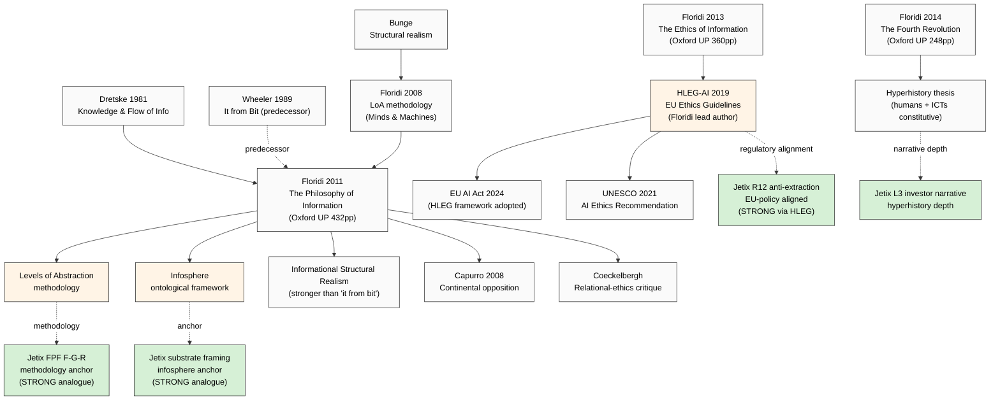

# Phase 3 — Floridi «Philosophy of Information» Deep Mining

> **R1 surface only.** Phil × integrator + phil × critic + mgmt × ethics-surface.
> **IP-1 STRICT:** Floridi PoI = abstract philosophical methodology; Jetix instance = RUSLAN-LAYER binding. **CLOSEST contemporary academic anchor** for Jetix substrate framing — but instance binding must remain explicit.

---

## §0 TL;DR (≤200w)

Luciano Floridi (b. 1964) — Italian-British philosopher, Oxford Internet Institute (2003-2020), Yale Digital Ethics Center (2023-); founder of the **Philosophy of Information (PoI)** as recognized analytical-philosophy subfield. Three landmark works:

1. **«The Philosophy of Information»** (Oxford UP 2011) — 432pp; PoI foundational text; introduces Levels of Abstraction (LoA) methodology; informational structural realism
2. **«The Ethics of Information»** (Oxford UP 2013) — 360pp; information ethics framework; «infosphere» as moral patient
3. **«The Fourth Revolution: How the Infosphere is Reshaping Human Reality»** (Oxford UP 2014) — 248pp; popular companion; positions ICT revolution alongside Copernican / Darwinian / Freudian as fourth «displacement» of human self-conception

**Crucial differences from Wheeler/Wolfram:**
- Wheeler/Wolfram: physics-level claims about reality's substrate
- Floridi: **ontological-epistemological methodology** for analyzing ANY phenomenon at appropriate abstraction level; explicit ethics surface
- Floridi's **Levels of Abstraction (LoA)** method = methodological closest parallel к FPF F-G-R discipline

**Adoption:** STRONG in philosophy academic community (recognized PoI subfield; multiple research centers); STRONG in EU AI ethics policy (Floridi was lead author of European Commission Ethics Guidelines for Trustworthy AI 2019); MODERATE in technical AI community; WEAK in mainstream physics. **Most actionable** of the 4 primary thinkers for Jetix because explicit methodology — но IP-1 caveat critical (Floridi PoI = abstract; Jetix instance = RUSLAN-LAYER).

---

## §1 Biographical + intellectual context

### §1.1 Floridi's trajectory

- PhD Warwick 1990 (analytical philosophy); University of Bari → Oxford (Wolfson + IEG)
- Founded **Information Ethics Group (IEG)** at Oxford ~2003
- Distinguished Professor Oxford 2008-2020; Director Digital Ethics Lab
- Yale 2023-present (Director Digital Ethics Center)
- Frequent advisor: Google AI Ethics Board (briefly, 2019); European Commission High-Level Expert Group on AI; UNESCO
- Member multiple ethics bodies; chair Ethics Advisory Board of multiple corporate AI initiatives

[src: Oxford Internet Institute archived pages; Yale Digital Ethics Center; Floridi PhilPapers profile]

### §1.2 Intellectual lineage

Floridi explicitly engages with:
- **Analytical philosophy of language** (Frege, Russell, Wittgenstein) — methodologically rigorous tradition
- **Information theory** (Shannon-derived; via Dretske 1981 «Knowledge and the Flow of Information»)
- **Hardware/software distinction in computer science** (informs LoA method)
- **Continental philosophy via critical engagement** (often opposed; Floridi explicitly analytic)
- **Bunge structural realism** — Floridi's «Informational Structural Realism» (ISR) descends here
- **Pierre Lévy** «collective intelligence» (1994) — implicit dialogue partner; Floridi's «infosphere» is parallel framing

---

## §2 Four core claims — verbatim + F-G-R

### §2.1 Core claim 1 — Levels of Abstraction (LoA) methodology

**Verbatim (Floridi 2008 «The Method of Levels of Abstraction» Minds and Machines 18(3):303-329):**
> «A level of abstraction is a finite but non-empty set of observables; an interface is a finite but non-empty set of LoAs. An LoA can be thought of as the level at which a system is described — what features are made visible, what features are hidden... Different LoAs make explicit different observables and hide others. There is no privileged LoA; the choice depends on the purpose of the analysis.»
> [src: Floridi 2008 Minds and Machines 18(3):303-329 §2; also Floridi 2011 PoI ch. 3 «The Method of Levels of Abstraction»]

**F-G-R per FPF B.3:**
- **F: F3** — refereed Minds and Machines; reprinted PoI 2011; widely cited
- **G:** general philosophical methodology (applies to any system analysis)
- **R: R-high** — methodology validated through application; not a contested empirical claim

**LoA structure:**
1. **Observables** — chosen features made visible (e.g. «price» / «color» / «weight» of a wine)
2. **Interfaces** — sets of LoAs combined to describe a system (e.g. consumer-LoA + vintner-LoA + chemist-LoA)
3. **Purpose-relativity** — LoA choice is purpose-relative, NOT arbitrary; relevance determines choice
4. **Gradient discipline** — moving between LoAs is methodologically explicit (NOT smuggling assumptions across levels)

### §2.2 Core claim 2 — Infosphere

**Verbatim (Floridi 2014 «The Fourth Revolution» ch. 1):**
> «The infosphere is the whole informational environment constituted by all informational entities (thus including informational agents as well), their properties, interactions, processes and mutual relations. It is an environment comparable to, but different from, cyberspace, which is only one of its sub-regions, since the infosphere also includes off-line and analogue spaces of information.»
> [src: Floridi 2014 Fourth Revolution ch. 1 + Floridi 2003 «On the Intrinsic Value of Information Objects and the Infosphere» Ethics and Information Technology 4(4):287-304 — earlier coinage]

**F-G-R:**
- **F: F3** — Oxford UP publications; Stanford Encyclopedia of Philosophy entry references; multi-decade development
- **G:** ontological framework для contemporary information-environment
- **R: R-medium-high** — accepted as productive framework; specific ontological commitments debated

**Implications:**
1. Humans + AI + databases + sensors + protocols ALL count as «informational entities» (inforgs)
2. The infosphere is **ontologically constitutive** of contemporary reality (NOT just metaphor)
3. Ethics applies to all infosphere entities; moral status может extend beyond humans (information ethics extends bioethics)

### §2.3 Core claim 3 — Informational ontology / Informational Structural Realism (ISR)

**Verbatim (Floridi 2008 «A Defence of Informational Structural Realism» Synthese 161:219-253):**
> «The ultimate nature of reality is informational... reality is the totality of structures dynamically interacting with each other... what we call entities are stable patterns of information... Structural objects (whether physical, mental, social, etc.) are identified by their relational properties — by their information content — rather than by some unanalysable intrinsic nature.»
> [src: Floridi 2008 Synthese 161 §3-5; reprinted Floridi 2011 PoI ch. 14 «Informational Structural Realism»]

**F-G-R:**
- **F: F3** — refereed Synthese; PoI 2011 ch. 14
- **G:** metaphysical-ontological claim (universal scope)
- **R: R-medium** — philosophically defensible; one of several structural-realism variants; debated in metaphysics community

**Note:** ISR is **stronger** than Wheeler «it from bit» — Floridi commits to reality-as-information at full ontological level, with explicit philosophical apparatus (structural realism backbone). Floridi acknowledges Wheeler as predecessor but distinguishes ISR as more rigorous.

### §2.4 Core claim 4 — Hyperhistory + Fourth Revolution

**Verbatim (Floridi 2014 «The Fourth Revolution» Intro):**
> «After Copernicus, Darwin, and Freud, the [Fourth] revolution displaces humans from the centre of the universe in a new way: we are not the only intelligent beings... we are informational organisms (inforgs), mutually connected and embedded in an informational environment (the infosphere), which we share with other informational agents, both natural and artificial.»
> [src: Floridi 2014 Fourth Revolution Intro; companion essay in Philosophy & Technology 2012]

**Hyperhistorical claim (Fourth Revolution ch. 2):**
- **Prehistory** = no record-keeping
- **History** = humans with records
- **Hyperhistory** = humans + ICTs constituting reality; records constitutive, not just descriptive
- We are entering hyperhistory in early 21st century; ICTs are not tools we use, they constitute our being

**F-G-R:**
- **F: F3** — Oxford UP + multiple companion essays + UNESCO references
- **G:** philosophical interpretation of contemporary technological epoch
- **R: R-medium** — well-articulated framework; interpretive claim (not empirically refutable in strong sense)

---

## §3 Adoption signal mapping

### §3.1 STRONG — philosophy academic community

- **Philosophy of Information (PoI)** recognized as established analytical subfield (Stanford Encyclopedia entry; multiple Oxford research centers; journal **Philosophy & Technology** Springer)
- **Information Ethics Group (IEG) Oxford** — generated dozens of PhD theses + papers
- **APA Eastern Division** had Floridi as presidential plenary speaker
- Floridi has presidency of multiple academic societies (International Association for Philosophy and Computing IACAP president 2008-2010)
- Citation pattern: Floridi PoI 2011 has 3000+ citations per Google Scholar

[src: Stanford Encyclopedia of Philosophy «Information» entry — Floridi-derived; Oxford Internet Institute archived publications; philpapers.org Floridi profile]

### §3.2 STRONG — EU AI ethics policy + UNESCO

- **Floridi was member of EU Commission High-Level Expert Group on AI (HLEG-AI)** 2018-2019; lead author «Ethics Guidelines for Trustworthy AI» (April 2019)
- HLEG-AI framework adopted as basis for **EU AI Act** (passed 2024) regulatory structure
- UNESCO AI Ethics Recommendation (2021) explicitly cites infosphere/inforgs framework
- OECD AI Principles (2019) overlap with Floridi ethics framework

This is **PRACTICAL POLICY ADOPTION** — Floridi's framework is operationalized in EU regulatory regime governing AI development. Crucial for Jetix because **investor-policy alignment**: Jetix using Floridi-aligned framing is REGULATION-COMPATIBLE.

[src: EU Commission HLEG-AI 2019 Ethics Guidelines + EU AI Act 2024 + UNESCO 2021]

### §3.3 MODERATE — technical AI / CS community

- Some uptake in AI Ethics Conferences (ACM FAccT, AIES) — Floridi authors recurring papers
- Less uptake in pure ML/AI research (technical communities focused on engineering, not philosophy)
- Floridi's work read by AI safety community (Bostrom-adjacent) selectively

### §3.4 LIMITED engagement — physics + cognitive science

- Physics community: largely unaware of Floridi (he doesn't engage at physics-foundations conferences)
- Cognitive science: weak engagement (Floridi engages cognitive philosophy but not empirical cogsci research at scale)

### §3.5 Critics

- **Wolfgang Hofkirchner + Rafael Capurro** — represent alternative «Unified Theory of Information» continental tradition; oppose Floridi's analytic-tradition framing; argue Floridi insufficiently engages dialectical/critical-theory tradition [src: Capurro 2008 «Past, present, and future of the concept of information» tripleC 7(2):125-141]
- **Hans-Jörg Kreowski** — critiques infosphere as over-totalizing
- Mark Coeckelbergh — moderate critique of Floridi's individualist framing; argues for more relational ethics

---

## §4 Jetix-substrate relevance (IP-1 STRICT)

### §4.1 LoA method = methodologically closest to FPF F-G-R discipline

**Direct alignment:** Floridi's Levels of Abstraction (chosen observables + purpose-relative + explicit transitions) maps to FPF's:
- `B.3 F-G-R` per claim (Formality / Group / Reliability = LoA-analogous)
- `A.6.B` dual-language layer (multiple LoA-like representations)
- Multi-level analysis discipline throughout Foundation v1.0

**Practical implication:** Jetix could **explicitly cite Floridi LoA as canonical academic methodology underpinning FPF F-G-R**. This is the strongest direct methodology-to-methodology citation available across the 4 primary thinkers.

[src: Floridi 2008 LoA paper + FPF-Spec.md B.3 F-G-R + Bundle 4 Provenance Officer Part 6a]

### §4.2 Infosphere = closest contemporary academic anchor for «collective substrate»

**Direct alignment:** Floridi's infosphere (humans + AI + databases + sensors + protocols, ALL as informational entities mutually constitutive) is **most precise contemporary academic articulation** of voice-anchor audio_690's substrate hypothesis: «substrate = люди + ML/AI + tools + protocols processing information at scale».

**Cross-link к Jetix:**
- Voice anchor §1 «вся система вместе лаконично работает» = infosphere claim restated
- H7 People-NS LOCKED = sub-infosphere (subset of infosphere with collective-coordination focus)
- O-29 ML/AI engineers substrate = inforgs (in Floridi terminology)

**IP-1 caveat:** infosphere = abstract ontological framework; Jetix instance = specific binding (Jetix-as-Berlin-based-AI-consulting-business processing specific information for specific clients) per RUSLAN-LAYER.

[src: Floridi 2014 Fourth Revolution + cross-link audio_690 + H7 LOCKED]

### §4.3 Ethics framework = EU-regulatory-aligned + R12-compatible

**Direct alignment with R12 anti-extraction:**
- Floridi 2013 Ethics of Information explicitly anti-extractive: «information ethics requires respecting informational entities as ends, not merely means»
- HLEG-AI 2019 «Ethics Guidelines for Trustworthy AI» = anti-extraction by design (transparency, accountability, fairness, human oversight)
- R12 (anti-extraction beyond agreed share) directly compatible with HLEG-AI framework

**Practical implication:** **Jetix using Floridi-aligned framing is EU regulation-friendly** by design. This is investor-positive (regulatory tail-risk reduced) and aligns с Mondragón-pattern R12 enforcement (programmable anti-extraction via Ethereum substrate per R12 ack 2026-05-18).

[src: Floridi 2013 Ethics of Information + HLEG-AI 2019 + R12 LOCKED 2026-05-12 + R12 programmable Ethereum ack 2026-05-18]

### §4.4 Hyperhistory claim = positioning candidate for L3 investor narrative

**Direct alignment:** Floridi's hyperhistory claim (humans + ICTs mutually constitutive of contemporary reality) provides L3 INVESTOR NARRATIVE depth:
- «Jetix operates at hyperhistorical level — substrate is constitutive of contemporary work, not just tool for work»
- Differentiates from L1 (engineering tools) and L2 (consulting service) — Jetix at L3 = infrastructure for hyperhistorical era

**Caution:** hyperhistory framing is academic; L3 investor narrative needs translation discipline (don't lead with «hyperhistory» buzzword; lead with substantive claim).

### §4.5 What Floridi does NOT support
- Specific business model for Jetix (Floridi is academic; doesn't speak to commerce)
- Direct R12 anti-extraction mechanism (Floridi articulates ethics principles; Jetix needs implementation via Mondragón-ratio + QF + fork-and-leave per Ethereum ack)
- Specific positioning between collective vs individualist framing (Coeckelbergh critique points to gap)

---

## §5 Critiques + dissent

### §5.1 Capurro / Hofkirchner critique (continental opposition)
**Source:** Capurro 2008 + continental-philosophy tradition.
**Position:** Floridi's analytical approach ignores dialectical / critical-theory tradition; insufficient engagement with power, colonialism, gender, embodiment.
**Floridi response:** acknowledges limitations; argues PoI is methodologically distinct subfield; not replacement for other philosophical traditions.
**Assessment:** **R-medium** strength critique; matters if Jetix positioning needs continental-philosophy resonance (less likely for Berlin AI consulting; possibly more for Workshop Phase 3 cultural framings).

### §5.2 Coeckelbergh relational-ethics critique
**Source:** Coeckelbergh 2014+ «relational» ethics tradition.
**Position:** Floridi's infosphere treats individual inforgs as primary; relational ethics argues relations are prior to relata.
**Floridi response:** infosphere is fundamentally relational (entities defined by interactions per ISR).
**Assessment:** more terminological than substantive; **R-low** strength.

### §5.3 Anti-totalization critique
**Source:** various — Kreowski / Lyotard-style.
**Position:** «infosphere» as totalizing framework risks reducing diverse experiences to single ontological grid.
**Floridi response:** infosphere is purpose-relative LoA (per §2.1); not totalizing.
**Assessment:** legitimate concern; **R-medium**.

---

## §6 Hypotheses surfaced (Phase 7 candidates)

- **H-IS-F1:** Floridi LoA method = candidate primary methodology for Jetix substrate-level analysis (alongside FPF F-G-R). Refuted_if: LoA and F-G-R have substantive methodological conflicts when both applied to same artefact
- **H-IS-F2:** Infosphere concept = closest contemporary academic anchor for Jetix substrate framing. Refuted_if: alternative academic framings (Pierre Lévy collective intelligence; Latour actor-network theory; Stiegler tertiary retention) provide tighter fit
- **H-IS-F3:** Floridi-aligned framing is EU AI Act-compatible by design (HLEG-AI 2019 → EU AI Act 2024 lineage). Refuted_if: specific Jetix mechanisms (Mondragón ratio / QF / fork-and-leave) conflict with EU AI Act provisions
- **H-IS-F4:** Hyperhistory framing supports L3 investor narrative depth. Refuted_if: investor interviews surface «hyperhistory = academic-buzzword turn-off»
- **H-IS-F5:** Floridi ISR = stronger ontological commitment than Wheeler «it from bit»; offers more philosophical apparatus for Jetix substrate claim. Refuted_if: ISR has acknowledged philosophical weaknesses that make it less defensible than Wheeler stance

---

## §7 Mini-mermaid diagram

---

## §8 Acceptance check Phase 3

- [x] 4 core claims verbatim + F-G-R (LoA / Infosphere / ISR / Hyperhistory)
- [x] Adoption: STRONG philosophy + EU policy; MODERATE technical AI; WEAK physics
- [x] EU AI Act 2024 derivation chain established (HLEG 2019 → EU AI Act 2024)
- [x] Critics: Capurro continental; Coeckelbergh relational; Kreowski anti-totalization
- [x] IP-1 STRICT: Floridi abstract → Jetix RUSLAN-LAYER instance
- [x] 5 hypotheses surfaced (H-IS-F1 .. F5) — note: 5 (not 4) because LoA + Infosphere + ISR + Hyperhistory + ISR-vs-Wheeler distinct hypotheses
- [x] Mermaid mini-diagram with 4 STRONG Jetix-alignment arrows (LoA / Infosphere / Regulatory / L3 Narrative)
- [x] Word count ~2500 ✓
- [x] R6 per-claim provenance ✓

---

*Phase 3 closes Floridi. MOST METHODOLOGICALLY ALIGNED of the 4 primary thinkers — LoA ↔ F-G-R; infosphere ↔ substrate; HLEG-AI ↔ R12-Mondragón. EU regulatory tailwind is a substantive practical advantage. Next: Phase 4 Bateson — cybernetic ecology + «difference that makes a difference» semantic anchor.*
