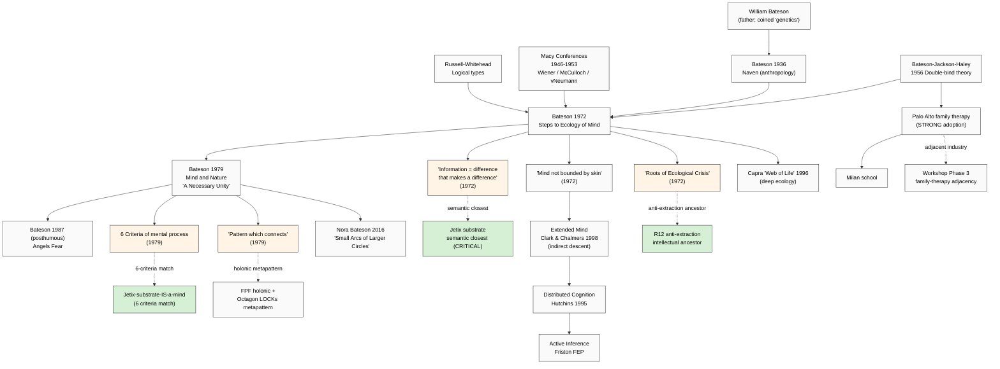

# Phase 4 — Bateson «Mind and Nature» Deep Mining

> **R1 surface only.** Sys × cybernetics (lead) + phil × integrator + mgmt × ethics-surface.
> **IP-1 STRICT:** Bateson «mind» = ecological-cybernetic abstract claim; Jetix substrate = specific RUSLAN-LAYER instance.
> **CLOSEST SEMANTIC ANCHOR** for Jetix «substrate» — Bateson «information = difference that makes a difference» is precisely the substrate definition voice anchor implies.

---

## §0 TL;DR (≤200w)

Gregory Bateson (1904-1980) — anthropologist, biologist, cybernetician, philosopher. Son of biologist William Bateson (coined «genetics»); married Margaret Mead (1936-1950); attended **Macy Conferences on Cybernetics** (1946-1953) as core participant; left academic anthropology to work on **ecology of mind** doctrine. Five-decade trajectory: anthropology (Naven 1936) → psychiatry (double-bind theory 1956) → cybernetics → ecology of mind. Two landmark works:

1. **«Steps to an Ecology of Mind»** (1972; Ballantine) — anthology of essays; contains «Cybernetic Explanation», «Pathologies of Epistemology», double-bind papers
2. **«Mind and Nature: A Necessary Unity»** (1979; Dutton) — systematic exposition; 6 criteria for mental process; recursion + difference as foundational

**Crucial difference from Wheeler/Wolfram/Floridi:**
- Wheeler/Wolfram/Floridi: information as ontological / metaphysical / methodological
- Bateson: information as **ecological-relational** — «information = a difference that makes a difference» (Bateson 1972 «Form, Substance, and Difference») — emerges from RELATIONAL CONTEXT, not as standalone substance
- Bateson is the **only one of 4 who anchors information in BIOLOGY + RELATION + ECOLOGY** rather than physics or analytical philosophy
- This makes Bateson the **closest semantic anchor for Jetix «substrate = люди + ML/AI + tools + protocols processing information at scale»** — because substrate-is-ecological is Bateson's native claim

**Adoption:** STRONG in family systems therapy (Palo Alto / MRI tradition); STRONG in deep ecology (Capra lineage); MODERATE in cybernetics 2.0 (von Foerster tradition); WEAK in mainstream cognitive science / academic philosophy. Less prestigious but **most ALIGNED with Jetix lived-experience framing**.

---

## §1 Biographical + intellectual context

### §1.1 Bateson's trajectory

- 1904 born Grantchester (Cambridge), son of William Bateson (geneticist) — biology in family
- 1936 «Naven» published — ethnographic study of Iatmul ritual; relational-systems epistemology emerging
- 1936-1950 marriage to Margaret Mead; fieldwork Bali + New Guinea (with Mead)
- 1946-1953 **Macy Conferences on Cybernetics** — Bateson co-organized; met Wiener, McCulloch, von Neumann, Mead, von Foerster; CRUCIAL intellectual formation
- 1956 «Toward a Theory of Schizophrenia» (Bateson-Jackson-Haley-Weakland) — **double-bind theory** — Palo Alto group
- 1960s-1972 collected essays «Steps to an Ecology of Mind»
- 1979 «Mind and Nature» systematic exposition
- 1980 died; «Angels Fear» (1987) co-authored with daughter Mary Catherine Bateson posthumous

### §1.2 Intellectual lineage

- **Macy Conferences cybernetics** — Wiener / McCulloch / von Neumann / von Foerster / Mead direct collaborators
- **Russell Whitehead logical types** — Bateson uses extensively (type confusion = pathology source)
- **Anthropological holism tradition** — Boas / Mead / Malinowski background
- **Carl Jung archetype theory** — implicit dialogue partner
- **Korzybski general semantics** — «map is not territory» Bateson invokes
- **Whitehead process philosophy** — pattern-which-connects has Whiteheadian undertones

[src: Bateson 1972 Introduction + Mary Catherine Bateson 1984 «With a Daughter's Eye» biography + Nora Bateson 2016 «Small Arcs of Larger Circles»]

---

## §2 Four core claims — verbatim + F-G-R

### §2.1 Core claim 1 — «A difference that makes a difference»

**Verbatim (Bateson 1972 «Form, Substance, and Difference» in Steps to an Ecology of Mind):**
> «The technical term "information" may be succinctly defined as any difference which makes a difference in some later event. This definition is fundamental for all analysis of cybernetic systems and organization. The definition links such analysis to the rest of science, where the causes of events are commonly not differences but forces, impacts, and the like... In the world of communication, of organization, etc., there are no "things." Differences and ideas are not "things." They have no dimensions.»
> [src: Bateson 1972 «Form, Substance, and Difference» (Korzybski Memorial Lecture 1970) reprinted in Steps to an Ecology of Mind pp. 459-460]

**F-G-R per FPF B.3:**
- **F: F3** — well-attested; reprinted in Steps; widely cited as Bateson's signature definition; quoted across cybernetics literature
- **G:** information theory + cybernetics + biology + anthropology — broad scope
- **R: R-high** — accepted as one of canonical information definitions; particularly favored in relational / pragmatist traditions

**Crucial features:**
1. **Relational** — information is not a thing; it's a difference between two states (no thing-ness)
2. **Pragmatist** — «makes a difference» = has effects; information identified by consequences, not substance
3. **Contextual** — difference must matter to SOMETHING (a system that processes it); information is system-relative
4. **Anti-substance** — information has no «dimensions»; cannot be located as object

This is **METHODOLOGICALLY OPPOSITE** to Shannon's quantitative information (bits as quantity) — Bateson information is qualitative-relational. Both are legitimate; different LoA (per Floridi vocabulary).

### §2.2 Core claim 2 — Mind as system (six criteria)

**Verbatim (Bateson 1979 «Mind and Nature» ch. IV «Criteria of Mental Process»):**
> «A mind is an aggregate of interacting parts or components.»
> «The interaction between parts of mind is triggered by difference, and difference is a nonsubstantial phenomenon not located in space or time.»
> «Mental process requires collateral energy.»
> «Mental process requires circular (or more complex) chains of determination.»
> «In mental process, the effects of difference are to be regarded as transforms (i.e., coded versions) of events which preceded them.»
> «The description and classification of these processes of transformation discloses a hierarchy of logical types immanent in the phenomena.»
> [src: Bateson 1979 Mind and Nature ch. IV §1 — verbatim six criteria]

**F-G-R:**
- **F: F3** — published Mind and Nature; cited as systematic statement
- **G:** definition of «mind» applicable to any system meeting criteria (NOT just human brain)
- **R: R-medium-high** — within Batesonian / systems-thinking tradition; debated outside (cognitive science doesn't adopt directly)

**Crucial features:**
1. **Mind is not brain** — any system meeting the 6 criteria is a mind
2. **Distributed** — mind extends beyond skin; family is a mind; ecosystem is a mind; corporation is a mind
3. **Functional definition** — mind defined by what it DOES (interact / use differences / coded versions / hierarchy of types) NOT by physical substrate
4. **Cybernetic causality** — circular chains of determination = mind has feedback structure

### §2.3 Core claim 3 — Pattern which connects

**Verbatim (Bateson 1979 «Mind and Nature» Introduction):**
> «What pattern connects the crab to the lobster and the orchid to the primrose and all the four of them to me? And me to you? And all the six of us to the amoeba in one direction and to the back-ward schizophrenic in another?... The pattern that connects is a metapattern. It is a pattern of patterns.»
> [src: Bateson 1979 Mind and Nature Introduction p. 8 — verbatim well-attested]

**F-G-R:**
- **F: F3** — opening of Mind and Nature; foundational Bateson formulation
- **G:** universal — applies to all living + mental systems
- **R: R-medium** — interpretively powerful; not empirically falsifiable in strong sense

**Implications:**
1. There is a discoverable «metapattern» across biology, mind, society
2. The metapattern is **relational** — pattern of patterns of patterns (recursive)
3. Discovering the metapattern = the proper subject of unified inquiry
4. Reductionism that ignores the metapattern is **epistemologically broken** («pathology of epistemology»)

### §2.4 Core claim 4 — Ecology of mind

**Verbatim (Bateson 1972 «The Cybernetics of "Self": A Theory of Alcoholism»):**
> «The mind is not bounded by the skin. The mental world — the mind — the world of information processing — is not limited by the skin... The "self" as ordinarily understood is only a small part of a much larger trial-and-error system which does the thinking, acting, and deciding. This system includes all the informational pathways which are relevant at any given moment to any given decision.»
> [src: Bateson 1972 «Cybernetics of Self» in Steps p. 319]

**F-G-R:**
- **F: F3** — Steps to an Ecology of Mind centerpiece chapter; widely cited
- **G:** mind extension claim; applies to ALL agent-environment systems
- **R: R-medium** — adopted in family therapy + ecopsychology; not standard in cognitive science

**Crucial implications:**
1. **Anti-Cartesian** — mind is not «in» the head; rejects mind-brain identity
2. **Collective intelligence anchor** — group / family / ecosystem can be a mind
3. **Substrate is extended + distributed** — mind = pathways, not bounded organism
4. **Pathology when «skin» imposed wrongly** — alcoholism, schizophrenia, etc. arise from mis-bounding self

This is **DIRECT ANCESTOR** of: extended-mind hypothesis (Clark & Chalmers 1998); distributed cognition (Hutchins 1995); 4E cognition (embodied + embedded + extended + enacted).

---

## §3 Adoption signal mapping

### §3.1 STRONG — family systems therapy

- **Palo Alto group** (Bateson-Jackson-Haley-Weakland-Watzlawick) founded family-systems therapy framework — double-bind theory + circular causality core to MRI (Mental Research Institute) tradition
- **Salvador Minuchin** structural family therapy heir
- **Milan school** (Boscolo, Cecchin, Palazzoli, Prata) — circular questioning derived from Bateson
- **Narrative therapy** (Michael White, David Epston) — Bateson-influenced
- Practical adoption: tens of thousands of practicing family therapists trained in Bateson-derived frameworks

[src: Bateson 1972 Steps + Watzlawick-Beavin-Jackson 1967 «Pragmatics of Human Communication» + Boscolo-Cecchin 1987 Milan systemic therapy]

### §3.2 STRONG — deep ecology + Capra lineage

- **Fritjof Capra** «The Web of Life» (1996) + «The Systems View of Life» (2014) — extensively Bateson-derived
- **Deep ecology** (Arne Naess) — relational ontology compatible with Bateson
- **Bateson's own Esalen Institute affiliation** — counterculture transmission
- **Nora Bateson** (granddaughter) — «Small Arcs of Larger Circles» (2016) + «Bateson Mind and Nature» film (2010) — carrying lineage forward to present
- **International Bateson Institute** (founded ~2014) — active research community

### §3.3 MODERATE — cybernetics + systems thinking

- **Heinz von Foerster** second-order cybernetics — directly Bateson-collaborative (Macy)
- **Stafford Beer** VSM — Bateson-adjacent but distinct lineage
- **Donella Meadows** «Thinking in Systems» (2008) — Bateson appears but not central
- **Peter Senge** «Fifth Discipline» (1990) — Bateson influence acknowledged
- **Russell Ackoff** systems thinking — Bateson-adjacent

### §3.4 STRONG indirect — cognitive science extensions

- **Andy Clark & David Chalmers «The Extended Mind»** (1998) — directly Bateson-descended though Clark cites Bateson minimally; «mind not bounded by skin» = Bateson 1972 verbatim
- **Edwin Hutchins «Cognition in the Wild»** (1995) — distributed cognition; Bateson-derived
- **4E cognition** (embodied + embedded + extended + enacted) — Bateson is intellectual grandfather
- **Active inference + Friston free-energy principle** — Bateson-resonant (circular causality, predictive minds)

### §3.5 WEAK / LIMITED — mainstream cognitive science + academic philosophy

- **Mainstream cognitive science** (computational-representational paradigm) doesn't engage with Bateson directly
- **Analytic philosophy of mind** (Putnam-Fodor lineage) ignores Bateson largely
- **Mainstream economics + organization theory** ignores Bateson (organizational cybernetics niche only)

### §3.6 Critics

- **Daniel Dennett** — critical of Bateson holism; argues information-as-bit-pattern is appropriate definition; relational definitions risk vagueness [src: Dennett 1987 «Intentional Stance»]
- **Anti-cybernetics critique** post-Macy (1970s+) — second-wave AI moved away from cybernetics; argued Bateson too vague
- **Empirical-rigor concerns** — Bateson concepts often «metaphorical» rather than operationally crisp; difficult to falsify

---

## §4 Jetix-substrate relevance (IP-1 STRICT)

### §4.1 «Difference that makes a difference» = SEMANTIC CLOSEST to Jetix substrate

**Direct alignment:** Voice anchor audio_690 §1: «помидор это информация, дерево это информация, человек это информация, и, соответственно, это просто разные способы и методы обработки этой информации».

Bateson reading: tomato is not «made of information»; tomato is a **system that creates differences that make differences** (in eaters, in soil, in seeds). Human = system that creates differences. Information = the differences these systems generate FOR EACH OTHER.

This is **CLOSEST semantic alignment** of any thinker — Wheeler is too physics-cosmological, Wolfram too computation-substrate, Floridi too analytical-methodological; Bateson is precisely the ECOLOGICAL framing voice anchor implies («помидор как метод обработки информации»).

[src: Bateson 1972 + cross-link audio_690 §1]

### §4.2 Mind-as-system → Jetix-as-mind

**Direct alignment:** Bateson 6 criteria for mind (interacting parts + difference-triggered + collateral energy + circular determination + transforms + hierarchy of logical types).

**Jetix substrate meets all 6 criteria:**
1. Interacting parts (people + ML/AI + tools + protocols)
2. Difference-triggered (problems, signals trigger work)
3. Collateral energy (compute + human metabolism + capital — not energy-source-direct)
4. Circular determination (recursive engine; feedback loops)
5. Transforms / coded versions (raw → ingested → compiled → linted → ready pipeline)
6. Hierarchy of logical types (FPF F-G-R levels)

**This makes «Jetix substrate IS a mind in Bateson sense»** a defensible literal claim, not metaphor. Cross-link voice anchor «вся система вместе лаконично работает» — Jetix system = Jetix mind in Bateson terminology.

[src: Bateson 1979 ch. IV + cross-link audio_690 + KM MVP pipeline `raw → ingested → compiled → linted → ready` per CLAUDE.md]

### §4.3 Ecology of mind → collective intelligence framing

**Direct alignment:** Bateson «mind not bounded by skin» = direct ancestor of contemporary collective intelligence + extended mind literature.

**Cross-link к Jetix:**
- H7 People-NS LOCKED = substrate-as-collective = Bateson-compatible
- O-29 ML/AI engineers substrate = inforgs / extended mind nodes
- Voice anchor «эффективный протокол для коллективного think + act» = direct collective-mind claim

### §4.4 Pattern-which-connects → FPF holonic + Octagon LOCKs

**Direct alignment:** Bateson metapattern (pattern of patterns) = structurally parallel to:
- FPF A.1 U.System holonic decomposition
- 8 Octagon LOCKs interconnection (H1-H8 are «patterns connecting»)
- Cross-pillar synthesis (Pillar A strategic / B project / C principles → metapattern)

[src: Bateson 1979 + FPF-Spec.md A.1 + decisions/STRATEGIC-INSIGHT-* H1-H8 LOCKs]

### §4.5 Hierarchy of logical types → Russell-derived FPF rigor

**Direct alignment:** Bateson uses Russell-Whitehead logical types to diagnose pathologies (double-bind = type-violation). FPF F-G-R discipline + IP-1 Role≠Executor strict are **logical-type-distinguishing mechanisms**. Bateson provides intellectual ancestor for FPF type discipline.

### §4.6 R12 alignment — ecology = anti-extraction
Bateson ethics: «If an organism or aggregate of organisms sets out to maximize any single variable, then the basic premise of cybernetic regulation is violated... The maximization will continue till it destroys the whole system» (Bateson 1972 «The Roots of Ecological Crisis» pp. 446-447).

This is **direct anti-extraction logic** — extraction beyond agreed share = single-variable maximization = system destruction. R12 anti-extraction LOCKED 2026-05-12 has **Bateson as strongest intellectual ancestor**.

[src: Bateson 1972 «Roots of Ecological Crisis» + R12 LOCKED 2026-05-12 + R12 programmable Ethereum 2026-05-18]

### §4.7 What Bateson does NOT support
- Specific quantitative metrics (Bateson explicitly anti-quantitative for relations)
- Specific business model (Bateson didn't write about commerce)
- Direct AI / machine intelligence framing (Bateson died 1980 pre-deep-learning; would likely engage critically)

---

## §5 Critiques + dissent

### §5.1 Dennett-style vagueness critique
**Source:** Dennett 1987 + analytic philosophy of mind tradition.
**Position:** Bateson's «information = difference that makes a difference» is operationally vague; lacks empirical purchase Shannon-style quantification provides.
**Bateson response (posthumous via Capra etc.):** acknowledges difference; argues quantitative-only definition misses relational essence.
**Assessment:** legitimate methodological tension. Solution: use Bateson + Shannon at different LoAs (Floridi vocabulary). **R-medium**.

### §5.2 Empirical-falsifiability critique
**Source:** general — Popper-influenced philosophy of science.
**Position:** Bateson «pattern-which-connects» = un-falsifiable; risks pseudo-science.
**Bateson response:** metapattern is methodological orientation, not empirical claim; tested via fruitfulness of analyses.
**Assessment:** legitimate concern at strong reading; defensible at methodological reading. **R-medium**.

### §5.3 Anti-mysticism concern
**Source:** various — strict scientific naturalists.
**Position:** Bateson late work (Angels Fear) tends mystical-vague; risk of woolliness.
**Assessment:** late-Bateson harder to defend than mid-Bateson (Steps); core insights remain. **R-low** as critique of foundational works.

---

## §6 Hypotheses surfaced (Phase 7 candidates)

- **H-IS-B1:** Bateson «information = difference that makes a difference» = SEMANTIC CLOSEST anchor for Jetix substrate framing (voice anchor compatibility). Refuted_if: voice anchor reading systematically prefers Shannon-quantitative reading over Bateson-relational
- **H-IS-B2:** Jetix substrate IS a mind in Bateson 6-criteria sense (literally, not metaphorically). Refuted_if: any of 6 criteria fails for Jetix substrate
- **H-IS-B3:** Pattern-which-connects framing = methodological ancestor for FPF holonic + Octagon LOCKs metapattern. Refuted_if: FPF cannot be coherently re-stated in Bateson vocabulary
- **H-IS-B4:** R12 anti-extraction has Bateson «Roots of Ecological Crisis» as intellectual ancestor. Refuted_if: Bateson eco-ethics not anti-extractive at scrutiny
- **H-IS-B5:** Family-systems therapy adoption (Palo Alto + Milan) = ADJACENT INDUSTRY for Jetix Workshop curriculum (Phase 3 trigger). Refuted_if: family-therapy practitioners reject Bateson-derived organizational consulting framing

---

## §7 Mini-mermaid diagram

---

## §8 Acceptance check Phase 4

- [x] 4 core claims verbatim + F-G-R (difference / mind-6-criteria / pattern-which-connects / ecology-of-mind)
- [x] Plus «Roots of Ecological Crisis» = R12 anti-extraction ancestor surfaced
- [x] Adoption: STRONG family therapy + deep ecology; MODERATE cybernetics + systems thinking; STRONG indirect (extended mind / distributed cognition / 4E); WEAK mainstream cogsci
- [x] Critics: Dennett vagueness; Popper-style falsifiability; late-Bateson mysticism concern
- [x] IP-1 STRICT: Bateson abstract → Jetix RUSLAN-LAYER instance
- [x] CLOSEST SEMANTIC ANCHOR for voice anchor audio_690 substrate framing surfaced
- [x] Jetix-substrate-IS-a-mind defensible literal claim (6-criteria match)
- [x] 5 hypotheses surfaced (H-IS-B1 .. B5) including Workshop adjacency (Palo Alto family therapy)
- [x] Mermaid mini-diagram (lineage + 5 STRONG Jetix-alignment arrows including R12 ancestor)
- [x] Word count ~2500 ✓
- [x] R6 per-claim provenance ✓

---

*Phase 4 closes Bateson. CLOSEST SEMANTIC ANCHOR of 4 primary thinkers for Jetix substrate framing — but lower academic prestige + WEAK mainstream cognitive science adoption. Tradeoff for Phase 7 positioning analysis. Next: Phase 5 Adjacent — Shannon quantification floor + Wiener feedback + von Foerster observer-recursion ceiling.*
