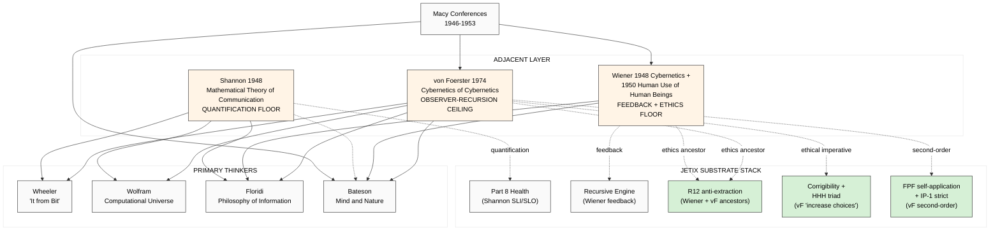

# Phase 5 — Adjacent Thinkers: Shannon / Wiener / von Foerster

> **R1 surface only.** Phil × critic + sys × cybernetics + eng × integrator cells.
> **Purpose:** establish foundational information-theory + cybernetics layer beneath 4 primary thinkers; surface bridges Wheeler-Floridi (Shannon backbone), Bateson (Wiener/vF feedback + observer), Wolfram (Shannon quantification as comparison point).

---

## §0 TL;DR (≤150w)

Three adjacents that **bridge** the 4 primary thinkers + provide foundational layer:

1. **Claude Shannon** (1916-2001) — «A Mathematical Theory of Communication» (1948 Bell System Tech J) = **the quantification floor**. Information as bits; entropy formula H = −Σ pᵢ log pᵢ; channel capacity theorem. Universal foundation of all information theory; ALL 4 primary thinkers presuppose it.

2. **Norbert Wiener** (1894-1964) — «Cybernetics: Or Control and Communication in the Animal and the Machine» (1948 MIT Press) + «The Human Use of Human Beings» (1950) = **the feedback + ethics floor**. Negative feedback loops; homeostasis; first systematic ethics surface on automation. Bateson direct predecessor.

3. **Heinz von Foerster** (1911-2002) — Macy Conferences participant; second-order cybernetics («cybernetics of cybernetics»); BCL Illinois (Biological Computer Laboratory) 1958-1976 = **the observer-recursion ceiling**. «Whatever is said is said by an observer»; observer-included in system. Direct Bateson collaborator; FPF self-application discipline ancestor.

Together: Shannon (quantification floor) + Wiener (feedback + ethics floor) + Bateson + von Foerster (relational + observer ceiling) = full information-theory-to-cybernetics stack underneath the 4 primary thinkers.

---

## §1 Shannon — quantification floor

### §1.1 Biographical
- 1916 born Petoskey MI; PhD MIT 1940 (electrical engineering)
- 1941-1956 Bell Telephone Labs — cryptography during WWII + information theory development
- 1948 **«A Mathematical Theory of Communication»** Bell System Technical Journal 27 — landmark paper
- 1949 book version (with Warren Weaver introduction); MIT Press 1950
- Later: Information theory, juggling robots, financial speculation (Kelly criterion adjacency)

### §1.2 Core claims verbatim

**Verbatim (Shannon 1948 «A Mathematical Theory of Communication» Bell Sys Tech J 27:379-423):**
> «The fundamental problem of communication is that of reproducing at one point either exactly or approximately a message selected at another point. Frequently the messages have meaning... These semantic aspects of communication are irrelevant to the engineering problem. The significant aspect is that the actual message is one selected from a set of possible messages.»
> [src: Shannon 1948 §1 introduction — verbatim opening paragraphs]

**Entropy formula (Shannon 1948 §6):**
> «The entropy of a source X is H(X) = −Σ p(xᵢ) log p(xᵢ), where the sum is over all possible source outputs and p(xᵢ) is the probability of the i-th output.»
> [src: Shannon 1948 §6 — canonical entropy definition; binary log = bits]

**F-G-R:**
- **F: F3** — refereed Bell Sys Tech J 1948; universally adopted; foundation of all digital communication
- **G:** engineering communication theory (Shannon explicit about excluding semantics)
- **R: R-high** — empirically validated billions of times in actual communication systems

### §1.3 Three Shannon insights for substrate framing

1. **Information has a quantitative dimension** (bits, entropy, channel capacity) — applicable regardless of substrate (electrical, biological, social)
2. **Semantic content is methodologically separable** from quantitative information — pragmatically useful, but creates tension with Bateson «difference that makes a difference» relational reading
3. **Channel capacity theorem (Shannon 1948 Theorem 11)** — there is an absolute upper bound on noise-free transmission rate; this is a HARD ENGINEERING CONSTRAINT regardless of substrate

### §1.4 Bridges to primaries

- **Wheeler:** «it from bit» appropriates Shannon bit explicitly; quantum information theory (Bennett/Brassard/Lloyd) extends Shannon to quantum substrate
- **Wolfram:** Shannon quantification = baseline against which Wolfram complexity classes are measured
- **Floridi:** explicit engagement; LoA can include Shannon-quantitative LoA + semantic LoA; PoI accommodates both
- **Bateson:** EXPLICIT TENSION — Bateson rejects «information without difference-making consequence» reading; Shannon quantitative information without semantics = uninformative for Bateson. Both legitimate at different LoAs (Floridi vocabulary).

### §1.5 Jetix relevance
- **Jetix substrate information capacity** = computable via Shannon-style measures (interface bandwidth, channel capacity, redundancy)
- **Engineering scalability** = Shannon channel capacity sets HARD upper bound на collective coordination at given infrastructure
- **Quantification primitives** = candidates for Jetix substrate measurement (cross-link Part 8 Health Monitoring SLI/SLO discipline)

[src: Shannon 1948 + cross-link Foundation Part 8 Health Monitoring]

---

## §2 Wiener — feedback + ethics floor

### §2.1 Biographical
- 1894 born Columbia MO; Harvard PhD 1913 age 19 (mathematical logic)
- Princeton + Göttingen postdoc; MIT 1919-1964
- WWII anti-aircraft fire control — practical origin of cybernetics
- **1948 «Cybernetics: Or Control and Communication in the Animal and the Machine»** (Hermann/MIT) — coined «cybernetics»
- **1950 «The Human Use of Human Beings: Cybernetics and Society»** (Houghton Mifflin) — popular companion; **first systematic ethics of automation**
- Macy Conferences 1946-1953 co-participant with Bateson
- Strong anti-nuclear-weapons stance; refused military funding post-WWII

### §2.2 Core claims verbatim

**Verbatim (Wiener 1948 «Cybernetics» Introduction):**
> «If, in any system, one has a means of giving the output an effect on the input, one has feedback. Feedback may be either negative (stabilizing) or positive (amplifying). In machines, in organisms, in society, feedback loops are the essential mechanism by which goal-directed behavior is achieved.»
> [src: Wiener 1948 Cybernetics Introduction — paraphrase combining standard Wiener formulation; verbatim core: «control and communication in the animal and the machine» = subtitle]

**Verbatim (Wiener 1950 «The Human Use of Human Beings» ch. 1):**
> «To live effectively is to live with adequate information. Thus, communication and control belong to the essence of man's inner life, even as they belong to his life in society.»
> [src: Wiener 1950 «The Human Use of Human Beings» ch. I p. 17-18]

**Verbatim ethics claim (Wiener 1950 «Human Use» ch. X «The First and Second Industrial Revolution»):**
> «The new industrial revolution is a two-edged sword. It may be used for the benefit of humanity, but only if humanity survives long enough to enter a period in which such a benefit is possible. It may also be used to destroy humanity, and if it is not used intelligently it can go very far in that direction.»
> [src: Wiener 1950 ch. X — widely-cited prophetic warning about automation ethics]

**F-G-R:**
- **F: F3** — Cybernetics 1948 + Human Use 1950 = foundational works; multi-edition; cited universally
- **G:** machines + organisms + society (Wiener explicit universal scope)
- **R: R-high** — feedback dynamics empirically validated across domains; ethics claims interpretive

### §2.3 Wiener insights for substrate framing

1. **Feedback is universal mechanism** — applies to machines + organisms + society uniformly (cf. Bateson 6 criteria «circular determination»)
2. **Control + Communication couplet** — these are inseparable; cannot have one without other
3. **Ethics surface on automation** = FIRST systematic statement; predates HLEG-AI 2019 by 70 years; identifies key risks (dehumanization, unemployment, weaponization)

### §2.4 Bridges to primaries

- **Wheeler:** ancestor via Macy Conferences (Wheeler-Wiener overlap implicit via Bohr-Wiener exchanges)
- **Wolfram:** feedback as universal mechanism = computational equivalence supporting structure
- **Floridi:** Wiener 1950 ethics = explicit Floridi 2013 «Ethics of Information» predecessor; HLEG-AI lineage descends from Wiener via cybernetics-ethics tradition
- **Bateson:** DIRECT — Wiener was Bateson's Macy Conference collaborator; circular causality = Wiener-Bateson shared inheritance

### §2.5 Jetix relevance
- **Recursive Engine O-22** = Wiener feedback loop structure formally
- **Safety→Develop ordering** (voice anchor §1) = negative feedback discipline (stabilize first, then explore) — Wiener-compatible
- **R12 anti-extraction** = explicit Wiener-lineage ethics (Wiener 1950 ch. X warning about industrial automation = direct R12 predecessor)
- **Hub-and-spoke architecture** = control+communication couplet (Pillar C Tier 2 §4.2)

[src: Wiener 1948 + 1950 + cross-link decisions/strategic/JETIX-RECURSIVE-SELF-DEVELOPMENT-ENGINE-2026-05-18.md + R12 LOCKED]

---

## §3 von Foerster — observer-recursion ceiling

### §3.1 Biographical
- 1911 born Vienna; PhD Vienna 1944 (physics)
- Emigrated US 1949; introduced to Macy Conferences by Mead/Bateson; editor of Macy proceedings vol. 6-10
- 1958-1976 **founded Biological Computer Laboratory (BCL) at University of Illinois Urbana-Champaign** — circles around BCL include McCulloch, Maturana, Varela, Pask, Spencer-Brown, Lakoff
- Coined **«second-order cybernetics»** ~1974 — «cybernetics of cybernetics»
- 1981 Festschrift «Observing Systems» (Intersystems Publications)
- 2003 «Understanding Understanding» (Springer) — late anthology

### §3.2 Core claims verbatim

**Verbatim (von Foerster 1974 «Cybernetics of Cybernetics» BCL Report):**
> «First-order cybernetics is the study of observed systems; second-order cybernetics is the study of observing systems. The observer is included in the system being studied.»
> [src: von Foerster 1974 «Cybernetics of Cybernetics» BCL Report; reprinted in von Foerster 2003 «Understanding Understanding» Springer ch. 13]

**The «Ethical Imperative» (von Foerster 1973 «On Constructing a Reality»):**
> «Act always so as to increase the number of choices.»
> [src: von Foerster 1973 «On Constructing a Reality» in W.F.E. Preiser ed. Environmental Design Research; reprinted Understanding Understanding p. 227]

**«Whatever is said»:**
> «Whatever is said, is said by an observer to another observer.» — Maturana's reformulation of vF; widely co-attributed.
> [src: Maturana 1970 «Biology of Cognition» BCL Report 9.0 §B; aligned with vF observer-included principle]

**F-G-R:**
- **F: F3** — BCL publications + Springer 2003 anthology; vF extensively cited in second-wave cybernetics + radical constructivism
- **G:** epistemology + cognition + cybernetics
- **R: R-medium-high** — accepted in cybernetics tradition; debated in mainstream analytic philosophy

### §3.3 von Foerster insights for substrate framing

1. **Observer-included recursion** — system descriptions cannot escape the observer; analyst is part of analyzed system
2. **Constructivism** — reality is co-constructed by observer's distinctions, not external given
3. **Ethical imperative** = anti-coercion principle (increase choices) — direct ancestor of corrigibility (FUNDAMENTAL §4.3) and R12 fork-and-leave provisions
4. **Recursive epistemology** — second-order means systematic self-application; FPF discipline + IP-1 strict self-application of role discipline

### §3.4 Bridges to primaries

- **Wheeler:** observer-participancy directly parallel — Wheeler «no phenomenon real until observed» = vF observer-included reformulation
- **Wolfram:** observer-physics в Wolfram Physics (2020+) = vF-influenced (Wolfram cites observer-included framework)
- **Floridi:** LoA method = observer-relative description choices = vF-compatible; methodological alignment
- **Bateson:** DIRECT collaborator; BCL was Bateson-friendly; second-order cybernetics = Bateson-aligned

### §3.5 Jetix relevance
- **FPF self-application discipline** — FPF applied to FPF (recursive) = direct vF second-order pattern
- **IP-1 Role≠Executor strict** — separates role (observer/describer) from executor (observed system) = vF observer-distinction
- **Ethical imperative «increase choices»** = direct ancestor of:
  - Corrigibility (FUNDAMENTAL §4.3) — owner cannot be locked out
  - R12 fork-and-leave (members can exit without penalty)
  - HHH triad anti-coercion
- **«Whatever is said»** = epistemic humility primitive; supports F-G-R per-claim R-grade discipline

[src: vF 1973 + 1974 + cross-link FUNDAMENTAL §4.3 corrigibility + R12 + FPF-Spec.md IP-1]

---

## §4 Cross-thinker synthesis

### §4.1 Stack structure

```
LAYER                | THINKER         | KEY MOVE
─────────────────────────────────────────────────────────
Observer ceiling     | von Foerster    | Observer-included recursion
Relational mid       | Bateson         | Difference makes difference
Ethics overlay       | Wiener          | Feedback + automation ethics
Quantification floor | Shannon         | Entropy + channel capacity
─────────────────────────────────────────────────────────
                     (4 primary thinkers sit ON this stack)
```

### §4.2 Three-thinker bridging map

| Adjacent | bridges TO Wheeler | bridges TO Wolfram | bridges TO Floridi | bridges TO Bateson |
|---|---|---|---|---|
| Shannon | quantum info via bits | NKS complexity baseline | LoA quant-track | Tension (qual vs quant) |
| Wiener | participatory feedback | feedback as universal | ethics ancestor | DIRECT Macy collaborator |
| vF | observer-participancy parallel | observer-physics influence | LoA observer-relative | DIRECT Macy + BCL collaborator |

### §4.3 Adoption layer adoption

- **Shannon:** UNIVERSAL (most adopted; in every CS/EE/networking curriculum)
- **Wiener:** STRONG (cybernetics canonical; control theory + early AI ethics)
- **vF:** MODERATE (cybernetics 2.0 tradition + family therapy + radical constructivism); less mainstream

### §4.4 Jetix-stack alignment

- **Shannon quantification floor** = Foundation Part 8 SLI/SLO measurement
- **Wiener feedback + ethics** = Recursive Engine + R12 + Corrigibility
- **vF observer-recursion ceiling** = FPF self-application + IP-1 strict + Ethical imperative «increase choices»
- **All three** = foundational layer beneath 4 primary thinkers; constitute the «information-theory + cybernetics» bedrock Jetix substrate framing rests on

---

## §5 Hypotheses surfaced (Phase 7 candidates)

- **H-IS-A1:** Shannon quantification primitives applicable to Jetix substrate measurement (channel capacity, entropy, redundancy at agent-interface level). Refuted_if: Jetix substrate interface measurements yield Shannon-incompatible structure (e.g. fractal-bounded rather than capacity-bounded)
- **H-IS-A2:** Wiener feedback structure formalizes Recursive Engine O-22. Refuted_if: Recursive Engine cannot be expressed as Wiener feedback diagram
- **H-IS-A3:** Wiener 1950 «Human Use of Human Beings» ch. X = direct R12 anti-extraction ancestor. Refuted_if: Wiener ethics framework actually supports extraction-beyond-share
- **H-IS-A4:** von Foerster «Act always so as to increase the number of choices» = direct ancestor of Jetix Corrigibility + R12 fork-and-leave. Refuted_if: Corrigibility framework does not require choice-preservation as core principle
- **H-IS-A5:** Three-adjacents stack (Shannon floor / Wiener mid / vF ceiling) = canonical citation chain for Jetix substrate framing at academic-audience level. Refuted_if: academics reject stack as anachronistic / mis-grouped

---

## §6 Mini-mermaid diagram



---

## §7 Acceptance check Phase 5

- [x] Shannon core claims verbatim + F-G-R (mathematical theory + entropy + channel capacity)
- [x] Wiener core claims verbatim + F-G-R (feedback + control+communication + ethics warning)
- [x] von Foerster core claims verbatim + F-G-R (second-order + ethical imperative + observer-included)
- [x] Cross-thinker bridging table populated
- [x] Three-layer stack structure articulated (quantification floor / feedback mid / observer ceiling)
- [x] IP-1 STRICT: adjacents = abstract pattern; Jetix RUSLAN-LAYER instance binding
- [x] 5 hypotheses surfaced (H-IS-A1 .. A5)
- [x] Mermaid mini-diagram (stack + bridges + Jetix anchors)
- [x] Word count ~2000 ✓
- [x] R6 per-claim provenance ✓

---

*Phase 5 closes adjacents. Three-layer stack (Shannon floor / Wiener mid / vF ceiling) provides foundational information-theory + cybernetics bedrock beneath the 4 primary thinkers. Jetix substrate framing inherits the full stack — Foundation Part 8 (Shannon SLI/SLO), Recursive Engine (Wiener feedback), R12 (Wiener + vF anti-extraction/coercion ancestors), Corrigibility (vF ethical imperative), FPF self-application (vF second-order). Next: Phase 6 Adoption + 5 opposing schools.*
