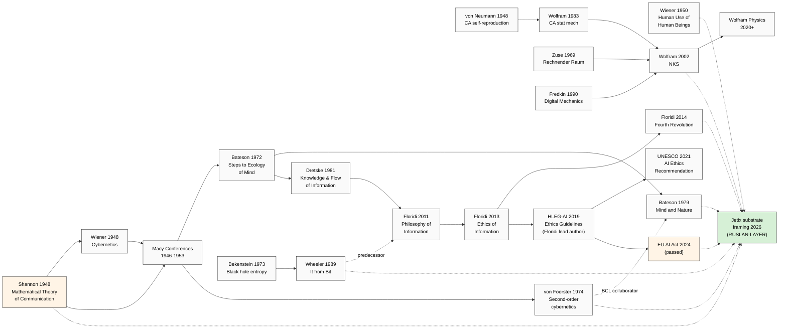

# Lineage Tree — 70+ years info-substrate philosophy

```mermaid
%%{init: {'theme':'base', 'themeVariables': {'primaryTextColor':'#000000','textColor':'#000000','lineColor':'#333333','primaryBorderColor':'#333333','primaryColor':'#fafafa','noteTextColor':'#000000','noteBkgColor':'#fff8d5','edgeLabelBackground':'#ffffff'}}}%%
graph LR
    SHA48["Shannon 1948<br/>Mathematical Theory<br/>of Communication"]
    WIE48["Wiener 1948<br/>Cybernetics"]
    WIE50["Wiener 1950<br/>Human Use of<br/>Human Beings"]
    MACY["Macy Conferences<br/>1946-1953"]

    VN48["von Neumann 1948<br/>CA self-reproduction"]
    BAT72["Bateson 1972<br/>Steps to Ecology<br/>of Mind"]
    BAT79["Bateson 1979<br/>Mind and Nature"]

    VF74["von Foerster 1974<br/>Second-order<br/>cybernetics"]
    BEK73["Bekenstein 1973<br/>Black hole entropy"]
    WHE89["Wheeler 1989<br/>It from Bit"]

    ZUSE69["Zuse 1969<br/>Rechnender Raum"]
    FRED["Fredkin 1990<br/>Digital Mechanics"]
    WOL83["Wolfram 1983<br/>CA stat mech"]
    WOL02["Wolfram 2002<br/>NKS"]
    WOL20["Wolfram Physics<br/>2020+"]

    DRET81["Dretske 1981<br/>Knowledge & Flow<br/>of Information"]
    FLO11["Floridi 2011<br/>Philosophy of<br/>Information"]
    FLO13["Floridi 2013<br/>Ethics of<br/>Information"]
    FLO14["Floridi 2014<br/>Fourth Revolution"]

    HLEG19["HLEG-AI 2019<br/>Ethics Guidelines<br/>(Floridi lead author)"]
    UNESCO21["UNESCO 2021<br/>AI Ethics<br/>Recommendation"]
    EUAA24["EU AI Act 2024<br/>(passed)"]

    JX["Jetix substrate<br/>framing 2026<br/>(RUSLAN-LAYER)"]

    SHA48 --> WIE48
    SHA48 --> MACY
    WIE48 --> MACY
    MACY --> BAT72
    MACY --> VF74
    VN48 --> WOL83
    BAT72 --> BAT79
    VF74 -.->|"BCL collaborator"| BAT79
    BEK73 --> WHE89
    BAT72 --> DRET81
    WHE89 -.->|"predecessor"| FLO11
    ZUSE69 --> WOL02
    FRED --> WOL02
    WOL83 --> WOL02
    WOL02 --> WOL20
    DRET81 --> FLO11
    FLO11 --> FLO13
    FLO13 --> FLO14
    FLO13 --> HLEG19
    HLEG19 --> UNESCO21
    HLEG19 --> EUAA24

    SHA48 -.-> JX
    WIE50 -.-> JX
    BAT79 -.-> JX
    VF74 -.-> JX
    WHE89 -.-> JX
    WOL02 -.-> JX
    FLO14 -.-> JX
    EUAA24 -.-> JX

    style JX fill:#d6f0d6
    style SHA48 fill:#fff4e6
    style EUAA24 fill:#fff4e6
```
