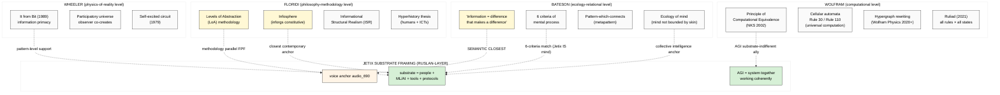

# 4 Primary Thinkers × Core Claims Matrix

```mermaid
%%{init: {'theme':'base', 'themeVariables': {'primaryTextColor':'#000000','textColor':'#000000','lineColor':'#333333','primaryBorderColor':'#333333','primaryColor':'#fafafa','noteTextColor':'#000000','noteBkgColor':'#fff8d5','edgeLabelBackground':'#ffffff'}}}%%
graph TB
    subgraph "WHEELER (physics-of-reality level)"
        W1["It from Bit (1989)<br/>information primacy"]
        W2["Participatory universe<br/>observer co-creates"]
        W3["Self-excited circuit<br/>(1979)"]
    end

    subgraph "WOLFRAM (computational level)"
        WO1["Principle of<br/>Computational Equivalence<br/>(NKS 2002)"]
        WO2["Cellular automata<br/>Rule 30 / Rule 110<br/>(universal computation)"]
        WO3["Hypergraph rewriting<br/>(Wolfram Physics 2020+)"]
        WO4["Ruliad (2021)<br/>all rules × all states"]
    end

    subgraph "FLORIDI (philosophy-methodology level)"
        F1["Levels of Abstraction<br/>(LoA) methodology"]
        F2["Infosphere<br/>(inforgs constitutive)"]
        F3["Informational<br/>Structural Realism (ISR)"]
        F4["Hyperhistory thesis<br/>(humans + ICTs)"]
    end

    subgraph "BATESON (ecology-relational level)"
        B1["'Information = difference<br/>that makes a difference'"]
        B2["6 criteria of<br/>mental process"]
        B3["Pattern-which-connects<br/>(metapattern)"]
        B4["Ecology of mind<br/>(mind not bounded by skin)"]
    end

    subgraph "JETIX SUBSTRATE FRAMING (RUSLAN-LAYER)"
        JX1["substrate = people +<br/>ML/AI + tools + protocols"]
        JX2["AGI = system together<br/>working coherently"]
        JX3["voice anchor audio_690"]
    end

    W1 -.->|"pattern-level support"| JX1
    WO1 -.->|"AGI substrate-indifferent ally"| JX2
    F1 -.->|"methodology parallel FPF"| JX3
    F2 -.->|"closest contemporary anchor"| JX1
    B1 -.->|"SEMANTIC CLOSEST"| JX3
    B2 -.->|"6-criteria match (Jetix IS mind)"| JX1
    B4 -.->|"collective intelligence anchor"| JX1

    style JX1 fill:#d6f0d6
    style JX2 fill:#d6f0d6
    style JX3 fill:#fff4e6
    style B1 fill:#fff8d5
    style F1 fill:#fff8d5
    style F2 fill:#fff8d5
```
