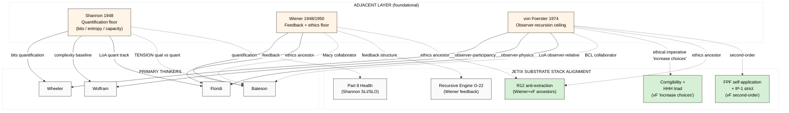

# Adjacent Thinkers Bridging Structure

```mermaid
%%{init: {'theme':'base', 'themeVariables': {'primaryTextColor':'#000000','textColor':'#000000','lineColor':'#333333','primaryBorderColor':'#333333','primaryColor':'#fafafa','noteTextColor':'#000000','noteBkgColor':'#fff8d5','edgeLabelBackground':'#ffffff'}}}%%
graph TB
    subgraph "ADJACENT LAYER (foundational)"
        SHA["Shannon 1948<br/>Quantification floor<br/>(bits / entropy / capacity)"]
        WIE["Wiener 1948/1950<br/>Feedback + ethics floor"]
        VF["von Foerster 1974<br/>Observer-recursion ceiling"]
    end

    subgraph "PRIMARY THINKERS"
        WH["Wheeler"]
        WO["Wolfram"]
        FL["Floridi"]
        BA["Bateson"]
    end

    subgraph "JETIX SUBSTRATE STACK ALIGNMENT"
        P8["Part 8 Health<br/>(Shannon SLI/SLO)"]
        RE["Recursive Engine O-22<br/>(Wiener feedback)"]
        R12["R12 anti-extraction<br/>(Wiener+vF ancestors)"]
        CORR["Corrigibility +<br/>HHH triad<br/>(vF 'increase choices')"]
        FPF["FPF self-application<br/>+ IP-1 strict<br/>(vF second-order)"]
    end

    SHA -->|"bits quantification"| WH
    SHA -->|"complexity baseline"| WO
    SHA -->|"LoA quant track"| FL
    SHA -.->|"TENSION qual vs quant"| BA

    WIE -->|"feedback"| BA
    WIE -->|"ethics ancestor"| FL
    WIE -.->|"Macy collaborator"| BA

    VF -->|"observer-participancy"| WH
    VF -->|"observer-physics"| WO
    VF -->|"LoA observer-relative"| FL
    VF -.->|"BCL collaborator"| BA

    SHA -.->|"quantification"| P8
    WIE -.->|"feedback structure"| RE
    WIE -.->|"ethics ancestor"| R12
    VF -.->|"ethical imperative<br/>'increase choices'"| CORR
    VF -.->|"ethics ancestor"| R12
    VF -.->|"second-order"| FPF

    style SHA fill:#fff4e6
    style WIE fill:#fff4e6
    style VF fill:#fff4e6
    style R12 fill:#d6f0d6
    style CORR fill:#d6f0d6
    style FPF fill:#d6f0d6
```
