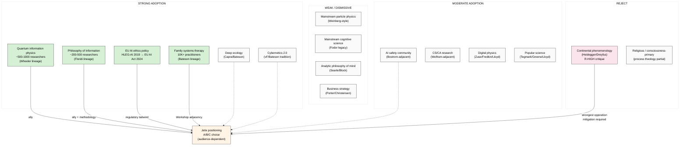

# Adoption-Rejection Matrix

```mermaid
%%{init: {'theme':'base', 'themeVariables': {'primaryTextColor':'#000000','textColor':'#000000','lineColor':'#333333','primaryBorderColor':'#333333','primaryColor':'#fafafa','noteTextColor':'#000000','noteBkgColor':'#fff8d5','edgeLabelBackground':'#ffffff'}}}%%
graph TB
    subgraph "STRONG ADOPTION"
        QI["Quantum information physics<br/>~500-1000 researchers<br/>(Wheeler lineage)"]
        POI["Philosophy of Information<br/>~200-500 researchers<br/>(Floridi lineage)"]
        EU["EU AI ethics policy<br/>HLEG-AI 2019 → EU AI Act 2024"]
        FT["Family systems therapy<br/>10K+ practitioners<br/>(Bateson lineage)"]
        DE["Deep ecology<br/>(Capra/Bateson)"]
        CY2["Cybernetics 2.0<br/>(vF/Bateson tradition)"]
    end

    subgraph "MODERATE ADOPTION"
        AS["AI safety community<br/>(Bostrom-adjacent)"]
        CS["CS/CA research<br/>(Wolfram-adjacent)"]
        DP["Digital physics<br/>(Zuse/Fredkin/Lloyd)"]
        POP["Popular science<br/>(Tegmark/Greene/Lloyd)"]
    end

    subgraph "WEAK / DISMISSIVE"
        MP["Mainstream particle physics<br/>(Weinberg-style)"]
        MC["Mainstream cognitive science<br/>(Fodor legacy)"]
        AP["Analytic philosophy of mind<br/>(Searle/Block)"]
        BS["Business strategy<br/>(Porter/Christensen)"]
    end

    subgraph "REJECT"
        PH["Continental phenomenology<br/>(Heidegger/Dreyfus)<br/>R-HIGH critique"]
        REL["Religious / consciousness-primary<br/>(process theology partial)"]
    end

    JX["Jetix positioning<br/>A/B/C choice<br/>(audience-dependent)"]

    QI -->|"ally"| JX
    POI -->|"ally + methodology"| JX
    EU -->|"regulatory tailwind"| JX
    FT -->|"Workshop adjacency"| JX
    DE -.-> JX
    CY2 -.-> JX
    AS -.-> JX
    PH -->|"strongest opposition<br/>mitigation required"| JX

    style QI fill:#d6f0d6
    style POI fill:#d6f0d6
    style EU fill:#d6f0d6
    style FT fill:#d6f0d6
    style PH fill:#fce4ec
    style JX fill:#fff4e6
```
