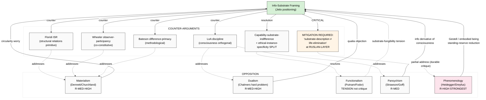

# 5 Opposing Schools

```mermaid
%%{init: {'theme':'base', 'themeVariables': {'primaryTextColor':'#000000','textColor':'#000000','lineColor':'#333333','primaryBorderColor':'#333333','primaryColor':'#fafafa','noteTextColor':'#000000','noteBkgColor':'#fff8d5','edgeLabelBackground':'#ffffff'}}}%%
graph TB
    INFO["Info-Substrate Framing<br/>(Jetix positioning)"]

    subgraph "OPPOSITION"
        MAT["Materialism<br/>(Dennett/Churchland)<br/>R-MED-HIGH"]
        DUA["Dualism<br/>(Chalmers hard problem)<br/>R-MED-HIGH"]
        FUN["Functionalism<br/>(Putnam/Fodor)<br/>TENSION not critique"]
        PAN["Pansychism<br/>(Strawson/Goff)<br/>R-MED"]
        PHE["Phenomenology<br/>(Heidegger/Dreyfus)<br/>R-HIGH STRONGEST"]
    end

    subgraph "COUNTER-ARGUMENTS"
        FLO_R["Floridi ISR<br/>(structural relations primitive)"]
        WHE_R["Wheeler observer-participancy<br/>(co-constitutive)"]
        BAT_R["Bateson difference-primacy<br/>(methodological)"]
        LOA["LoA discipline<br/>(consciousness orthogonal)"]
        SPLIT["Capability-substrate-indifference<br/>+ ethical-instance-specificity SPLIT"]
        MIT["MITIGATION REQUIRED:<br/>'substrate-description ≠<br/>life-elimination'<br/>at RUSLAN-LAYER"]
    end

    MAT -->|"circularity worry"| INFO
    DUA -->|"qualia objection"| INFO
    FUN -.->|"substrate-fungibility tension"| INFO
    PAN -->|"info derivative of consciousness"| INFO
    PHE -->|"Gestell / embodied being<br/>standing-reserve reduction"| INFO

    INFO -->|"counter"| FLO_R
    FLO_R -.->|"addresses"| MAT
    INFO -->|"counter"| WHE_R
    WHE_R -.->|"addresses"| MAT
    INFO -->|"counter"| BAT_R
    BAT_R -.->|"addresses"| MAT
    INFO -->|"counter"| LOA
    LOA -.->|"addresses"| DUA
    LOA -.->|"addresses"| PAN
    INFO -->|"resolution"| SPLIT
    SPLIT -.->|"resolves"| FUN
    INFO -->|"CRITICAL"| MIT
    MIT -.->|"partial address (durable critique)"| PHE

    style PHE fill:#fce4ec
    style MIT fill:#fff4e6
    style INFO fill:#d6f0d6
```
