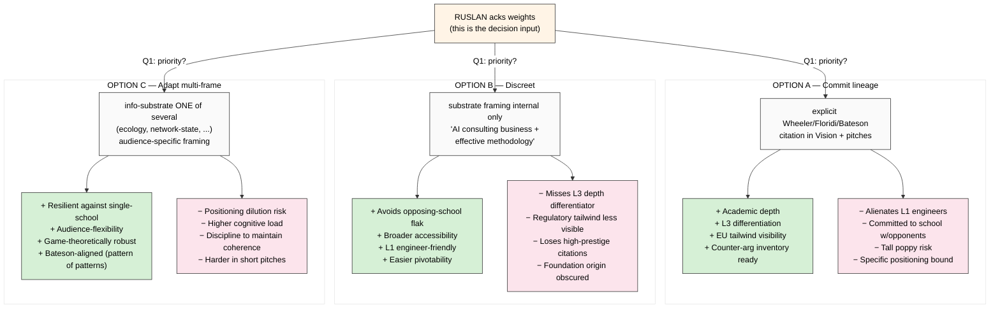

# Jetix Positioning A/B/C — Tradeoffs Surfaced (NO Recommendation per R1)

```mermaid
%%{init: {'theme':'base', 'themeVariables': {'primaryTextColor':'#000000','textColor':'#000000','lineColor':'#333333','primaryBorderColor':'#333333','primaryColor':'#fafafa','noteTextColor':'#000000','noteBkgColor':'#fff8d5','edgeLabelBackground':'#ffffff'}}}%%
graph TB
    RUSLAN["RUSLAN acks weights<br/>(this is the decision input)"]

    subgraph "OPTION A — Commit lineage"
        A_DESC["explicit Wheeler/Floridi/Bateson<br/>citation in Vision + pitches"]
        A_PRO["+ Academic depth<br/>+ L3 differentiation<br/>+ EU tailwind visibility<br/>+ Counter-arg inventory ready"]
        A_CON["− Alienates L1 engineers<br/>− Committed to school w/opponents<br/>− Tall poppy risk<br/>− Specific positioning bound"]
    end

    subgraph "OPTION B — Discreet"
        B_DESC["substrate framing internal only<br/>'AI consulting business +<br/>effective methodology'"]
        B_PRO["+ Avoids opposing-school flak<br/>+ Broader accessibility<br/>+ L1 engineer-friendly<br/>+ Easier pivotability"]
        B_CON["− Misses L3 depth differentiator<br/>− Regulatory tailwind less visible<br/>− Loses high-prestige citations<br/>− Foundation origin obscured"]
    end

    subgraph "OPTION C — Adapt multi-frame"
        C_DESC["info-substrate ONE of several<br/>(ecology, network-state, ...)<br/>audience-specific framing"]
        C_PRO["+ Resilient against single-school<br/>+ Audience-flexibility<br/>+ Game-theoretically robust<br/>+ Bateson-aligned (pattern of patterns)"]
        C_CON["− Positioning dilution risk<br/>− Higher cognitive load<br/>− Discipline to maintain coherence<br/>− Harder in short pitches"]
    end

    RUSLAN -->|"Q1: priority?"| A_DESC
    RUSLAN -->|"Q1: priority?"| B_DESC
    RUSLAN -->|"Q1: priority?"| C_DESC

    A_DESC --> A_PRO
    A_DESC --> A_CON
    B_DESC --> B_PRO
    B_DESC --> B_CON
    C_DESC --> C_PRO
    C_DESC --> C_CON

    style RUSLAN fill:#fff4e6
    style A_PRO fill:#d6f0d6
    style B_PRO fill:#d6f0d6
    style C_PRO fill:#d6f0d6
    style A_CON fill:#fce4ec
    style B_CON fill:#fce4ec
    style C_CON fill:#fce4ec
```
