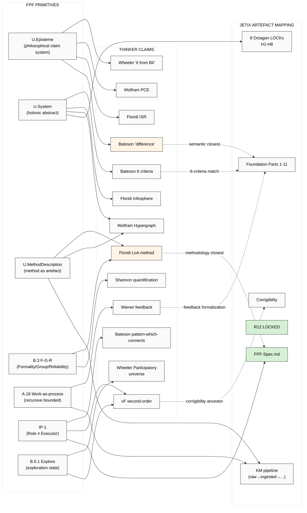

# FPF Primitive Mapping × Thinker Claims

```mermaid
%%{init: {'theme':'base', 'themeVariables': {'primaryTextColor':'#000000','textColor':'#000000','lineColor':'#333333','primaryBorderColor':'#333333','primaryColor':'#fafafa','noteTextColor':'#000000','noteBkgColor':'#fff8d5','edgeLabelBackground':'#ffffff'}}}%%
graph LR
    subgraph "FPF PRIMITIVES"
        UE["U.Episteme<br/>(philosophical claim system)"]
        US["U.System<br/>(holonic abstract)"]
        UM["U.MethodDescription<br/>(method as artefact)"]
        BFGR["B.3 F-G-R<br/>(Formality/Group/Reliability)"]
        AWORK["A.16 Work-as-process<br/>(recursive bounded)"]
        IP1["IP-1<br/>(Role ≠ Executor)"]
        BEXP["B.5.1 Explore<br/>(exploration state)"]
    end

    subgraph "THINKER CLAIMS"
        WH_IFB["Wheeler 'It from Bit'"]
        WH_PART["Wheeler Participatory<br/>universe"]
        WO_PCE["Wolfram PCE"]
        WO_HG["Wolfram Hypergraph"]
        FL_LOA["Floridi LoA method"]
        FL_INF["Floridi Infosphere"]
        FL_ISR["Floridi ISR"]
        BA_DIFF["Bateson 'difference'"]
        BA_6CRIT["Bateson 6 criteria"]
        BA_PATCONN["Bateson pattern-which-connects"]
        SHA_QUANT["Shannon quantification"]
        WIE_FB["Wiener feedback"]
        VF_2ND["vF second-order"]
    end

    subgraph "JETIX ARTEFACT MAPPING"
        FOUND["Foundation Parts 1-11"]
        OCT["8 Octagon LOCKs<br/>H1-H8"]
        FPFS["FPF-Spec.md"]
        R12L["R12 LOCKED"]
        CORR["Corrigibility"]
        PIPE["KM pipeline<br/>(raw→ingested→...)"]
    end

    UE --> WH_IFB
    UE --> WO_PCE
    UE --> FL_ISR
    UE --> BA_DIFF

    US --> BA_6CRIT
    US --> FL_INF
    US --> WO_HG
    US --> OCT

    UM --> FL_LOA
    UM --> WO_HG
    UM --> PIPE

    BFGR --> FL_LOA
    BFGR --> SHA_QUANT

    AWORK --> WIE_FB
    AWORK --> PIPE

    IP1 --> BA_PATCONN
    IP1 --> VF_2ND
    IP1 --> FPFS

    BEXP --> WH_PART
    BEXP --> VF_2ND

    FL_LOA -.->|"methodology closest"| FPFS
    BA_DIFF -.->|"semantic closest"| FOUND
    BA_6CRIT -.->|"6-criteria match"| FOUND
    WIE_FB -.->|"feedback formalization"| FOUND
    VF_2ND -.->|"corrigibility ancestor"| CORR

    style FL_LOA fill:#fff4e6
    style BA_DIFF fill:#fff4e6
    style FPFS fill:#d6f0d6
    style R12L fill:#d6f0d6
```
