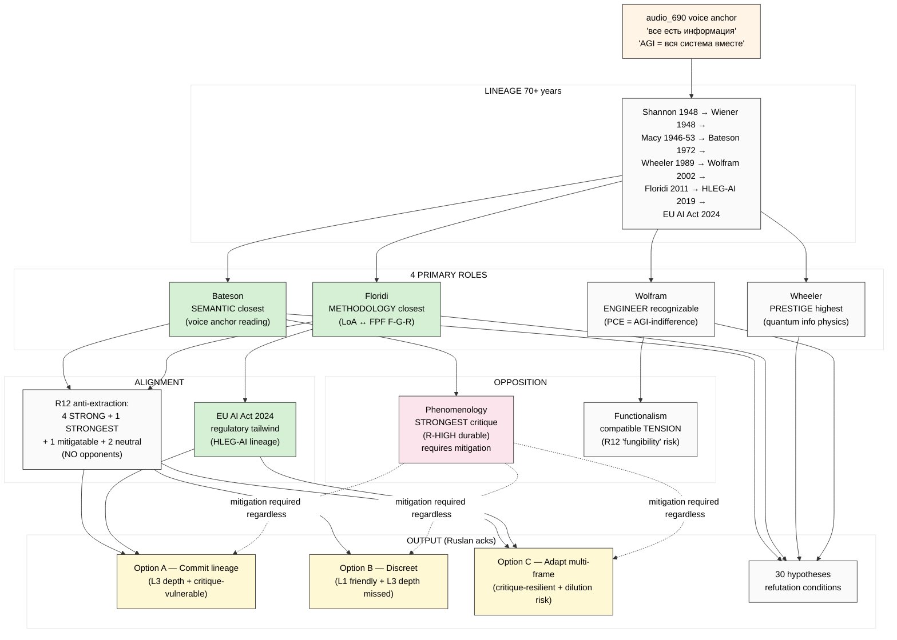

# Master TL;DR — K-1 at-a-glance

```mermaid
%%{init: {'theme':'base', 'themeVariables': {'primaryTextColor':'#000000','textColor':'#000000','lineColor':'#333333','primaryBorderColor':'#333333','primaryColor':'#fafafa','noteTextColor':'#000000','noteBkgColor':'#fff8d5','edgeLabelBackground':'#ffffff'}}}%%
graph TB
    INPUT["audio_690 voice anchor<br/>'все есть информация'<br/>'AGI = вся система вместе'"]

    subgraph "LINEAGE 70+ years"
        STACK["Shannon 1948 → Wiener 1948 →<br/>Macy 1946-53 → Bateson 1972 →<br/>Wheeler 1989 → Wolfram 2002 →<br/>Floridi 2011 → HLEG-AI 2019 →<br/>EU AI Act 2024"]
    end

    subgraph "4 PRIMARY ROLES"
        BA["Bateson<br/>SEMANTIC closest<br/>(voice anchor reading)"]
        FL["Floridi<br/>METHODOLOGY closest<br/>(LoA ↔ FPF F-G-R)"]
        WH["Wheeler<br/>PRESTIGE highest<br/>(quantum info physics)"]
        WO["Wolfram<br/>ENGINEER recognizable<br/>(PCE = AGI-indifference)"]
    end

    subgraph "OPPOSITION"
        PHE["Phenomenology<br/>STRONGEST critique<br/>(R-HIGH durable)<br/>requires mitigation"]
        FUN["Functionalism<br/>compatible TENSION<br/>(R12 'fungibility' risk)"]
    end

    subgraph "ALIGNMENT"
        R12_ALIGN["R12 anti-extraction:<br/>4 STRONG + 1 STRONGEST<br/>+ 1 mitigatable + 2 neutral<br/>(NO opponents)"]
        REG["EU AI Act 2024<br/>regulatory tailwind<br/>(HLEG-AI lineage)"]
    end

    subgraph "OUTPUT (Ruslan acks)"
        OPT_A["Option A — Commit lineage<br/>(L3 depth + critique-vulnerable)"]
        OPT_B["Option B — Discreet<br/>(L1 friendly + L3 depth missed)"]
        OPT_C["Option C — Adapt multi-frame<br/>(critique-resilient + dilution risk)"]
        BANK["30 hypotheses<br/>refutation conditions"]
    end

    INPUT --> STACK
    STACK --> BA
    STACK --> FL
    STACK --> WH
    STACK --> WO
    BA --> R12_ALIGN
    FL --> R12_ALIGN
    FL --> REG
    BA --> PHE
    WO --> FUN
    R12_ALIGN --> OPT_A
    R12_ALIGN --> OPT_B
    R12_ALIGN --> OPT_C
    REG --> OPT_A
    REG --> OPT_C
    PHE -.->|"mitigation required regardless"| OPT_A
    PHE -.->|"mitigation required regardless"| OPT_B
    PHE -.->|"mitigation required regardless"| OPT_C
    BA --> BANK
    FL --> BANK
    WH --> BANK
    WO --> BANK

    style INPUT fill:#fff4e6
    style BA fill:#d6f0d6
    style FL fill:#d6f0d6
    style PHE fill:#fce4ec
    style REG fill:#d6f0d6
    style OPT_A fill:#fff8d5
    style OPT_B fill:#fff8d5
    style OPT_C fill:#fff8d5
```
