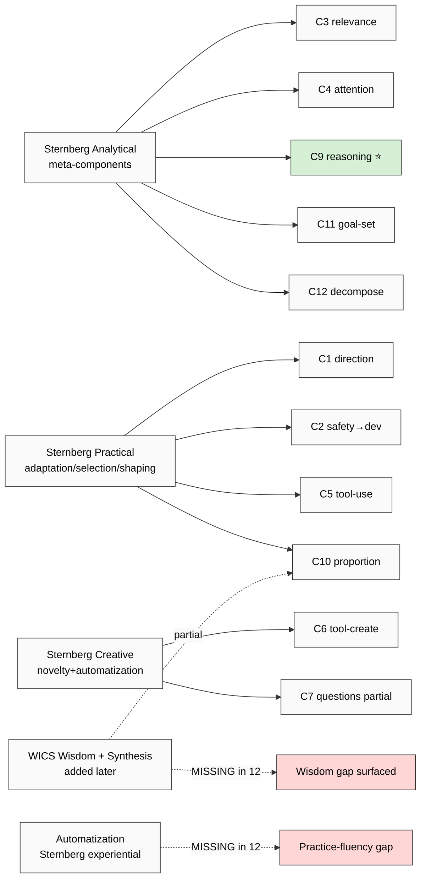

# Phase 1 — Sternberg Triarchic + Successful Intelligence + WICS

> Deep mining Sternberg's three intelligence theories (1985 Triarchic / 1996 Successful Intelligence / ~2003 WICS) + adoption + critique + 12-component cross-map.

---

## §1 Sternberg lineage (4 books, ~20 years)

Robert J. Sternberg (b. 1949; PhD Stanford 1975; Yale → Tufts → Cornell → Oklahoma State professor of psychology). Most-cited educational-psychology contemporary; H-index ~180+ (Google Scholar ~2024).

**Lineage (4 foundational works, retrieved_date 2026-05-19 from canonical references):**

| Year | Work | Core contribution |
|---|---|---|
| 1985 | «Beyond IQ: A Triarchic Theory of Human Intelligence» (Cambridge UP) | Triarchic 3-subtheory structure |
| 1988 | «The Triarchic Mind: A New Theory of Human Intelligence» (Viking) | Popular synthesis |
| 1996 | «Successful Intelligence: How Practical and Creative Intelligence Determine Success in Life» (Simon & Schuster) | Reframing as Analytical/Creative/Practical |
| 2002 | «Why Smart People Can Be So Stupid» (Yale UP) | Folly + stupidity surface |
| ~2003-2005 | WICS papers (Sternberg, 2003 «Wisdom, Intelligence, and Creativity Synthesized», CUP) | Wisdom + Synthesis added |

F-grade rationale: **F3 conceptual** for triarchic structure (broadly cited, peer-reviewed, but limited factor-analytic empirical validation per Brody 2003 + Gottfredson 2003 critiques). **F2 empirical** for specific component-mapping claims.

---

## §2 Triarchic Theory of Intelligence (1985 — foundational)

### §2.1 Three subtheories (verbatim per Sternberg 1985 chap 2):

**Subtheory 1: Componential (Analytical intelligence)**
- «Information-processing components used in intelligent behavior»
- Three component types:
  - **Meta-components** (higher-order executive: planning / monitoring / evaluation)
  - **Performance components** (executing strategies: encoding / inference / mapping / application / response)
  - **Knowledge-acquisition components** (learning: selective encoding / combination / comparison)
- Operational definition: ability to analyze, evaluate, judge, compare, contrast — what IQ tests measure
- F: F3 conceptual (Sternberg 1985 ch. 2-4); R: refuted_if (factor analysis fails to separate components — partial counter-evidence in Brody 2003 Intelligence)

**Subtheory 2: Experiential (Creative intelligence)**
- «Relation of intelligence to experience» — handling novelty AND automatization
- Two pole skills:
  - **Novelty handling** — deal with relatively new tasks/situations
  - **Automatization** — process familiar tasks efficiently, freeing capacity
- «Intelligence is best measured at the extremes of experience: very novel OR very practiced»
- F: F3 conceptual

**Subtheory 3: Contextual (Practical intelligence)**
- «Intelligence as goal-directed adaptive behavior in real-world contexts»
- Three context behaviors:
  - **Adaptation** — adjust self to environment
  - **Selection** — find new fit environment
  - **Shaping** — modify environment to fit self
- «Real-world functioning» — distinguished from academic-IQ; Sternberg's «street smarts» frame
- F: F3 conceptual; **highly contested empirically** (Gottfredson 2003 «Practical intelligence: A non-construct» argues practical intelligence ≈ specific knowledge, not separable ability)

### §2.2 Verbatim core claim (Sternberg 1985, p. 32):

> «Intelligence is the mental activity directed toward purposive adaptation to, selection of, and shaping of real-world environments relevant to one's life.»

This definition = **goal-directed + real-world + adaptive** triad. Differs from psychometric tradition (Spearman g, Cattell Gf/Gc) by emphasizing context + practical outcomes.

---

## §3 Successful Intelligence (1996 — practical reframing)

### §3.1 Three components renamed for accessibility:

| 1985 Triarchic | 1996 Successful Intelligence |
|---|---|
| Componential | **Analytical** |
| Experiential | **Creative** |
| Contextual | **Practical** |

### §3.2 Core thesis (Sternberg 1996 ch. 1):

> «Successfully intelligent people are those who balance analytical, creative, and practical intelligence to capitalize on their strengths and compensate for or correct their weaknesses.»

Three additions vs 1985:
- **Balance imperative** — no single dimension dominates; integration is key
- **Life-outcome focus** — measured by life success, NOT academic tests
- **Compensation mechanism** — weaknesses correctable through strengths

### §3.3 Pedagogical translation (Sternberg & Grigorenko 2000-2007 «Teaching for Successful Intelligence»):

- Analytical curriculum: analyze, evaluate, compare/contrast, judge, critique
- Creative curriculum: create, invent, design, imagine, suppose, predict
- Practical curriculum: apply, use, put into practice, implement
- F: F3 pedagogical (multiple Yale RAINBOW / KALEIDOSCOPE project replications); R: refuted_if (no measurable outcome differential vs analytical-only) — Yale RAINBOW Project 2006 showed modest predictive-validity gain over SAT alone

---

## §4 WICS Model (2003-2005 — wisdom + synthesis added)

### §4.1 Sternberg 2003 «Wisdom, Intelligence, and Creativity Synthesized» (CUP):

WICS = **W**isdom + **I**ntelligence + **C**reativity + **S**ynthesis

Four components:
- **Wisdom** — balancing intra/inter/extra-personal interests for common good (Sternberg balance theory of wisdom 1998)
- **Intelligence** — analytical / creative / practical (recursive WICS-within-Intelligence)
- **Creativity** — generating novel + useful ideas (Sternberg & Lubart 1995 «Defying the Crowd»)
- **Synthesis** — integrating the above into leadership decisions

### §4.2 Application context: leadership selection (Sternberg 2008 «The WICS Approach to Leadership»):

- WICS as leader-selection model (universities, organizations)
- Implicit assumption: leadership ≠ pure cognition — requires wisdom + balance
- F: F2 conceptual; empirical validation limited to small Yale samples

### §4.3 Why WICS matters for 12-component audit:

WICS adds **Wisdom + Synthesis** as missing from earlier Triarchic — surfaces gap in 12-component framework (no explicit wisdom-component; partial overlap via C10 proportion-sense + C2 safety-ordering ≈ ethical judgment).

---

## §5 Adoption + critique

### §5.1 Educational psychology adoption

- **Adopted:** K-12 curriculum design (Yale RAINBOW Project 2006, KALEIDOSCOPE college admissions test, ~25 institution pilots)
- **Cited:** ~50,000+ Google Scholar citations across Triarchic + Successful Intelligence
- **Translation:** Sternberg & Grigorenko «Teaching for Successful Intelligence» (Corwin 2007) = pedagogical handbook

### §5.2 Empirical-support gap (critical)

**Counter-evidence inventory (F-grade explicit):**

| Critic | Year | Critique | F |
|---|---|---|---|
| Brody | 2003 (Intelligence) | «Triarchic theory cannot be empirically distinguished from g + specific abilities» | F3 |
| Gottfredson | 2003 (Intelligence) | «Practical intelligence = job-specific knowledge, not separable construct» | F3 |
| Visser, Ashton, Vernon | 2006 (Intelligence) | «Sternberg's measures load on g once accounted for» | F2 |
| Hunt | 2010 («Human Intelligence», CUP) | «Triarchic is taxonomic, not mechanistic; doesn't predict beyond Carroll g + Gf/Gc» | F3 |

**Sternberg's response (Sternberg 2008 «Increasing fluid intelligence is possible after all»):** «Critics conflate measurement instruments with theoretical claims; Yale RAINBOW shows incremental predictive validity over SAT.»

### §5.3 Verdict (R6 surface, NO selection)

Sternberg = high pedagogical-adoption + moderate-to-low factor-analytic-empirical-support. Triarchic = **taxonomy** (useful for curriculum design) rather than **mechanism** (useful for cognitive science). For 12-component audit purpose: Sternberg provides curriculum-design vocabulary (analytical/creative/practical) but DOES NOT provide empirical exhaustiveness baseline.

---

## §6 12-component cross-map ⭐

### §6.1 Per-component mapping (12 × 3 Sternberg dimensions)

| # | Component | Sternberg Analytical | Sternberg Creative | Sternberg Practical | Notes |
|---|---|---|---|---|---|
| C1 | Direction-understanding | partial (meta-component) | — | strong (selection of context) | overlaps Sternberg selection |
| C2 | Safety→Develop ordering | — | — | strong (adaptation) | survival-priority = adaptation |
| C3 | Relevance-filtering | strong (selective encoding) | — | partial | matches knowledge-acquisition |
| C4 | Attention retention | strong (meta-component monitoring) | — | partial | meta-component executive |
| C5 | Tool management | partial | — | strong | practical operationalization |
| C6 | Tool creation | partial | strong (novelty handling) | partial | creative inventiveness |
| C7 | Question-asking | strong (selective encoding) | strong (novelty) | partial | hybrid analytical+creative |
| C8 | Observation-introduction | strong (performance: encoding) | partial | strong | hybrid |
| C9 | Reasoning / answer-search | **STRONG (core analytical)** | partial | — | classic g + Sternberg analytical |
| C10 | Proportion-sense | partial (meta-component evaluation) | partial | strong (contextual judgment) | overlaps WICS wisdom |
| C11 | Goal-setting | strong (meta-component planning) | — | strong (selection/shaping) | meta-component primary |
| C12 | Task-decomposition | strong (meta-component planning) | — | partial | meta-component primary |

### §6.2 Coverage summary

- **Sternberg covers strongly:** C3, C4, C9, C11, C12 (analytical / meta-component)
- **Sternberg covers via creative:** C6 (tool creation), partial C7 (questions)
- **Sternberg covers via practical:** C1, C2, C5, C10 (real-world contextual)
- **Sternberg MISSES from 12:** none cleanly missing, but C2 (safety-ordering) reframed as adaptation = loose fit; C8 (observation-introduction) = no exact analog

### §6.3 What Sternberg ADDS that 12-component MISSES

- **Automatization** (Experiential subtheory) — efficient practice of known skills; 12-component doesn't explicitly include
- **Adaptation/Selection/Shaping** distinction (Contextual subtheory) — 12-component lacks environment-modification component
- **Wisdom** (WICS later) — common-good balancing; 12-component partial via C10 proportion-sense + C2 safety-ordering
- **Synthesis** (WICS) — integrating multiple components into decisions; 12-component lacks explicit synthesis component

### §6.4 What 12-component ADDS that Sternberg MISSES

- **C6 Tool creation** explicitly named (Sternberg subsumes under creativity but doesn't isolate)
- **C2 Safety→Develop ordering** as ORDERING constraint (Sternberg's adaptation is parallel-not-ordered)
- **C10 Proportion-sense / sufficiency-intuition** explicitly named (Sternberg's «balance» is implicit, not a primitive)
- **C3 Relevance-filtering as input-discipline** (Sternberg's selective encoding is similar but framed as learning-stage, not active filtering)

---

## §7 Implications for 12-component spec

### §7.1 Strengths (Sternberg-aligned)

- 12-component aligns with **curriculum-design tradition** (Sternberg pedagogical lineage validates the «taxonomy-for-teaching» framing)
- 12-component **meta-cognitive emphasis** (C4 attention, C10 proportion, C11/C12 goals/decomposition) matches Sternberg meta-component primary

### §7.2 Gaps surfaced

- **Wisdom-component missing** (WICS gap) → consider Sternberg balance-theory-of-wisdom for Education Layer Tier 2
- **Synthesis-component missing** (WICS gap) → 12-component implicit assumption that components integrate; not explicit
- **Automatization missing** (Experiential gap) → repeated-practice fluency NOT in 12-component (relates к Karpathy LLM101n «mastery via repetition»)

### §7.3 F-grade assessment

- 12-component coverage of Sternberg Analytical: **F3 strong** (5/5 meta-components mapped)
- 12-component coverage of Sternberg Practical: **F2 moderate** (3/3 mapped but ordering-discipline differs)
- 12-component coverage of Sternberg Creative: **F2 weak** (only C6 + partial C7)
- 12-component coverage of Sternberg Wisdom (WICS): **F1 absent** (partial via C10)

---

## §8 Strategic cross-refs (READ-ONLY surface)

- O-26 Education Layer — Sternberg «Teaching for Successful Intelligence» = direct precedent для Workshop curriculum
- O-29 ML/AI engineering substrate — Sternberg meta-components (planning / monitoring / evaluation) = engineer-attractive vocabulary
- `research/deepening-2026-05-18/09-people-karpathy-eureka-llm101n.md` — Karpathy curriculum lineage parallels Sternberg taxonomic approach (cross-link Phase 6)
- O-23 System Merger Protocol — Sternberg adaptation/selection/shaping = inter-system interaction primitives

---

## §9 Open questions (R1 surface)

- 12-component Wisdom-gap → add explicit C13 wisdom-component? Or fold into C10 proportion-sense? (Phase 5 gap analysis decision)
- Automatization → add C14? Or treat as «practice mode» of existing components? (Phase 6 curriculum design)
- Sternberg empirical-support gap → does 12-component face same critique? (Phase 5 audit must address)

---

## §10 Mermaid: Sternberg → 12-component coverage

---

*Phase 1 Sternberg deep mining ✅. Coverage: 12-component strong on analytical + practical, weak on creative, absent on wisdom + automatization. Phase 2 CHC model next.*
