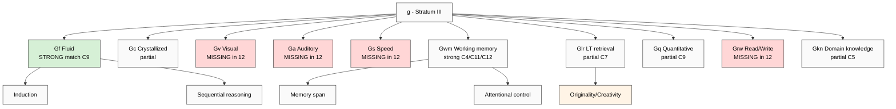

# Phase 2 — Cattell-Horn-Carroll (CHC) Model: Most-Empirically-Grounded Intelligence Taxonomy

> Deep mining CHC three-stratum model (1941-1993-2018) + 10 broad / 70+ narrow abilities + WAIS/WJ adoption + 12-component coverage matrix. CHC = empirical gold standard for cognitive-ability taxonomy.

---

## §1 CHC lineage (3 traditions merged)

CHC = synthesis of three independent research programs over 60+ years:

| Decade | Tradition | Key figures | Contribution |
|---|---|---|---|
| 1940s-60s | Cattell-Horn | Raymond Cattell (1941, 1963, 1966), John Horn (1965, 1968) | Gf/Gc distinction + 9-factor model |
| 1980s-90s | Carroll three-stratum | John B. Carroll (1993) | Reanalysis of 461 factor-analytic datasets |
| 2000s+ | Integrated CHC | Kevin McGrew + Dawn Flanagan (1998-2018), W. Joel Schneider | Synthesis of Cattell-Horn + Carroll into unified taxonomy |

**Latest authoritative synthesis (retrieved_date 2026-05-19):**
- Schneider, W. J., & McGrew, K. S. (2018). «The Cattell-Horn-Carroll Theory of Cognitive Abilities». In Flanagan & McDonough (eds.) *Contemporary Intellectual Assessment* (4th ed., pp. 73-163). Guilford.

F-grade rationale: **F4 empirical** — most-replicated factor-structure in intelligence research (Carroll 1993 reanalysis ~461 datasets); broad ability factors consistently emerge across cultures + age groups + measurement instruments.

---

## §2 Cattell-Horn foundation (1941-1980)

### §2.1 Cattell 1941-1963 Gf/Gc distinction

Raymond Cattell (1905-1998; PhD London, King's College). Trained under Spearman; developed factor analysis methods.

**Verbatim core claim (Cattell 1963, J. Educational Psych, 54(1):1-22):**

> «There are two general factors of intelligence — fluid (Gf) representing biological capacity and crystallized (Gc) representing accumulated learning — which decline and grow at different rates across the lifespan.»

- **Gf (Fluid intelligence):** «raw» reasoning + problem-solving in novel situations; biologically rooted; **peaks around age 20-25 + declines from ~30**
- **Gc (Crystallized intelligence):** acquired knowledge + verbal skills + experience-based; **grows across lifespan until ~60-70**

**Empirical signature:** age curves diverge — strongest empirical signature for the Gf/Gc distinction (cross-validated Salthouse 2010, Trends Cogn Sci).

### §2.2 Horn 1965-1968 nine-factor extension

John Horn (1928-2006; PhD Illinois, Cattell student). Extended Cattell с additional factors:

- **Gv** Visual Processing
- **Ga** Auditory Processing
- **Gs** Processing Speed
- **Gsm** Short-Term Memory (later renamed Gwm Working Memory)
- **Glr** Long-Term Retrieval
- **Gq** Quantitative Reasoning
- **Grw** Reading and Writing
- **Gkn** Domain-specific Knowledge (Horn-McArdle 2007)

**Horn's critique of g (general intelligence):** Horn rejected Spearman g as artifact of correlated lower factors. Gf vs Gc + multiple specialized factors = better fit than single g (Horn 1989).

---

## §3 Carroll's three-stratum theory (1993 — landmark)

### §3.1 «Human Cognitive Abilities» (Carroll 1993, CUP)

John B. Carroll (1916-2003; PhD Minnesota). Most-comprehensive reanalysis of human-intelligence factor structure ever conducted:
- **461 datasets** reanalyzed (1925-1987)
- **~130,000 subjects** aggregated
- Hierarchical factor analysis (then-state-of-the-art technique)

### §3.2 Three-stratum model (Carroll 1993 ch. 15)

**Verbatim core claim (Carroll 1993, p. 626):**

> «The data accumulated over more than half a century strongly support the existence of three strata of cognitive abilities: a small number of broad factors (stratum II) and a single general factor (stratum III) underlying many specific abilities (stratum I).»

Three strata:
- **Stratum III (top):** g — general intelligence (Spearman 1904 vindicated as higher-order factor)
- **Stratum II (middle):** 8 broad factors — Gf, Gc, Gy (general memory), Gv, Gu (auditory), Gr (retrieval), Gs (processing speed), Gt (decision/RT)
- **Stratum I (bottom):** 70+ narrow abilities (highly specific skills: inductive reasoning, vocabulary, spatial scanning, etc.)

### §3.3 Difference from Cattell-Horn

- Carroll preserves g; Horn rejects
- Carroll uses hierarchical model (g above broads); Horn uses flat multi-factor
- Carroll empirically grounded in 461 datasets; Horn theoretically derived

---

## §4 Integrated CHC (McGrew 1997-2018)

### §4.1 McGrew & Flanagan synthesis

Kevin McGrew (Director, Institute for Applied Psychometrics) + Dawn Flanagan (St. John's University). Integrated Cattell-Horn + Carroll into unified CHC taxonomy used by majority of modern cognitive assessment batteries.

**McGrew 1997 «The Intelligence Test Desk Reference»:** First formal CHC integration; merged 9-Horn + 3-stratum-Carroll into ~10 broad abilities under g (or sub-g cluster в Horn-purist variants).

### §4.2 CHC broad abilities (Schneider & McGrew 2018)

| Code | Name | Definition (Schneider-McGrew 2018 verbatim) |
|---|---|---|
| **Gf** | Fluid reasoning | «Deliberate, controlled mental operations to solve novel problems that cannot be performed automatically» |
| **Gc** | Comprehension-knowledge | «Depth + breadth of acquired knowledge of dominant culture (verbal + general world knowledge)» |
| **Gv** | Visual processing | «Generate, perceive, analyze, synthesize, manipulate visual information» |
| **Ga** | Auditory processing | «Detect, discriminate, perceive auditory stimuli + manipulate language sounds» |
| **Gs** | Processing speed | «Ability to perform automatic, simple cognitive tasks quickly + fluently» |
| **Gwm** | Working memory (was Gsm) | «Encode, maintain, manipulate information in immediate awareness» |
| **Glr** | Long-term storage + retrieval | «Store information + fluently retrieve it later through association» |
| **Gq** | Quantitative knowledge | «Ability to comprehend quantitative concepts + perform mathematical operations» |
| **Grw** | Reading + writing | «Read fluently + understand text + write coherently» |
| **Gkn** | Domain-specific knowledge | «Specialized knowledge in narrow domain (technical, professional, scholarly)» |

### §4.3 Narrow abilities (70+) — sample

Under **Gf:**
- Induction (I) — inferring rules from examples
- General sequential reasoning (RG) — multi-step deductive
- Quantitative reasoning (RQ) — math reasoning

Under **Gwm:**
- Memory span (MS) — digit span
- Working memory capacity (WM) — manipulation
- Attentional control (AC) — distraction resistance

Under **Glr:**
- Associative memory (MA)
- Free recall memory (M6)
- Ideational fluency (FI)
- Naming facility (NA)
- Word fluency (FW)
- Originality / creativity (FO)

**70+ total narrow abilities** documented in Schneider-McGrew 2018 ch. 6-12.

---

## §5 Empirical foundation + measurement

### §5.1 Used in modern cognitive batteries

| Battery | Year | CHC alignment |
|---|---|---|
| **WAIS-IV** (Wechsler Adult Intelligence Scale) | 2008 | 4-factor model maps к Gc/Gv/Gwm/Gs |
| **WAIS-V** | 2024 | Explicit CHC alignment + Gf added |
| **WJ-IV** (Woodcock-Johnson IV) | 2014 | Direct CHC primary taxonomy |
| **KABC-II** (Kaufman) | 2004 | CHC-informed dual-theory |
| **DAS-II** (Differential Ability Scales) | 2007 | CHC-aligned |
| **Stanford-Binet 5** | 2003 | CHC-influenced |

**Implication:** CHC = de facto industry standard for cognitive assessment.

### §5.2 Cross-cultural validation

- Wang & Lin (2016) — CHC factor structure replicates в Chinese WJ-III data (N=2,254)
- Reynolds et al. (2013) — CHC stable across European + American samples
- F: F4 empirical (broad cross-cultural support); R: refuted_if (specific narrow abilities fail replication — partial counter-evidence for Gq/Grw outside Western contexts)

### §5.3 Critique inventory

| Critic | Critique | F |
|---|---|---|
| Gardner (1983/1999) | «CHC too quantitative; misses musical/bodily-kinesthetic/intrapersonal» | F2 (theoretical, not empirical) |
| Sternberg (1996) | «CHC lacks practical-intelligence dimension» | F2 |
| Critical-pedagogy tradition | «CHC reproduces Western academic-IQ bias» | F2 (qualitative argument) |
| Schneider-McGrew rebuttal | «Gkn domain-specific knowledge accommodates non-Western expertise» | F3 |

---

## §6 12-component cross-map ⭐

### §6.1 Per-component vs 10 CHC broad abilities

| # | Component | Gf | Gc | Gv | Ga | Gs | Gwm | Glr | Gq | Grw | Gkn | Coverage notes |
|---|---|---|---|---|---|---|---|---|---|---|---|---|
| C1 | Direction-understanding | partial | partial | — | — | — | — | — | — | — | partial | Meta-cognitive; underrepresented |
| C2 | Safety→Develop ordering | partial | partial | — | — | — | — | — | — | — | — | Executive function; CHC misses ordering-discipline |
| C3 | Relevance-filtering | strong | — | — | — | — | strong | — | — | — | — | Gwm attentional control + Gf selection |
| C4 | Attention retention | — | — | — | — | strong | **STRONG** | — | — | — | — | Gwm AC narrow ability |
| C5 | Tool management | — | partial | partial | — | partial | — | — | — | — | strong | Gkn domain-specific |
| C6 | Tool creation | strong | — | — | — | — | — | partial | — | — | — | Gf novel-problem-solving |
| C7 | Question-asking | strong | partial | — | — | — | — | strong | — | — | — | Gf+Glr ideational fluency |
| C8 | Observation-introduction | partial | — | strong | strong | — | — | — | — | — | — | Gv+Ga perception |
| C9 | Reasoning / answer-search | **STRONG (Gf core)** | partial | — | — | — | strong | partial | — | — | — | Gf = direct match |
| C10 | Proportion-sense | partial | partial | — | — | — | — | — | partial | — | strong | Gq+Gkn judgment |
| C11 | Goal-setting | strong | — | — | — | — | strong | — | — | — | — | Gwm executive function |
| C12 | Task-decomposition | strong | — | — | — | — | strong | — | — | — | — | Gwm + Gf planning |

### §6.2 CHC coverage of 12-component (overall)

- **Strongly covered by CHC:** C3, C4, C6, C7, C9, C11, C12 (7/12 — cognitive/executive components map к Gf+Gwm)
- **Partially covered:** C1, C2, C5, C8, C10 (5/12 — practical/contextual components)
- **CHC strongest match:** **C9 reasoning ⇄ Gf** (near-isomorphic)
- **CHC weakest match:** C2 safety-ordering (no CHC analog — CHC is descriptive-taxonomic, not prescriptive-ordering)

### §6.3 What CHC ADDS that 12-component MISSES

CHC broad abilities NOT explicitly in 12-component:

1. **Gv Visual processing** — spatial reasoning, mental rotation, visual memory (Gardner overlap: spatial intelligence). 12-component MISSES.
2. **Ga Auditory processing** — phonemic awareness, sound discrimination, music perception (Gardner overlap: musical). 12-component MISSES.
3. **Gs Processing speed** — reaction time, perceptual speed, automaticity. 12-component MISSES (related: Sternberg automatization gap).
4. **Glr Long-term retrieval** — associative memory, free recall, naming facility, **CREATIVITY (originality FO is Glr narrow!)**. 12-component MISSES explicit memory + creativity dimensions.
5. **Gq Quantitative reasoning** — math-specific reasoning. 12-component partial via C9.
6. **Grw Reading + writing** — literacy. 12-component MISSES (assumed implicit).
7. **Gkn Domain-specific knowledge** — expert knowledge. 12-component partial via C5.

**Major gap:** **Gv + Ga + Gs + Glr + Grw = 5 broad abilities missing or underrepresented in 12-component.**

### §6.4 What 12-component ADDS that CHC MISSES

CHC is **descriptive cognitive-ability taxonomy** — does NOT capture:

1. **C2 Safety→Develop ordering** (constitutional discipline; CHC has no prescriptive primitive)
2. **C10 Proportion-sense / sufficiency-intuition** (CHC is quantitative; «достаточность» is qualitative judgment)
3. **C6 Tool creation as DISTINCT from tool use** (CHC bundles into Gf+Gkn; 12-component separates)
4. **C7 Question-asking as ACTIVE practice** (CHC has Glr ideational fluency = generation, but not specifically question-formation discipline)
5. **C8 Observation-introduction as DELIBERATE METHOD** (CHC has Gv/Ga as receptive abilities, not active practice)

---

## §7 Strategic implications

### §7.1 Strengths of 12-component vs CHC

- 12-component captures **active practice + ordering + discipline** dimensions CHC ignores
- 12-component aligns с executive-function / metacognition emphasis (modern cognitive psych)
- 12-component is **prescriptive curriculum-design ready**; CHC is descriptive-taxonomic

### §7.2 Gaps vs CHC

- **5 broad abilities** weakly represented (Gv, Ga, Gs, Glr, Grw)
- 70+ narrow abilities → 12-component has no granular sub-level
- Empirical-validation gap — 12-component has zero factor-analytic validation; CHC has ~80 years

### §7.3 F-grade verdict

- 12-component CHC-Gf coverage: **F4 strong** (C3+C6+C9+C11+C12 ≈ Gf)
- 12-component CHC-Gwm coverage: **F3 moderate** (C4 attention strong; working-memory implicit)
- 12-component CHC-other-broads coverage: **F2 weak** (Gv/Ga/Gs/Glr/Grw underrepresented)
- 12-component empirical validation: **F1 absent** (NO factor-analytic study; needed for Education Layer Tier 1)

---

## §8 Mermaid: CHC three-stratum vs 12-component

---

## §9 Open questions (R1 surface)

- Visual + auditory processing: add C13 (sensory-perception)? Or treat as substrate (not component)? (Phase 5 decision)
- Processing speed / automaticity: add as «mastery stage» of existing components (Sternberg automatization parallel)? Or as separate dimension?
- Empirical validation: should 12-component undergo factor-analytic study (Tier 1 curriculum measurement)? Phase 7 hypothesis candidate.

---

*Phase 2 CHC deep mining ✅. CHC = empirical gold standard; 12-component STRONG match с Gf+Gwm + WEAK match Gv+Ga+Gs+Glr+Grw. 5 missing-component candidates surfaced. Phase 3 Gardner next.*
