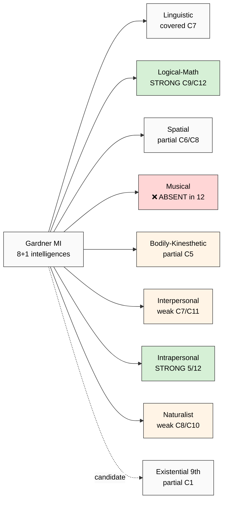

# Phase 3 — Gardner Multiple Intelligences: 8+1 Intelligences + Empirical Critique

> Deep mining Gardner's MI theory (1983/1999/2006) — massive educational adoption + persistent empirical-validation gap. Phase 3 = R1-disciplined: deep critique inventory mandatory.

---

## §1 Gardner lineage

Howard Gardner (b. 1943; Harvard professor of cognition + education). H-index ~190 (Google Scholar 2024). Among top-10 most-influential educational thinkers globally per Education-Next 2008 + 2024 surveys.

**Lineage (3 foundational works):**

| Year | Work | Contribution |
|---|---|---|
| 1983 | «Frames of Mind: The Theory of Multiple Intelligences» (Basic Books) | Original 7-intelligence theory |
| 1999 | «Intelligence Reframed: Multiple Intelligences for the 21st Century» (Basic Books) | 8th intelligence (naturalist) + existential candidate |
| 2006 | «Multiple Intelligences: New Horizons in Theory and Practice» (Basic Books) | Educational practice synthesis |

F-grade rationale: **F2 conceptual + theoretical** (rich taxonomy, broadly adopted in K-12); **F1 empirical** (limited factor-analytic validation; Waterhouse 2006 + Visser 2006 critiques sharpen this).

---

## §2 Original 7 intelligences (Gardner 1983)

### §2.1 The 7 (verbatim per «Frames of Mind»):

**Verbatim core claim (Gardner 1983, p. 8):**

> «An intelligence is the ability to solve problems, or to create products, that are valued within one or more cultural settings.»

The 7 (1983):

1. **Linguistic intelligence** — sensitivity to spoken + written language + use of language to accomplish goals (poets, writers, lawyers, orators)
2. **Logical-mathematical intelligence** — capacity to analyze problems logically + reason mathematically (mathematicians, scientists, logicians)
3. **Spatial intelligence** — pattern recognition в both wide spaces + confined areas (architects, sculptors, surgeons, pilots, navigators)
4. **Musical intelligence** — skill в performance, composition, appreciation of musical patterns (musicians, composers, conductors)
5. **Bodily-kinesthetic intelligence** — using whole body or parts to solve problems / create products (dancers, athletes, surgeons, craftspeople)
6. **Interpersonal intelligence** — understand + work with others (teachers, salespeople, religious leaders, political leaders)
7. **Intrapersonal intelligence** — understand oneself, including emotions, fears, motivations (philosophers, psychologists, spiritual leaders)

### §2.2 Gardner's 8 criteria for «an intelligence» (1983 ch. 4)

To qualify as an intelligence (per Gardner's epistemological criteria):

1. Potential isolation by brain damage (neuropsychological)
2. Existence of idiots savants, prodigies, exceptional individuals
3. Identifiable core operation(s) (cognitive-psychological)
4. Distinctive developmental history + definable expert end-state
5. Evolutionary history + plausibility
6. Support from experimental-psychological tasks
7. Support from psychometric findings
8. Susceptibility to encoding в symbol system

**Note:** Gardner explicitly designed these criteria to be looser than factor-analytic validation (which he considered narrow + culturally biased).

---

## §3 8th + candidate 9th (Gardner 1999)

### §3.1 Naturalist intelligence (8th, added 1999)

**Verbatim per «Intelligence Reframed» (1999, p. 48):**

> «The naturalist intelligence designates the human ability to discriminate among living things (plants, animals) as well as sensitivity to other features of the natural world (clouds, rock configurations).»

Examples: Darwin, Linnaeus, indigenous hunters, gardeners, naturalists.

### §3.2 Existential intelligence (candidate 9th, 1999)

> «The capacity to locate oneself with respect to the furthest reaches of the cosmos + the related capacity to locate oneself with respect to the existential features of the human condition.»

Gardner explicitly LEFT existential as candidate (NOT formal): «I deliberately use the term '8½ intelligences' to indicate my hesitation» (1999, p. 65).

### §3.3 Why not 9 intelligences?

Gardner argued existential intelligence lacks neurobiological evidence (criterion 1) — no brain-region-localization comparable к other 8. Pedagogical-philosophical, NOT neurocognitive.

---

## §4 Adoption — massive in K-12

### §4.1 Educational practice

- **K-12 USA:** ~50%+ of public schools incorporate MI vocabulary в curriculum design (NEA 2015 estimate)
- **Project Zero (Harvard):** Gardner's research center; «Teaching for Understanding» framework derived from MI
- **Schools designed around MI:** Key Learning Community (Indianapolis), Atrium School (Boston), New City School (St. Louis) — multiple-decades operation
- **Pop-psychology:** MI vocabulary («I'm a kinesthetic learner», «she's musical-intelligence») = mainstream cultural concept

### §4.2 Why adopted?

- **Equity-affirming:** every learner has «their intelligence» — no child labeled «not smart»
- **Curriculum-design vocabulary:** teachers gain pedagogical taxonomy
- **Cultural-pluralism friendly:** non-Western expertise (indigenous naturalist knowledge, oral-tradition linguistic) gains legitimacy
- **Educational-philosophy resonance:** matches Dewey progressive education + constructivist pedagogy

---

## §5 Empirical critique inventory ⭐ (R1 mandatory)

Per prompt §12 anti-list «Dismiss Gardner low-empirical critique → forbidden». Critique must be surfaced.

### §5.1 Waterhouse 2006 (CRITICAL — most-cited critique)

**Lynn Waterhouse (2006). «Multiple Intelligences, the Mozart Effect, and Emotional Intelligence: A Critical Review.» Educational Psychologist, 41(4), 207-225.**

Verbatim core critiques:

> «Despite a quarter century of widespread use в educational contexts, MI theory has not been supported by published studies of any kind that have been peer-reviewed in scientifically-acceptable journals.»

> «The eight intelligences are not domains of brain function; nor are they intelligences in the meaning of measured psychometric ability.»

> «MI theory cannot be tested or refuted scientifically because Gardner does not specify falsifiable predictions about the relationships between his intelligences and other variables.»

Three core failures per Waterhouse:
- No factor-analytic study has identified Gardner's 8 intelligences as separable factors
- No neuropsychological localization study has confirmed 8 brain regions corresponding к 8 intelligences
- No pedagogical study has shown MI-aligned curriculum produces measurable learning gains vs traditional curriculum (controlling for novelty effects)

F: F3 critique-strength; R: refuted_if (peer-reviewed factor-analytic study identifies 8 separable factors — none found in 40+ years).

### §5.2 Visser, Ashton, Vernon 2006 (factor-analytic test)

**Visser, B. A., Ashton, M. C., & Vernon, P. A. (2006). «g and the measurement of Multiple Intelligences: A response to Gardner.» Intelligence, 34(5), 507-510.**

Empirical study: measured Gardner's 8 intelligences in N=200 adults. Result:
- 6 of 8 intelligences correlated highly with g (general intelligence)
- 2 intelligences (musical, bodily-kinesthetic) showed weaker g-loading но still significant
- «MI is not multiple — it is g + specialized skills»

F: F3 empirical (replicable factor study).

### §5.3 Gardner's defense (Gardner 2006)

Gardner: «Critics conflate MI with psychometric tradition; MI is anthropological + neurological + cultural — not psychometric. MI theory is meant to expand pedagogical vocabulary, not replace psychometric IQ.»

**Verdict per R1 + R6 surface (NO selection):** Gardner = pedagogically influential + empirically contested. For 12-component audit: Gardner provides **diversity-of-domains vocabulary** but does NOT provide empirical exhaustiveness baseline.

---

## §6 12-component cross-map ⭐

### §6.1 Per-component vs Gardner 8 intelligences

| # | Component | Ling | LogMath | Spatial | Music | BodKin | Inter | Intra | Natural | Notes |
|---|---|---|---|---|---|---|---|---|---|---|
| C1 | Direction-understanding | partial | partial | partial | — | — | partial | strong | — | Intrapersonal primary |
| C2 | Safety→Develop ordering | — | — | — | — | — | partial | strong | — | Intrapersonal (self-management) |
| C3 | Relevance-filtering | partial | strong | — | — | — | — | partial | — | Logical-math primary |
| C4 | Attention retention | — | partial | — | — | — | — | strong | — | Intrapersonal (self-discipline) |
| C5 | Tool management | partial | partial | partial | — | strong | — | — | — | Bodily-kinesthetic primary |
| C6 | Tool creation | — | strong | strong | — | strong | — | — | partial | Logical+Spatial+BK |
| C7 | Question-asking | strong | strong | — | — | — | partial | partial | — | Linguistic+LogMath |
| C8 | Observation-introduction | — | partial | strong | partial | — | — | — | strong | Spatial+Naturalist |
| C9 | Reasoning / answer-search | partial | **STRONG** | — | — | — | — | — | — | LogMath core |
| C10 | Proportion-sense | — | partial | partial | partial | — | — | strong | strong | Intrapersonal+Naturalist |
| C11 | Goal-setting | partial | partial | — | — | — | partial | strong | — | Intrapersonal primary |
| C12 | Task-decomposition | — | strong | partial | — | — | — | — | — | LogMath primary |

### §6.2 Coverage summary

- **Strongly covered:** C5 (BodKin), C6 (Multi: Log+Spat+BK), C7 (Ling+LogMath), C8 (Spatial+Natural), C9 (LogMath)
- **Intrapersonal-dominated:** C1, C2, C4, C10, C11 — 5/12 components heavily intrapersonal (self-management)
- **Gardner-side dimensions UNDERREPRESENTED in 12-component:**
  - **Musical intelligence (entire dimension)** — NO 12-component analog
  - **Bodily-kinesthetic** — only C5 partial (tool-use); MISSING dance/athletics/embodied-skill
  - **Interpersonal intelligence** — mostly absent (C7+C11 partial; missing teaching/leading/empathy)
  - **Naturalist intelligence** — MISSING; partial C8 + C10

### §6.3 What Gardner ADDS that 12-component MISSES

**Gardner intelligences not in 12-component (4 major gaps):**

1. **Musical intelligence** — pattern recognition в auditory/temporal domain; appears in CHC Ga; ZERO 12-component representation
2. **Bodily-kinesthetic intelligence** — embodied cognition + craft + athletic skill; partial C5 only
3. **Interpersonal intelligence** — social cognition, empathy, leadership, teaching; PARTIAL via C7+C11 only
4. **Naturalist intelligence** — taxonomy formation, pattern detection in natural systems; partial C8+C10

**Plus existential intelligence (Gardner candidate 9th)** — locating oneself in cosmic/philosophical frame; partial overlap C1 direction-understanding only.

### §6.4 What 12-component ADDS that Gardner MISSES

12-component **active-practice / discipline / ordering** dimensions absent from Gardner:

1. **C2 Safety→Develop ordering** — constitutional discipline; Gardner has no prescriptive primitive
2. **C10 Proportion-sense / sufficiency-intuition** — Gardner has no «достаточность» analog (closest: practical intelligence-ish framing)
3. **C3 Relevance-filtering as ACTIVE practice** — Gardner is descriptive-typological, NOT methodological
4. **C6 Tool creation as DISTINCT primitive** — Gardner subsumes into linguistic/logical/spatial/BK
5. **C11+C12 explicit goal-setting + decomposition** — Gardner has no executive-function primitive

---

## §7 Strategic implications

### §7.1 Strengths of 12-component vs Gardner

- 12-component is **empirically more constrained** (12 components vs Gardner's underspecified «multiple») — Gardner explicitly anti-factor-analytic, 12-component is open к empirical study
- 12-component avoids **Gardner's «smorgasbord» trap** (Waterhouse 2006 critique) — provides operationalizable components
- 12-component is **methodological / executive-function-emphasizing**; Gardner is **domain-of-expertise-emphasizing**

### §7.2 Gaps surfaced by Gardner critique

- **Musical intelligence gap** — should Education Layer Tier 1 address musical/auditory pattern recognition?
- **Interpersonal intelligence gap** — Workshop methodology has master-apprentice; but interpersonal as INTELLIGENCE component (not as social process) is missing
- **Bodily-kinesthetic gap** — Embodied cognition + craft skill; possibly relevant к C5+C6 expansion («tool-use is embodied»)
- **Naturalist gap** — Pattern detection в natural systems; possibly relevant к Phase 5 systems-thinking-overlap (К-6 sibling)

### §7.3 F-grade verdict

- 12-component coverage of Gardner-linguistic-mathematical: **F3 strong** (covers C7+C9+C12)
- 12-component coverage of Gardner-spatial: **F2 weak** (partial C6+C8)
- 12-component coverage of Gardner-musical: **F0 absent**
- 12-component coverage of Gardner-bodily-kinesthetic: **F1 minimal** (partial C5)
- 12-component coverage of Gardner-interpersonal: **F1 minimal** (partial C7+C11)
- 12-component coverage of Gardner-intrapersonal: **F4 strong** (5/12 components map here)
- 12-component coverage of Gardner-naturalist: **F1 minimal** (partial C8+C10)

---

## §8 Mermaid: Gardner 8+1 vs 12-component coverage

---

## §9 Open questions (R1 surface)

- Musical intelligence — IS this an intelligence component for Education Layer, or domain-of-expertise? (Phase 5 decision)
- Interpersonal intelligence — relates к R12 anti-extraction + Workshop master-apprentice; should be EXPLICIT C13? Or substrate?
- Bodily-kinesthetic — does it overlap C5 tool-management or is it separate (craft + embodied skill)?
- Gardner empirical-validation gap — does 12-component face same Waterhouse-style critique? (Phase 5 audit must surface)

---

*Phase 3 Gardner deep mining ✅ — critique inventory mandatory per prompt §12. 4 missing-component candidates surfaced (musical / BK / interpersonal / naturalist). 12-component STRONG match intrapersonal + logical-math; ABSENT musical. Phase 4 AI capability + EI + Deary next.*
