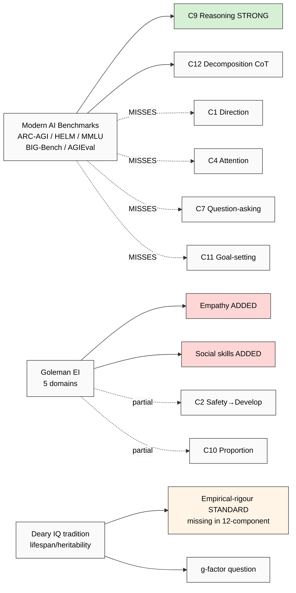

# Phase 4 — Modern AI Capability Benchmarks + Goleman EI + Deary Individual Differences

> Triple-survey: (a) AI capability frameworks (ARC-AGI / HELM / MMLU / BIG-Bench / AGIEval), (b) Goleman Emotional Intelligence (1995+), (c) Deary individual-differences IQ-tradition rigour. 12-component coverage cross-map.

---

## §1 AI capability frameworks (modern — what AI systems are measured on)

Modern AI capability benchmarks operationalize «intelligence» в machine-evaluable form. Critical для 12-component audit because: AI benchmarks expose **what's operationally measurable** vs **what theory claims**. If 12-component has no measurement analog в AI benchmarks → likely Tier-2 component (qualitative) vs Tier-1 (quantifiable).

### §1.1 ARC-AGI (Chollet 2019, 2024)

**François Chollet (creator of Keras; Google → independent 2024). «On the Measure of Intelligence.» arXiv:1911.01547 (2019).**

ARC-AGI = **A**bstraction + **R**easoning **C**orpus. Designed as AI-IQ test resistant к pattern-memorization (unlike MMLU, BIG-Bench).

**Core definition (Chollet 2019, p. 27):**

> «Intelligence is a measure of skill-acquisition efficiency over a scope of tasks, with respect to priors, experience, and generalization difficulty.»

ARC-AGI design:
- 800 unique grid-puzzle tasks
- Each task = few-shot demonstration + new puzzle to solve
- **Resistance к memorization:** novel patterns each puzzle; can't memorize answer-keys
- **Resistance к brute search:** designed for «one-shot» abstraction-and-reuse
- 2024 update (ARC-AGI-2): harder, more abstraction-required

**Verbatim core claim (Chollet 2019, abstract):**

> «We argue that intelligence should be measured by ability to acquire new skills from limited experience and prior knowledge, NOT by performance on tasks for which the system has been extensively trained.»

ARC-AGI measures: **fluid intelligence (Gf) + abstraction + few-shot reasoning + transfer learning.**

F: F3 (well-cited benchmark; partial replication via ARC-AGI Prize 2024); R: refuted_if (high-scoring AI fails to generalize beyond ARC tasks).

### §1.2 HELM (Stanford Holistic Evaluation of Language Models)

**Liang, Bommasani, et al. (2022). «Holistic Evaluation of Language Models.» arXiv:2211.09110. CRFM Stanford.**

HELM = **H**olistic **E**valuation of **L**anguage **M**odels.

Design philosophy: «no single benchmark suffices.» 16 scenarios × 7 metrics:

**Scenarios (sample):**
- Question answering (HellaSwag, OpenbookQA, NaturalQA)
- Information retrieval (MSMARCO)
- Summarization (XSUM, CNN/DM)
- Sentiment analysis (IMDB)
- Toxicity detection
- Disinformation detection
- Reasoning (MMLU, GSM8K)
- Translation
- Code generation

**Metrics:**
- Accuracy
- Calibration
- Robustness
- Fairness
- Bias
- Toxicity
- Efficiency

**Verbatim positioning (Liang et al. 2022):**

> «Existing benchmarks evaluate language models on narrow tasks; HELM aims to characterize language models на 16 core scenarios + 7 metric dimensions, giving holistic picture.»

HELM measures: **language-bound intellectual capacities** + safety + fairness metrics. Strong on Gc (linguistic), partial on Gf (reasoning subset), weak on Gv/Ga/Gs (visual/auditory not LM-applicable).

### §1.3 MMLU (Massive Multitask Language Understanding)

**Hendrycks, Burns, et al. (2021). «Measuring Massive Multitask Language Understanding.» ICLR 2021.**

MMLU = **M**assive **M**ultitask **L**anguage **U**nderstanding. 57 subjects (STEM + humanities + social sciences + applied) × 14,079 multiple-choice questions.

**Coverage:**
- Elementary mathematics, high school physics, college chemistry, etc.
- Professional law, medicine, accounting
- Philosophy, ethics, world religions
- Computer science, machine learning

**Verbatim core claim (Hendrycks et al. 2021):**

> «To attain high accuracy, models must possess extensive world knowledge AND problem-solving ability... performance is heterogeneous across categories.»

MMLU measures: **crystallized intelligence (Gc) + domain-specific knowledge (Gkn)** primarily; some Gf via reasoning subjects. Heavy CHC Gc loading.

F: F4 (massively replicated, used by all frontier LLM evaluations); R: limited generalization beyond multiple-choice format.

### §1.4 BIG-Bench (Beyond the Imitation Game)

**Srivastava et al. (2023). «Beyond the Imitation Game: Quantifying and extrapolating the capabilities of language models.» TMLR.**

BIG-Bench = collaborative benchmark of 204 tasks designed by 444 authors at 132 institutions. Range: arithmetic, analogies, ethical-reasoning, creative-writing, language understanding, edge cases.

**Key sub-benchmark: BIG-Bench Hard (BBH)** — 23 tasks identified as challenging for current LLMs (chain-of-thought required).

**Verbatim positioning:**

> «BIG-Bench... attempts to provide a benchmark suite that captures the breadth of language-model capabilities.»

BIG-Bench measures: **broad cognitive surface** including reasoning, creativity, common sense, ethics. Strong on Gf+Gc; weak Gv/Ga.

### §1.5 AGIEval (Microsoft 2023)

**Zhong et al. (2023). «AGIEval: A Human-Centric Benchmark for Evaluating Foundation Models.» arXiv:2304.06364.**

AGIEval uses **human-administered standardized tests** (SAT, GRE, LSAT, GMAT, Chinese College Entrance Exam) as benchmarks. Anchored к human intelligence assessment tradition.

**Verbatim core claim:**

> «We propose AGIEval, a human-centric benchmark that uses official, standardized, high-standard admission and qualification exams designed for general human test-takers.»

AGIEval measures: **classical human-IQ-test surface + domain knowledge.** Heavy CHC Gc + Gf loading.

### §1.6 What AI benchmarks MEASURE vs MISS (per Chollet 2019 critique)

**Chollet's «On the Measure of Intelligence» critique inventory:**

> «Most current AI benchmarks measure skill on specific tasks. But skill is a function of intelligence multiplied by priors + experience. Memorization-prone benchmarks (MMLU, BIG-Bench) reward skill without disentangling intelligence from training-data exposure.»

**What modern benchmarks MISS:**
- **Few-shot generalization** (only ARC-AGI focuses here)
- **Causality understanding** (not directly measured)
- **Embodied + multimodal capabilities** (text-only benchmarks miss BK/Gv/Ga)
- **Goal-setting / self-directed task selection** (benchmarks supply tasks; don't measure ability to find tasks)
- **Wisdom / value-alignment** (only via toxicity/bias proxies)
- **Curiosity / question-asking** (rarely benchmarked)

---

## §2 Goleman Emotional Intelligence (1995+)

### §2.1 Goleman 1995 popular EI

**Daniel Goleman (b. 1946; PhD Harvard; psychologist, journalist). «Emotional Intelligence: Why It Can Matter More Than IQ.» (Bantam 1995).**

Goleman's EI = 5 domains:

1. **Self-awareness** — recognizing one's emotions + their effects
2. **Self-regulation** — managing disruptive emotions
3. **Motivation** — internal drive to achieve
4. **Empathy** — recognizing others' emotions
5. **Social skills** — managing relationships + building networks

**Verbatim core claim (Goleman 1995, p. 34):**

> «Emotional intelligence may matter more than IQ for life success.»

### §2.2 Pre-Goleman academic EI (Mayer & Salovey)

**Salovey, P., & Mayer, J. D. (1990). «Emotional Intelligence.» Imagination, Cognition, and Personality, 9(3), 185-211.**

The academic 4-branch EI model (pre-Goleman):
- Perception of emotion
- Use of emotion to facilitate thought
- Understanding emotion
- Management of emotion

This is the **MSCEIT** (Mayer-Salovey-Caruso EI Test) basis — academic measurement.

### §2.3 Adoption + critique

**Adoption:** Goleman's EI = massively popular в corporate + leadership development (HR practice, MBA curricula, leadership-coaching). EI vocabulary mainstream.

**Critique (Waterhouse 2006 — same critic):**
- Goleman's EI conflates personality (Big Five Conscientiousness + Agreeableness) with «intelligence»
- Empirical predictive validity overstated; «1.6x more predictive than IQ» claims (Goleman 1998) not replicated
- MSCEIT (academic EI test) shows modest g-loading + correlation with personality, NOT a separate intelligence dimension

**Verdict (R6 surface):** EI as «intelligence» = contested. EI as «cluster of social-emotional skills» = useful pedagogical vocabulary.

F: F2 conceptual (Goleman 1995); F3 academic (Mayer-Salovey 1990 MSCEIT); F1 popular claims (1998 Goleman corporate-success-prediction).

---

## §3 Deary Individual Differences (Edinburgh group rigour)

### §3.1 Ian Deary lineage

Ian J. Deary (b. 1954; Emeritus Edinburgh; Lothian Birth Cohort Studies). Modern leading individual-differences psychologist. ~600+ publications; Lothian Birth Cohort (LBC) cohort tracks IQ from age 11 to 80+ years.

**Foundational work:**
- Deary (2012). «Intelligence.» Annual Review of Psychology, 63, 453-482.
- Deary, Strand, Smith, & Fernandes (2007). «Intelligence and educational achievement.» Intelligence, 35(1), 13-21.

### §3.2 What Deary group establishes (high empirical rigour)

1. **g-factor stability across lifespan** — childhood IQ predicts adult-IQ with r~0.70 across 60-70 years (LBC data, Deary et al. 2013)
2. **IQ predicts mortality** — meta-analysis: lower IQ → ~24% increased all-cause mortality (Calvin et al. 2011, Intelligence)
3. **IQ-educational achievement r~0.81** (Deary et al. 2007 — strongest single predictor of academic outcomes)
4. **Heritability of g ~50-80%** (twin studies; rises with age — Deary 2013)
5. **«Cognitive epidemiology»** — Deary founded subfield linking cognitive ability to health/life outcomes

**Verbatim core claim (Deary 2012, p. 453):**

> «There is now substantial evidence that general intelligence (g) is a robust, replicable, lifespan-stable individual difference variable with profound predictive validity for educational, occupational, health, and longevity outcomes.»

### §3.3 Where IQ tradition VALID vs WHERE IT FAILS

**VALID:**
- Predicting academic + occupational outcomes (Schmidt-Hunter 1998 meta-analyses; r~0.50+ for high-complexity jobs)
- Lifespan stability + heritability
- Diagnostic clinical use (ID/intellectual-disability assessment, dementia tracking)

**FAILS:**
- **Cultural bias persistence** — Flynn effect (IQ scores rising ~3 pts/decade) suggests measurement is culturally-bound (Flynn 2012)
- **Tail validity** — at extreme high IQ, predictive validity decreases (Lubinski et al. 2014)
- **Wisdom + ethics + creativity** — not captured (Sternberg 2002 «Why Smart People Can Be So Stupid»)
- **Emotional + social outcomes** — partial only

---

## §4 12-component cross-map (AI capability + EI + Deary)

### §4.1 AI capability benchmarks vs 12-component

| # | Component | ARC-AGI | HELM | MMLU | BIG-Bench | AGIEval | Notes |
|---|---|---|---|---|---|---|---|
| C1 | Direction-understanding | weak | partial | — | partial | — | AI weakly measures goal-direction |
| C2 | Safety→Develop ordering | — | partial (safety metrics) | — | partial | — | HELM safety metrics partial |
| C3 | Relevance-filtering | partial | partial | — | partial | — | Implicit в retrieval/QA |
| C4 | Attention retention | — | — | — | — | — | Not benchmarked (AI: no human-like attention) |
| C5 | Tool management | — | partial (tool-use task) | — | partial | — | LLM tool-use partial |
| C6 | Tool creation | — | partial (code) | — | partial (creative tasks) | — | Limited |
| C7 | Question-asking | — | — | — | partial | — | AI weakly evaluates curiosity |
| C8 | Observation-introduction | partial | — | — | partial | — | Visual perception NOT in text LMs |
| C9 | Reasoning / answer-search | **STRONG (ARC-AGI core)** | strong | strong | strong | strong | All benchmarks heavily reasoning |
| C10 | Proportion-sense | — | — | — | partial | — | Implicit (judgment tasks) |
| C11 | Goal-setting | — | — | — | — | — | Tasks GIVEN, not self-generated |
| C12 | Task-decomposition | partial | partial | — | strong (chain-of-thought tasks) | partial | CoT tasks |

**AI benchmarks MEASURE:** C9 reasoning (all), C12 decomposition (CoT), C3 filtering (partial), C5 tool-use (partial)
**AI benchmarks MISS:** C4 attention, C11 goal-setting, C2 safety-ordering, C8 observation, C7 question-asking, C10 proportion-sense, C1 direction-understanding (heavy gaps)

**Implication:** **9 of 12 components are weakly or not measured by current AI benchmarks** — this surfaces a 12-component STRENGTH (frames intelligence beyond AI benchmark coverage) AND a research-design challenge (no measurement instruments exist for most components).

### §4.2 Goleman EI vs 12-component

| # | Component | Self-aware | Self-reg | Motivation | Empathy | Social-skills |
|---|---|---|---|---|---|---|
| C1 | Direction | partial | partial | strong | — | — |
| C2 | Safety→Develop | partial | **STRONG** | partial | — | — |
| C4 | Attention | partial | strong | — | — | — |
| C10 | Proportion-sense | strong | strong | — | — | — |
| C11 | Goal-setting | partial | — | strong | — | — |

**EI covers C2+C10+C11 partially.** EI ADDS: empathy + social skills — NOT в 12-component.

**Missing-component candidates from EI:**
- **Empathy** — recognizing others' emotions (overlaps Gardner Interpersonal)
- **Social skills** — relationship management (overlaps Gardner Interpersonal)

### §4.3 Deary IQ tradition vs 12-component

Deary group's IQ measures (WAIS, RPM, NART) primarily measure **g + Gf + Gc** — CHC overlap.

**Deary's contribution к 12-component audit:**
- **Empirical rigour standard** — for 12-component to gain credibility, requires longitudinal + heritability + predictive-validity studies (impractical for Workshop short-term; longer-term research target)
- **Lifespan-stability question** — are 12 components stable across lifespan or developmentally-acquired? (Phase 7 hypothesis)
- **Heritability question** — partial heritability vs trainability (Workshop pedagogical assumption is trainability — supportable per Deary's gene-by-environment work)

---

## §5 Synthesis (Phase 4) — what AI benchmarks + EI + Deary add

### §5.1 AI benchmarks add (vs 12-component)

1. **Causality understanding** — not in 12-component explicitly
2. **Few-shot generalization** — overlaps C7+C9 implicitly but not isolated
3. **Calibration** — confidence-in-own-knowledge; relates к C10 proportion-sense
4. **Robustness to adversarial inputs** — relates к C3 relevance-filtering

### §5.2 EI adds (vs 12-component)

1. **Empathy + social cognition** — Gardner Interpersonal overlap; CONFIRMED missing-component candidate
2. **Emotional self-regulation** — partial overlap C2+C10; could be Tier-1 component candidate

### §5.3 Deary IQ tradition adds (vs 12-component)

1. **Methodological standard** — for empirical validation (Phase 7 hypothesis target)
2. **g-factor question** — is there an underlying «g» across 12 components? Phase 7 candidate hypothesis (H-IC-2: «12 components show factor-analytic g-loading»)

---

## §6 Mermaid: AI benchmarks + EI + Deary vs 12-component

---

## §7 Open questions (R1 surface)

- Empathy + social cognition: explicit C13/C14 candidate? Or substrate (assumed) like literacy?
- Calibration / metacognitive accuracy: emerging AI benchmarks (Lin et al. 2023 «Calibration of LLMs») show calibration ≠ accuracy. Could be Tier-1 component for Workshop curriculum.
- g-factor question for 12-component: feasible to test? Requires N~200+ Workshop cohort with longitudinal measurement (Phase 7 hypothesis design)

---

*Phase 4 AI capability + EI + Deary ✅. 9/12 components weakly/not measured by AI benchmarks (strength + research-design gap). Empathy + social-skills = EI-surfaced missing candidate (overlaps Gardner). Phase 5 12-component audit ⭐ MANDATORY gap analysis next.*
