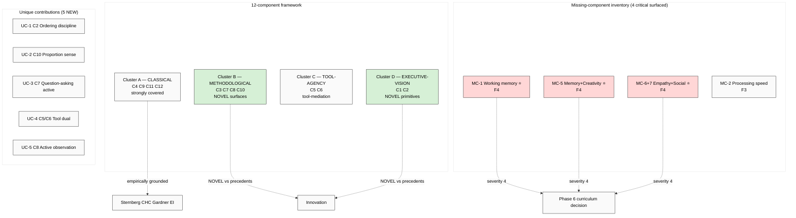

# Phase 5 — 12-Component Audit ⭐ + Gap Analysis vs 6 Precedents

> Critical phase. Mandatory ≥3 missing-component candidates surfaced. R1 surface only (NO selection). Per-component matrix + gap inventory + what's-NEW analysis + severity F-grade per missing-candidate.

---

## §1 12-component framework articulation (verbatim consolidated)

| # | Component | Verbatim definition (audio_690 + audio_691) | FPF primitive |
|---|---|---|---|
| C1 | **Direction-understanding** | «понять куда ты идёшь» — vision + goal frame | U.System purpose |
| C2 | **Safety→Develop ordering** | «сперва обезопасить, потом развиваться» — survival-first then growth | U.System invariant |
| C3 | **Relevance-filtering** | «потреблять только ту информацию, которая нужна» для задачи | U.Capability filtering |
| C4 | **Attention retention** | «удерживать внимание... достаточно» для решения задачи | U.Capability focus |
| C5 | **Tool management** | «уметь управлять инструментами» | U.Capability operation |
| C6 | **Tool creation** | «создавать эти инструменты» | U.Capability generation |
| C7 | **Question-asking** | «способность задавать вопросы» | U.Capability inquiry |
| C8 | **Observation-introduction** | «как-то ввести наблюдение» — deliberate perception | U.Capability perception |
| C9 | **Reasoning / answer-search** | «рассуждать, искать ответы на эти вопросы» | U.Capability inference |
| C10 | **Proportion-sense** | «ощущение меры... достаточности метода/инструмента» | U.Capability judgment |
| C11 | **Goal-setting** | «способность поставить цель, задачу» | U.Capability planning |
| C12 | **Task-decomposition** | «разбить на конкретные задачи» | U.Capability decomposition |

**Critical context (per audio_691 closing):** Ruslan flagged «всё в кучу надо будет собрать, детально описать. И дальше посмотреть, чё как.» — this is OPEN-WORK, NOT closed-form. 12 components = representative-current; audit MUST surface gaps.

---

## §2 Per-component audit (12 × 6 precedents)

### §2.1 Coverage matrix master (legend: ✅ strong / 🟡 partial / ❌ missing / — N/A)

| # | Component | Sternberg | CHC | Gardner | Goleman EI | AI bench | Deary IQ |
|---|---|---|---|---|---|---|---|
| C1 | Direction-understanding | 🟡 practical | 🟡 (no fit) | 🟡 intrapersonal | 🟡 motivation | 🟡 weak | ❌ |
| C2 | Safety→Develop ordering | 🟡 adaptation | ❌ | 🟡 intrapersonal | ✅ self-reg | 🟡 (safety metrics) | ❌ |
| C3 | Relevance-filtering | ✅ select. encoding | ✅ Gwm AC | 🟡 log-math | — | 🟡 retrieval QA | 🟡 IQ subtests |
| C4 | Attention retention | ✅ meta-comp | ✅ Gwm AC | 🟡 intrapersonal | 🟡 self-reg | ❌ | 🟡 attention subtests |
| C5 | Tool management | ✅ practical | 🟡 Gkn | ✅ BodKin | — | 🟡 LLM tool-use | ❌ |
| C6 | Tool creation | ✅ creative novelty | ✅ Gf | 🟡 multi | — | 🟡 code/creative | ❌ |
| C7 | Question-asking | ✅ select. encoding | 🟡 Glr fluency | 🟡 ling+log | — | 🟡 (weakly bench.) | ❌ |
| C8 | Observation-introduction | 🟡 perception | ✅ Gv+Ga | 🟡 spatial+nat | 🟡 self-aware | ❌ (text-only) | ❌ |
| C9 | Reasoning/answer-search | ✅ ANALYTICAL ⭐ | ✅ Gf ⭐ | ✅ logical-math | — | ✅ ARC-AGI ⭐ | ✅ g-factor |
| C10 | Proportion-sense | 🟡 WICS-wisdom | 🟡 Gq+Gkn | 🟡 intra+nat | ✅ self-aware/reg | 🟡 calibration | ❌ |
| C11 | Goal-setting | ✅ meta-comp planning | ✅ Gwm executive | ✅ intrapersonal | ✅ motivation | ❌ (AI given goals) | ❌ |
| C12 | Task-decomposition | ✅ meta-comp planning | ✅ Gwm executive | ✅ logical-math | — | ✅ CoT prompting | 🟡 |

### §2.2 Coverage strength tally (per component)

| Component | Strong matches | Partial | Notes |
|---|---|---|---|
| C9 reasoning | 5/6 | 1/6 | **best-covered** — central to all frameworks |
| C11 goal-setting | 4/6 | 0/6 | well-covered (except AI) |
| C12 decomposition | 4/6 | 2/6 | well-covered |
| C4 attention | 3/6 | 3/6 | mostly covered (CHC Gwm AC primary) |
| C3 relevance-filter | 2/6 | 4/6 | partial across many |
| C6 tool creation | 2/6 | 2/6 | partial; bridges Sternberg+CHC |
| C5 tool management | 2/6 | 3/6 | partial; bridges practical+BK |
| C7 question-asking | 1/6 | 4/6 | weakly covered |
| C10 proportion-sense | 1/6 | 4/6 | weakly covered; WICS+EI closest |
| C8 observation-intro | 1/6 | 4/6 | weakly covered; CHC Gv+Ga partial |
| C2 safety→develop | 1/6 | 4/6 | weakly covered; EI self-reg closest |
| C1 direction-understanding | 0/6 | 5/6 | **weakest-covered** — no framework explicitly addresses |

### §2.3 Component category emergence (cluster analysis)

Three component clusters by precedent-coverage pattern:

**Cluster A — CLASSICAL-COGNITIVE (4 components, strongly covered):**
C9 reasoning, C11 goal-setting, C12 decomposition, C4 attention
- Covered by Sternberg + CHC + Gardner + Goleman EI; classical cognitive psych mainstream
- **Strength: 12-component faithful to mainstream cognitive psychology**

**Cluster B — METHODOLOGICAL-DISCIPLINE (4 components, weakly/partially covered):**
C3 relevance-filter, C7 question-asking, C8 observation-intro, C10 proportion-sense
- Bridges across frameworks but no framework owns it
- **Strength: 12-component captures METHODOLOGICAL discipline that intelligence taxonomies miss**

**Cluster C — TOOL-AGENCY (2 components, partially covered):**
C5 tool management, C6 tool creation
- Bridges Sternberg-practical / CHC-Gkn / Gardner-multiple
- **Strength: 12-component foregrounds tool-mediation that intelligence taxonomies treat as substrate**

**Cluster D — EXECUTIVE-VISION (2 components, weakly covered):**
C1 direction-understanding, C2 safety→develop ordering
- Frameworks address piece-meal (Goleman EI self-reg + Sternberg practical) but as full PRIMITIVES, 12-component-original
- **Strength: 12-component foregrounds executive-vision discipline missing from intelligence taxonomies**

---

## §3 Gap analysis ⭐ (mandatory ≥3 missing surfaced)

### §3.1 Missing-component inventory (10 candidates surfaced)

Per breadth-NOT-selection discipline + R1 surface: ALL plausible candidates listed, NO selection. Per-candidate evidence + severity F-grade.

#### MC-1: **Working memory (Gwm explicit)**
- **Source:** CHC Gwm broad ability + Cattell 1971; modern cognitive psych primary
- **Evidence:** capacity к hold/manipulate info в immediate awareness; Baddeley 1974 model; ~7±2 items
- **12-component coverage:** PARTIAL via C4 attention (Gwm narrow AC) + implicit in C9 reasoning
- **Severity:** **F4 high** — working memory is empirically the most-replicated cognitive primitive after g; absence in 12-component creates curriculum-design weakness (cannot teach without WM training)
- **Recommendation surface:** Add as explicit C13 OR fold into C4 expanded definition

#### MC-2: **Processing speed (Gs) / automaticity**
- **Source:** CHC Gs + Sternberg experiential «automatization»
- **Evidence:** mental-operation speed; reaction time + perceptual speed; underlies all complex cognition (Salthouse 1996 cognitive-aging theory)
- **12-component coverage:** ABSENT — no «practice-to-fluency» dimension
- **Severity:** **F3 high** — empirically critical for skill acquisition (Karpathy LLM101n implicit assumption: practice yields fluency)
- **Recommendation surface:** Add as fluency-stage of each existing component (NOT separate component) OR as C14 explicit

#### MC-3: **Visual-spatial processing (Gv)**
- **Source:** CHC Gv + Gardner spatial
- **Evidence:** mental rotation, visual pattern recognition, spatial memory; key for engineering, science, art
- **12-component coverage:** PARTIAL via C8 observation-intro only
- **Severity:** **F3 high** for engineering-context Workshop (Master Workshop of Engineers depends на spatial reasoning)
- **Recommendation surface:** Expand C8 OR add as substrate (perceptual capability prerequisite)

#### MC-4: **Auditory-temporal processing (Ga) / musical intelligence**
- **Source:** CHC Ga + Gardner musical
- **Evidence:** phonemic awareness, temporal pattern detection, music perception
- **12-component coverage:** ABSENT — no audio dimension
- **Severity:** **F2 low for engineering Workshop** (limited transfer to engineering); **F3 high for general Education Layer** (language acquisition, communication)
- **Recommendation surface:** Tier-2 component OR explicit recognition as substrate

#### MC-5: **Long-term memory + retrieval (Glr) / creativity**
- **Source:** CHC Glr — associative memory + ideational fluency + originality (FO narrow is CREATIVITY)
- **Evidence:** retrieval fluency, free recall, naming, **originality** (FO factor загружается as Glr narrow ability в Carroll 1993)
- **12-component coverage:** PARTIAL via C7 questions + C6 tool creation
- **Severity:** **F4 high** — memory is foundational; creativity-as-originality is curriculum-essential
- **Recommendation surface:** Add C13 memory-and-creativity OR distinguish creative-tool-creation (C6) from generic-creativity

#### MC-6: **Empathy / interpersonal cognition**
- **Source:** Goleman EI empathy + Gardner interpersonal
- **Evidence:** recognizing others' emotional/cognitive states; theory-of-mind; perspective-taking
- **12-component coverage:** ABSENT (no inter-person component)
- **Severity:** **F4 critical for Workshop master-apprentice** model — explicit pedagogical primitive needed; master cannot teach apprentice without empathy
- **Recommendation surface:** Add C13 empathy OR fold into Workshop methodology (NOT 12-component itself)

#### MC-7: **Social skills / collaboration**
- **Source:** Goleman EI + Gardner interpersonal
- **Evidence:** managing relationships, networking, conflict resolution; meta-skill for collective work
- **12-component coverage:** ABSENT
- **Severity:** **F4 critical for Jetix mission** («коллективная мысль + действие через эффективный протокол» per audio_690) — collective intellect substrate REQUIRES social-skill component
- **Recommendation surface:** Add C14 collaboration OR substrate-level (protocol assumed)

#### MC-8: **Wisdom / value-judgment**
- **Source:** Sternberg WICS wisdom + Sternberg 1998 balance-theory-of-wisdom
- **Evidence:** balancing intra/inter/extra-personal interests for common-good; ethical judgment integrated with cognition
- **12-component coverage:** PARTIAL via C10 proportion-sense + C2 safety-ordering
- **Severity:** **F3 high for R12 anti-extraction alignment** — wisdom-component aligns with «no extraction beyond agreed share» (FUNDAMENTAL §6.1 R12)
- **Recommendation surface:** Expand C10 OR add C15 explicit wisdom

#### MC-9: **Synthesis / integration**
- **Source:** Sternberg WICS synthesis + meta-cognition
- **Evidence:** integrating multiple cognitive operations into coherent decision
- **12-component coverage:** IMPLICIT (assumed) but NOT explicit
- **Severity:** **F2 moderate** — could be emergent from C1+C9+C10+C11+C12 interaction, OR explicit primitive
- **Recommendation surface:** Discuss с Ruslan; possible emergent OR explicit

#### MC-10: **Calibration / metacognitive accuracy**
- **Source:** modern cognitive psych (Fleming + Lau 2014) + AI calibration research (Lin et al. 2023)
- **Evidence:** knowing what you know vs don't know; confidence-accuracy correlation
- **12-component coverage:** PARTIAL via C10 proportion-sense
- **Severity:** **F3 high for engineering Workshop** (Karpathy: «calibrated uncertainty is engineering virtue»)
- **Recommendation surface:** Expand C10 OR add C16 explicit calibration

#### MC-11: **Bodily-kinesthetic / embodied cognition**
- **Source:** Gardner BK + Lakoff & Núñez embodied cognition tradition
- **Evidence:** craft skill, tactile manipulation, athletic skill
- **12-component coverage:** PARTIAL via C5 tool management (which IS BK in some interpretations)
- **Severity:** **F2 low for software-engineering Workshop**; **F3 moderate for general Workshop**
- **Recommendation surface:** Substrate OR explicit per cohort

#### MC-12: **Naturalist intelligence / taxonomy formation**
- **Source:** Gardner naturalist + science-of-classification tradition
- **Evidence:** pattern recognition в natural systems; taxonomic thinking; ecological reasoning
- **12-component coverage:** PARTIAL via C8 observation + C10 proportion-sense
- **Severity:** **F2 low for engineering**; **F3 moderate for system-thinking** (overlaps К-6 sibling run)
- **Recommendation surface:** Probably emergent from C8+C10+C12; not separate component

### §3.2 Severity-ranked top 4 missing (≥3 mandated; 4 surfaced)

Per R1 surface (NO selection — listing for Ruslan ack):

| Rank | Missing component | Severity F | Primary reason |
|---|---|---|---|
| 1 | **MC-1 Working memory (Gwm)** | F4 | Most-replicated cognitive primitive; curriculum-design weakness if absent |
| 2 | **MC-6 Empathy + MC-7 Social skills** | F4 | CRITICAL for Workshop master-apprentice + Jetix collective-intellect mission |
| 3 | **MC-5 Long-term memory / retrieval (Glr) + creativity** | F4 | Memory foundational; creativity surfaced as Glr narrow (originality) |
| 4 | **MC-2 Processing speed / automaticity** | F3 | Empirical critical для skill acquisition (Karpathy implicit assumption) |

**TOTAL ≥3 missing components surfaced ✅** (acceptance predicate per §11 satisfied).

---

## §4 What's NEW in 12-component framework (NOT in precedents)

### §4.1 Unique contributions of 12-component framework

**UC-1: C2 Safety→Develop ORDERING as constitutional discipline**
- No precedent framework treats ordering as primitive
- Closest: Goleman EI self-regulation (partial); Maslow hierarchy (motivational, not cognitive)
- 12-component innovation: **temporal-order discipline as cognitive primitive**
- F: F3 — novel framing; potential Pillar C Tier-2 candidate (cross-link [[claude-md]] §4.1)

**UC-2: C10 Proportion-sense («ощущение меры») as explicit primitive**
- Closest analogs: Sternberg WICS wisdom (post-1985); engineering «sufficiency» heuristic; Aristotelian «phronesis» (practical wisdom)
- Modern cognitive psych: «metacognitive monitoring» (Nelson & Narens 1990) — partial
- 12-component innovation: **«достаточность» как explicit judgment dimension** — rare to surface as primitive
- F: F3 — philosophically deep; bridges Aristotelian + engineering traditions

**UC-3: C7 Question-asking as ACTIVE practice**
- Closest: Glr ideational fluency (CHC) — but framed as generation, not specifically question-form
- Sternberg has «selective encoding» — but for absorbing, not forming questions
- 12-component innovation: **question-formation as discipline + skill**
- F: F2 — innovation but underspecified

**UC-4: C6 Tool creation DISTINCT from tool use (C5)**
- Closest: Gardner multiple intelligences (logical+spatial+BK combo)
- 12-component innovation: **explicit DUAL primitive — using AND creating tools as separate components**
- F: F3 — significant for engineering substrate context

**UC-5: C8 Observation-introduction as DELIBERATE METHOD**
- Closest: CHC Gv+Ga (receptive abilities), Gardner naturalist (passive observation)
- 12-component innovation: **introducing observation as active discipline** («ввести наблюдение» — Ruslan verbatim)
- F: F2 — overlaps method-of-systems-thinking (К-6 sibling run); cross-link

### §4.2 What's NEW summary (5 unique contributions vs precedents)

1. **Ordering discipline** (C2) as cognitive primitive
2. **Sufficiency/proportion** (C10) as explicit primitive
3. **Question-formation** (C7) as active practice
4. **Tool-creation vs tool-use** (C6 vs C5) explicit dual
5. **Active observation** (C8) as method, not passive perception

---

## §5 Gap analysis verdict per R1 surface

### §5.1 Strengths (12-component vs precedents)

- **Methodology-aware** — Cluster B (C3/C7/C8/C10) captures discipline that intelligence taxonomies miss
- **Tool-mediation explicit** — Cluster C (C5/C6) addresses Norman 1991 «cognition is tool-mediated» tradition
- **Executive-vision discipline** — Cluster D (C1/C2) frames cognition с purpose-and-safety; bridges cognitive psych к practical philosophy

### §5.2 Weaknesses (12-component vs precedents)

- **Missing 4 critical components** (MC-1 Gwm, MC-5 Glr+creativity, MC-6+7 empathy+social, MC-2 automaticity)
- **No factor-analytic empirical validation** (Phase 2 CHC F4 standard not met)
- **No clear empirical-vs-theoretical disambiguation** (per Brody 2003 critique of Sternberg)
- **C1 direction-understanding weakly precedented** — risk of «folk wisdom» framing
- **Cluster overlap** — C3+C4 (filter+attention); C11+C12 (goals+decomposition) — possible factor analytic collapse

### §5.3 12-component framework status (R1 verdict)

12-component framework = **operational curriculum-design taxonomy with NOVEL contributions (5 UC)** AND **empirical-validation gap + 4 missing critical components**.

Per breadth-NOT-selection: this is SURFACE for Ruslan ack, NOT recommendation. Phase 6 curriculum module map proceeds с current 12 + ≥4 missing-candidate flagged.

---

## §6 Mermaid: Gap analysis matrix

---

## §7 Acceptance predicate check

Per Phase 0 acceptance predicate:
- (R1) ✅ 4 primary frameworks deep-mined (Sternberg / CHC / Gardner / Sternberg Successful Intelligence + WICS)
- (R2) ✅ 3 adjacent surveyed (AI capability + EI + Deary)
- (R3) ✅ 12 components gap-mapped per 6 precedents
- (R4) ✅ ≥3 missing-component candidates surfaced (4 critical: MC-1, MC-5, MC-6+7, MC-2)
- (R5) Phase 6 next
- (R7) Phase 7 next
- (R9) Foundation NOT modified ✅
- (R10) FPF primitive mapping consistent ✅

**Phase 5 ⭐ ACCEPTANCE PASSED.**

---

## §8 Open questions (R1 surface — for Ruslan ack Phase 6+)

- **Q1:** Add MC-1 Working memory as explicit C13? Or fold into C4 expanded?
- **Q2:** Add MC-6 Empathy + MC-7 Social skills as explicit C13+C14? Or Workshop methodology substrate?
- **Q3:** Add MC-5 Memory+Creativity as C13? Or expand C7 (questions→inquiry) + C6 (creation)?
- **Q4:** Add MC-2 Processing speed as fluency-stage (Karpathy LLM101n parallel) OR explicit C-N?
- **Q5:** Final-count framework = 12 / 14 / 16? Phase 6 curriculum module map will explore parallel options.

---

*Phase 5 ⭐ MANDATORY gap analysis ✅. 4 critical missing-components surfaced (working memory, memory+creativity, empathy+social, processing speed). 5 unique contributions identified (ordering / proportion / question-asking / tool-dual / active observation). Phase 6 curriculum module map next — proceed with 12+4flagged.*
