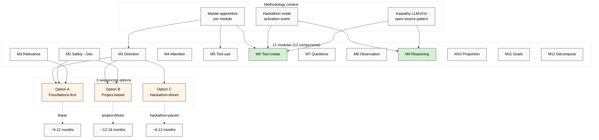

# Phase 6 — Curriculum Module Map (Education Layer Tier 1)

> 12 components → 12 curriculum modules. Per-module: objective / methods / measures / cohort progression. Cross-link к Karpathy LLM101n + Workshop master-apprentice methodology. **3 sequencing options surfaced parallel (NO recommendation per R1).**

---

## §1 IP-1 boundary reminder

Per FPF IP-1 STRICT:
- **12-component framework = abstract pattern** (U.System × 12 U.Capability sub-instances)
- **Curriculum module map в этом документе = ABSTRACT module taxonomy** (U.MethodDescription primitive)
- **Specific Jetix Workshop binding = RUSLAN-LAYER instance** (Ruslan ack required — Phase 7 surfaces 3 options)

This document = **abstract module spec**. Specific cohort timing / cohort size / master-apprentice pairing = Ruslan-acked instance.

---

## §2 Per-component module spec (M1-M12)

Each module follows U.Capability acquisition 4-stage lifecycle (Phase 0 §2.2):
- **Stage 1 Awareness** — learner knows component exists
- **Stage 2 Procedural** — learner performs under guidance
- **Stage 3 Autonomous** — learner performs unsupervised
- **Stage 4 Generative** — learner improves/teaches

Per-module: **Objective / Methods / Measures / Progression / Karpathy LLM101n cross-link**.

### M1 — Direction-understanding (C1)

- **Objective:** Learner articulates what they're trying to achieve + WHY before action
- **Methods:**
  - Personal North Star exercise (1-page vision draft)
  - Goal pyramid construction (Levenchuk-style multi-level)
  - Mentor-led «why before what» check-in cadence
  - Reflective writing (journaling)
- **Measures:**
  - Stage 1: Learner can identify own current goal
  - Stage 2: Goal pyramid with ≥3 levels filled
  - Stage 3: Daily/weekly cadence sustained
  - Stage 4: Coaches peer through goal articulation
- **Progression:** Module 1 — foundational. Required prerequisite for M11+M12.
- **Karpathy LLM101n parallel:** «Why X» framing per lecture; explicit motivation before mechanics

### M2 — Safety→Develop ordering (C2)

- **Objective:** Learner internalizes «secure infrastructure first, develop second» discipline
- **Methods:**
  - Backup discipline (data, version control)
  - Risk-checklist construction
  - Default-Deny mental model (per Jetix Pillar C R11)
  - Stoic «premeditatio malorum» reflective exercise
- **Measures:**
  - Stage 1: Identifies own «infrastructure» (code, data, body, finances, relations)
  - Stage 2: Maintains backup + monitoring
  - Stage 3: Auto-prioritizes safety in new projects
  - Stage 4: Coaches risk-management для peer
- **Progression:** Module 2 — early; precedes self-directed project work
- **Karpathy LLM101n parallel:** «Always have a baseline running» + commit discipline

### M3 — Relevance-filtering (C3)

- **Objective:** Learner consumes only task-relevant information; resists distraction
- **Methods:**
  - Information diet design (reading list curation)
  - «5 whys» before consuming new resource
  - Distraction-blocking infrastructure (Freedom app, focus modes)
  - «Just-in-time» learning vs «just-in-case» learning distinction
- **Measures:**
  - Stage 1: Can articulate current task's relevance criteria
  - Stage 2: Curates reading list per project
  - Stage 3: Auto-rejects irrelevant inputs
  - Stage 4: Teaches relevance-filter design
- **Progression:** Module 3 — pre-deep-work
- **Karpathy LLM101n parallel:** «Don't read X paper until you need it»

### M4 — Attention retention (C4)

- **Objective:** Learner sustains focus on chosen task for ≥90 min uninterrupted
- **Methods:**
  - Pomodoro / time-block discipline
  - Attention restoration ritual (walks, meditation, sleep hygiene)
  - Working-memory training (dual N-back — experimental)
  - Single-tasking practice
- **Measures:**
  - Stage 1: Self-tracks attention episodes
  - Stage 2: Sustains 25-50 min focus
  - Stage 3: Sustains 90+ min deep work
  - Stage 4: Teaches attention discipline
- **Progression:** Module 4 — early; foundation для all other deep work modules
- **Karpathy LLM101n parallel:** «I built LLM101n during deep-work blocks — practice required»
- **Note:** **MC-1 Working memory candidate folds here** (per Phase 5 gap analysis)

### M5 — Tool management (C5)

- **Objective:** Learner operates existing tools fluently (CLI, IDE, framework, AI assistant)
- **Methods:**
  - Tool-stack curriculum (Git, Linux, Docker, Python, agent-tools per domain)
  - Pair-programming with mentor
  - Reproducible-environment build (containers, dotfiles)
  - Documentation reading discipline
- **Measures:**
  - Stage 1: Names ≥10 tools in own stack
  - Stage 2: Operates tools with reference
  - Stage 3: Operates fluently без reference
  - Stage 4: Customizes / extends tools
- **Progression:** Module 5 — parallel к M6; M5 precedes M6 in linear sequencing
- **Karpathy LLM101n parallel:** Karpathy «my dev environment is my second brain»; tool-mastery substrate

### M6 — Tool creation (C6)

- **Objective:** Learner creates NEW tools when existing tools insufficient
- **Methods:**
  - Build-your-own-X exercises (Karpathy nanoGPT model)
  - Refactor-into-tool discipline (after 3 repetitions, abstract)
  - Open-source contribution to existing tool
  - Tool-design critique (what makes a good tool?)
- **Measures:**
  - Stage 1: Identifies inefficiencies in own workflow
  - Stage 2: Builds ≥1 tool под supervision
  - Stage 3: Ships ≥3 tools autonomously
  - Stage 4: Reviews peer tool designs
- **Progression:** Module 6 — after M5
- **Karpathy LLM101n parallel:** Karpathy ENTIRE pedagogy is «build from scratch»; M6 = primary Karpathy module
- **Note:** **MC-5 Creativity candidate partially folds here** (creative tool generation)

### M7 — Question-asking (C7)

- **Objective:** Learner formulates well-posed questions surfacing new knowledge
- **Methods:**
  - «Stupid questions» protocol (low-stakes question-asking practice)
  - Socratic dialogue exercises
  - «What would change my mind?» critical-thinking habit
  - Question quality rubric (specific / falsifiable / actionable / time-bound)
- **Measures:**
  - Stage 1: Asks ≥1 question per learning session
  - Stage 2: Formulates well-posed questions
  - Stage 3: Auto-surfaces important questions about own work
  - Stage 4: Teaches question-design
- **Progression:** Module 7 — pre-reasoning (M9)
- **Karpathy LLM101n parallel:** Karpathy «What's the simplest model that captures X» — question-design discipline

### M8 — Observation-introduction (C8)

- **Objective:** Learner introduces deliberate observation methods (NOT passive seeing)
- **Methods:**
  - Field notes practice (anthropologist mode)
  - Code instrumentation (logging / tracing / metrics)
  - Cybernetic observation loop (Beer VSM cross-link)
  - Data-set inspection rituals
- **Measures:**
  - Stage 1: Distinguishes observation from interpretation
  - Stage 2: Practices structured observation
  - Stage 3: Designs observation infrastructure для own work
  - Stage 4: Teaches observation methodology
- **Progression:** Module 8 — parallel к M7 (questions enable observation)
- **Karpathy LLM101n parallel:** Karpathy «look at the data» — explicit primitive
- **Cross-link:** К-6 sibling run «method-systems-thinking» Phase 3 Beer VSM operative function

### M9 — Reasoning / answer-search (C9)

- **Objective:** Learner reasons systematically через problem space
- **Methods:**
  - Chain-of-thought practice (explicit step-listing)
  - First-principles decomposition (Feynman-style)
  - Counterfactual reasoning exercises
  - Formal logic primer (deduction / induction / abduction)
- **Measures:**
  - Stage 1: Distinguishes deductive / inductive / abductive
  - Stage 2: Explicit chain-of-thought when stuck
  - Stage 3: Auto-reasons through new problems
  - Stage 4: Teaches reasoning patterns
- **Progression:** Module 9 — central; ALL precedents agree this is intelligence-primary
- **Karpathy LLM101n parallel:** Karpathy ENTIRE micro-pedagogy is «derive from first principles»

### M10 — Proportion-sense / sufficiency (C10)

- **Objective:** Learner judges when method/tool «достаточно» — neither over- nor under-engineered
- **Methods:**
  - «Minimum viable» discipline (MVP, MVA — minimum viable answer)
  - Engineering-tradeoff exercises
  - Stoic «sufficient» practice (Marcus Aurelius)
  - 80/20 Pareto + Goodhart's law awareness
- **Measures:**
  - Stage 1: Articulates «good enough» criteria explicit
  - Stage 2: Stops at sufficiency under guidance
  - Stage 3: Auto-stops at sufficiency
  - Stage 4: Teaches sufficiency judgment
- **Progression:** Module 10 — mid-to-late; requires M1+M9 foundation
- **Karpathy LLM101n parallel:** Karpathy «good enough scale for understanding» (nanoGPT not GPT-4)
- **Note:** **MC-10 Calibration folds here**

### M11 — Goal-setting (C11)

- **Objective:** Learner sets specific, falsifiable, time-bound goals
- **Methods:**
  - SMART goals (with Jetix critique: NOT bureaucratic)
  - North Star → quarterly → monthly → weekly cascade
  - OKR (Objectives + Key Results) practice
  - «What does done look like?» discipline
- **Measures:**
  - Stage 1: Sets own goals weekly
  - Stage 2: Goals are specific + falsifiable
  - Stage 3: Goal cascade sustained
  - Stage 4: Coaches peer goal-setting
- **Progression:** Module 11 — requires M1+M2 prerequisite

### M12 — Task-decomposition (C12)

- **Objective:** Learner decomposes goals into actionable tasks
- **Methods:**
  - WBS (Work Breakdown Structure) practice
  - GTD «next action» discipline
  - Tree-search-style decomposition (BFS / DFS exercise)
  - Critical-path identification
- **Measures:**
  - Stage 1: Decomposes 1-week project
  - Stage 2: Decomposes multi-month project
  - Stage 3: Auto-decomposes new projects
  - Stage 4: Coaches peer decomposition
- **Progression:** Module 12 — pairs с M11

---

## §3 Module map summary table (12 components × M1-M12)

| Module | Component | Cohort weeks (approx.) | Prereq | Karpathy parallel | Cross-link |
|---|---|---|---|---|---|
| M1 | C1 Direction | 1-2 | — | «Why X» | Jetix vision |
| M2 | C2 Safety→Dev | 1-2 | — | «Baseline running» | Pillar C R11 |
| M3 | C3 Relevance | 2-3 | M1 | «JIT learning» | — |
| M4 | C4 Attention | 3-4 | M2+M3 | «Deep work» | MC-1 Gwm folds |
| M5 | C5 Tool-use | 4-6 | M3 | «Second brain» | Engineering substrate |
| M6 | C6 Tool-create | 6-9 | M5 | nanoGPT model | MC-5 creativity folds |
| M7 | C7 Questions | 4-6 | M3+M4 | «Simplest model» | Socratic |
| M8 | C8 Observation | 4-6 | M4 | «Look at data» | К-6 VSM |
| M9 | C9 Reasoning | 6-9 | M7+M8 | «First principles» | Formal logic |
| M10 | C10 Proportion | 8-12 | M1+M9 | «Good enough scale» | MC-10 calibration |
| M11 | C11 Goals | 9-12 | M1+M2 | OKR cascade | — |
| M12 | C12 Decompose | 9-12 | M11 | WBS / GTD | — |

---

## §4 Cross-link к Karpathy LLM101n (Phase 6 §8.2)

### §4.1 Karpathy curriculum lineage

Per `research/deepening-2026-05-18/09-people-karpathy-eureka-llm101n.md`:
- Karpathy LLM101n = open-source pedagogical curriculum (Eureka Labs 2024)
- 8 modules: tokenization, micrograd, makemore, transformer, GPT, finetune, RLHF, deployment
- Per-module: lecture + code + exercise + reflection

### §4.2 Module-to-module parallel

| 12-component module | Karpathy LLM101n parallel |
|---|---|
| M1 Direction | «What are we building + why» framing (every Karpathy lecture opens here) |
| M2 Safety→Dev | Karpathy commit discipline + baseline running |
| M3 Relevance | «Don't read X paper until you need it» |
| M4 Attention | Deep-work blocks для building |
| M5 Tool-use | Karpathy dev environment + tool stack |
| M6 Tool-create | nanoGPT model = entire Karpathy pedagogy is M6 |
| M7 Questions | «What is the simplest model that captures X?» |
| M8 Observation | «Look at the data» discipline |
| M9 Reasoning | First-principles derivation |
| M10 Proportion | nanoGPT NOT GPT-4 scale — sufficient |
| M11 Goals | Per-module goal-setting |
| M12 Decompose | Module = task decomposition example |

**Verdict:** Karpathy LLM101n pattern transferable к 12-component curriculum. **H-IC-17 hypothesis (Phase 7).**

---

## §5 Cross-link к Workshop master-apprentice methodology

Per voice-anchor audio_686 batch-4 + audio_689 batch-5 Jetix vision:
- **Master Workshop of Engineers** — primary cohort vehicle (apprenticeship + master pairing)
- **Hackathon mode** — rapid cycles + cohort engagement
- **Workshop methodology** — master-apprentice + peer-learning + project-based

### §5.1 Master-apprentice per module

Each module = master-apprentice pair execution:
- **Master** demonstrates Stage 4 generative practice (component teaching)
- **Apprentice** progresses Stage 1 → Stage 4 over module duration
- **Peer learning** между apprentices in cohort

### §5.2 Hackathon mode per component

Per hackathon (1-3 day intensive):
- Focus on 1-3 components activation
- Apply components to specific project
- Compress Stage 2 → Stage 3 transition

### §5.3 R12 anti-extraction alignment (per prompt §9.3 forward-link)

- Curriculum is **open educational resource** (Karpathy LLM101n model)
- Master-apprentice is **fork-and-leave compatible** (apprentice can leave; no extraction)
- Cohort revenue model = QF (quadratic funding) per Pillar C Tier 2 R12 programmable enforcement (cross-link Foundation §4.2)
- **Verdict:** R12 aligned ✅ (full check Phase 7 §9.3)

---

## §6 3 sequencing options surfaced parallel ⭐ (NO recommendation)

Per breadth-NOT-selection — 3 sequencing options, each with tradeoff explicit, NO selection:

### §6.1 Option A — Foundations-first sequencing

**Order:** M1 → M2 → M3 → M4 → M5 → M9 → M7 → M8 → M6 → M10 → M11 → M12

**Logic:** cognitive base before applied; reasoning (M9) before creation (M6); meta-cognition (M10) late.

**Pros:**
- Systematic + rigorous
- Cumulative scaffolding minimizes early-failure
- Aligns с CHC factor-analytic tradition (foundational abilities first)

**Cons:**
- Slow + linear; may bore engineer cohort accustomed к hackathon pace
- Late tool-creation (M6) delays «interesting» work
- Engagement risk if cognitive-base phase >4 weeks

**Cohort:** 12-week + module; total ~144 weeks (~2.7 years) Stage-4 — full lifelong; Stage-3 likely 6-9 month cohort.

### §6.2 Option B — Project-based sequencing

**Order:** Modules activated по mere when project demands; project-determined sequencing.

**Logic:** Per-project activation drives component acquisition. Project comes first, modules activated as needed.

**Pros:**
- Applied + motivating
- Immediate engineering output (real projects from week 1)
- Engineer-attractive (matches actual engineering workflow)

**Cons:**
- Component gaps may emerge (some components NEVER activated if project doesn't demand)
- Inconsistent across cohort (each apprentice has different module exposure)
- Hard to assess (no clean module completion)
- Risk: shallow on M10 proportion-sense + M2 safety-ordering (often skipped в hackathon)

**Cohort:** Project-cycle ~3 months; ~5-7 projects = full lifecycle ~1.5-2 years Stage-3.

### §6.3 Option C — Hackathon-driven sequencing

**Order:** 12 hackathons (1 per component) over ~6 months + master-apprentice 1:1 between hackathons.

**Logic:** Hackathon = activation event per component; master-apprentice = depth.

**Pros:**
- High engagement + community formation
- Rapid cycles + immediate Stage-2 demonstration
- Aligns с Jetix vision «hackathon as primary recruitment + activation vehicle»
- Generates portfolio (12 hackathon projects per cohort member)

**Cons:**
- Depth concerns — hackathon shallow Stage 3+
- Burnout risk (12 intensive events в 6 months)
- Master-apprentice may suffer if hackathon-paced
- Hard to integrate M2 safety-ordering + M10 proportion-sense в hackathon format

**Cohort:** ~6-month intensive + 6-month consolidation = 12-month Stage-3 target.

### §6.4 Hybrid options (briefly surfaced — Phase 7 H-IC-19+ candidates)

- **Hybrid A+B:** Foundations-first first 4 weeks (M1-M4) + project-based thereafter
- **Hybrid A+C:** Foundations-first M1-M4 + hackathon-driven M5-M12
- **Hybrid B+C:** Project-based with hackathon punctuation

---

## §7 Mermaid: Curriculum module map + 3 sequencing options

---

## §8 Open questions (R1 surface — Phase 7 hypothesis seeds)

- Which sequencing maximizes (a) retention (b) engagement (c) Stage-3 outcome quality? **H-IC-16-19 candidates.**
- Are modules linearly orderable, OR is graph-dependent (each module precondition depends на others)?
- Should missing-component candidates (Gwm, Glr+creativity, empathy+social, Gs) be added as M13+M14+M15+M16? Or folded into existing modules? **H-IC-20+ candidates.**
- Master-apprentice 1:1 sustainable at scale (Workshop target 1M users)? OR teaching-cascade (master → 10 apprentices → 100 sub-apprentices)? **H-IC-25 candidate.**

---

*Phase 6 Curriculum module map ✅. 12 modules specified; 3 sequencing options surfaced parallel (NO recommendation). Karpathy LLM101n parallel mapped per module. Master-apprentice + hackathon methodology cross-linked. R12 alignment preliminary OK. Phase 7 hypothesis bank next.*
