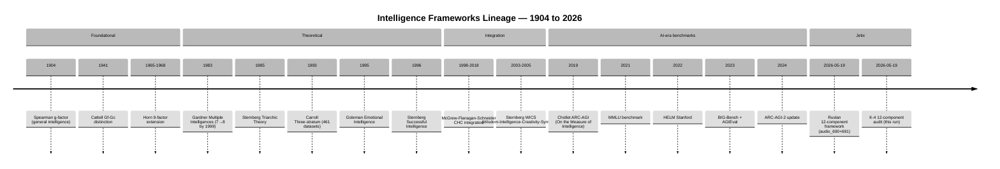

# Diagram 01 — Intelligence Frameworks Lineage (1904-2026)

## Notes

- **Cattell-Horn-Carroll (CHC)** — current empirical gold standard; ~80 years lineage
- **Sternberg + Gardner** — taxonomic/pedagogical traditions; lower empirical validation
- **AI-era benchmarks** — operationalize measurement; mostly Gf+Gc loading
- **Ruslan 12-component** — newest entry; combines methodological discipline + cognitive primitives

---

*Diagram 01 — frameworks lineage timeline.*
