# Diagram 02 — 12-component vs 6 Precedents Coverage

```mermaid
%%{init: {'theme':'base', 'themeVariables': {'primaryColor':'#fafafa','primaryTextColor':'#000000','lineColor':'#333','primaryBorderColor':'#333'}}}%%
graph TD
    subgraph "12 Components (voice anchored)"
        C1[C1 Direction]
        C2[C2 Safety→Dev]
        C3[C3 Relevance]
        C4[C4 Attention]
        C5[C5 Tool-use]
        C6[C6 Tool-create]
        C7[C7 Questions]
        C8[C8 Observation]
        C9[C9 Reasoning ⭐]
        C10[C10 Proportion]
        C11[C11 Goals]
        C12[C12 Decompose]
    end

    subgraph "Precedent frameworks"
        S[Sternberg Triarchic+WICS]
        CHC[Cattell-Horn-Carroll]
        GM[Gardner Multiple]
        EI[Goleman EI]
        AI[AI benchmarks ARC/MMLU/HELM]
        D[Deary IQ tradition]
    end

    C9 -.STRONG.-> S
    C9 -.STRONG.-> CHC
    C9 -.STRONG.-> GM
    C9 -.STRONG.-> AI
    C9 -.STRONG.-> D
    C11 --> S
    C11 --> CHC
    C11 --> GM
    C11 --> EI
    C12 --> S
    C12 --> CHC
    C12 --> GM
    C12 --> AI
    C4 --> S
    C4 --> CHC
    C5 --> CHC
    C5 --> GM
    C6 --> S
    C6 --> CHC
    C3 -.partial.-> S
    C3 -.partial.-> CHC
    C7 -.partial.-> S
    C7 -.partial.-> CHC
    C7 -.partial.-> GM
    C8 -.partial.-> CHC
    C8 -.partial.-> GM
    C10 -.partial.-> S
    C10 -.partial.-> EI
    C1 -.weak.-> GM
    C2 -.weak.-> EI

    style C9 fill:#d6f0d6
    style C11 fill:#d6f0d6
    style C12 fill:#d6f0d6
    style C1 fill:#fff4e6
    style C2 fill:#fff4e6
    style C8 fill:#fff4e6
    style C10 fill:#fff4e6
```

## Key
- **STRONG link** (solid arrow) = component fully covered by precedent
- **partial / weak link** (dotted arrow) = partial coverage
- Green = Cluster A (classical-cognitive, strong coverage)
- Orange = Cluster B/D (methodological-discipline / executive-vision, novel)

---

*Diagram 02 — coverage matrix visualization.*
