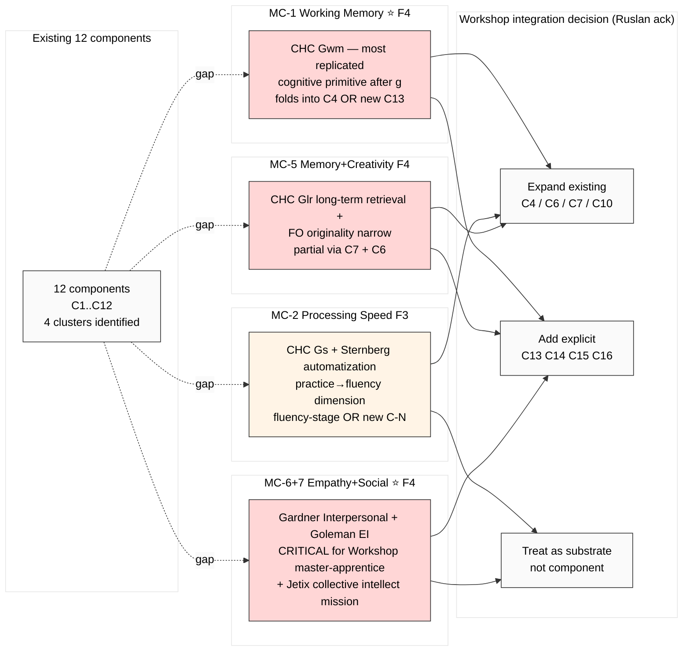

# Diagram 03 — Gap Analysis: 12 Components + 4 Critical Missing Candidates

## Severity ranking

| Rank | Missing | F | Reason |
|---|---|---|---|
| 1 | MC-1 Working memory | F4 | most-replicated cognitive primitive |
| 2 | MC-6+7 Empathy+Social | F4 | critical Workshop methodology + Jetix mission |
| 3 | MC-5 Memory+Creativity | F4 | Glr foundational |
| 4 | MC-2 Processing speed | F3 | skill-acquisition (Karpathy implicit) |

Total ≥3 missing surfaced per acceptance predicate ✅

---

*Diagram 03 — gap analysis output.*
