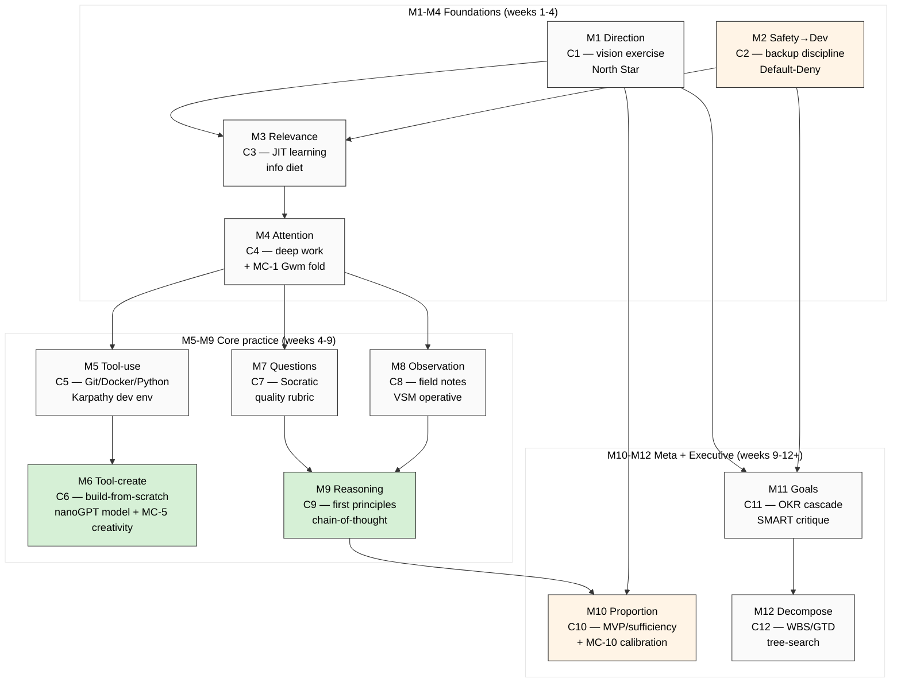

# Diagram 04 — Curriculum Module Map (12 Components → 12 Modules)

## Cohort time-to-Stage-3 (per module)

| Module | Weeks | Karpathy parallel |
|---|---|---|
| M1 Direction | 1-2 | «Why X» framing |
| M2 Safety→Dev | 1-2 | baseline running + commit |
| M3 Relevance | 2-3 | JIT learning |
| M4 Attention | 3-4 | deep work blocks |
| M5 Tool-use | 4-6 | second brain |
| M6 Tool-create | 6-9 | nanoGPT model |
| M7 Questions | 4-6 | simplest model |
| M8 Observation | 4-6 | look at data |
| M9 Reasoning | 6-9 | first principles |
| M10 Proportion | 8-12 | nanoGPT NOT GPT-4 |
| M11 Goals | 9-12 | per-module objectives |
| M12 Decompose | 9-12 | per-module structure |

---

*Diagram 04 — 12-module curriculum map.*
