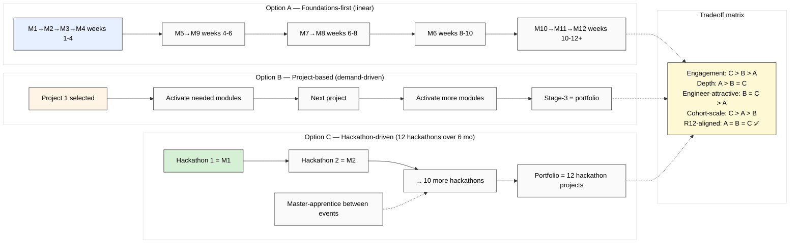

# Diagram 05 — Cohort Progression: 3 Sequencing Options (NO recommendation)

## Hybrid options (Phase 7 H-IC-19 candidates)

- **Hybrid A+B:** M1-M4 foundations + project-based thereafter
- **Hybrid A+C:** M1-M4 foundations + hackathon-driven thereafter
- **Hybrid B+C:** project-based with hackathon punctuation

**Decision discipline:** Ruslan acks selection OR pilot 3-arm RCT (H-IC-16 + H-IC-19 + H-IC-24)

---

*Diagram 05 — 3 sequencing options surfaced parallel per R1.*
