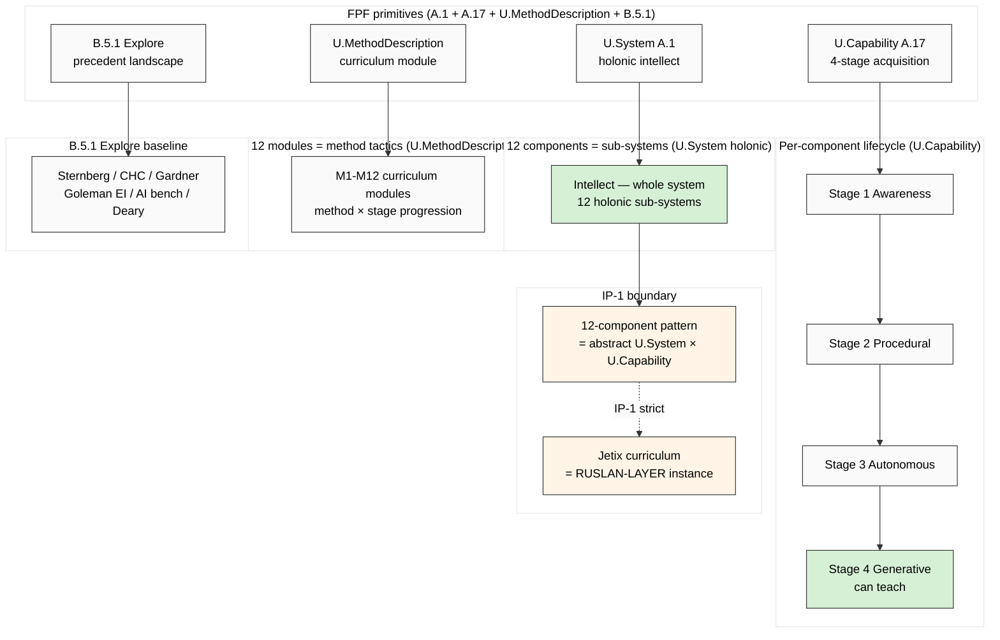

# Diagram 06 — FPF Primitive Mapping: U.System + U.Capability × 12 Components

## FPF mapping summary

- **U.System (A.1):** Intellect = whole-system; 12 components = holonic sub-systems
- **U.Capability (A.17):** Each component has 4-stage acquisition lifecycle (Awareness → Procedural → Autonomous → Generative)
- **U.MethodDescription:** Curriculum modules = method tactics × stage progression
- **B.5.1 Explore:** Precedent landscape mined (Phases 1-4)
- **IP-1 STRICT:** abstract pattern vs RUSLAN-LAYER instance preserved throughout

---

*Diagram 06 — FPF lens mapping.*
