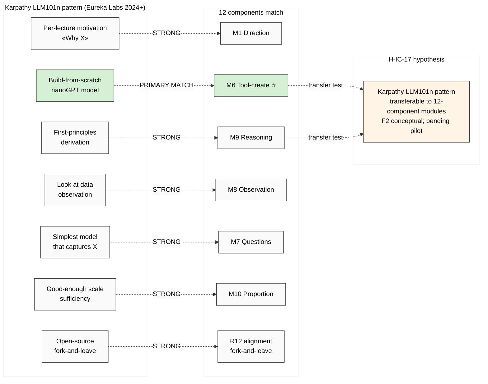

# Diagram 07 — Karpathy LLM101n Cross-link (12 components mapped to Karpathy pedagogy)

## Karpathy LLM101n parallel summary (per Phase 6 §4)

- M6 Tool-creation = **PRIMARY Karpathy module** (entire LLM101n pedagogy is build-from-scratch)
- M9 Reasoning = direct first-principles match
- M8 Observation = «look at the data» discipline match
- M10 Proportion = «good enough scale» match (nanoGPT не GPT-4)
- M1 Direction = per-lecture motivation match
- R12 alignment = open-source / fork-and-leave compatible

**H-IC-17:** Karpathy LLM101n pattern transferable к non-ML domains (12-component context). Test design = pilot module comparison.

---

*Diagram 07 — Karpathy cross-link.*
