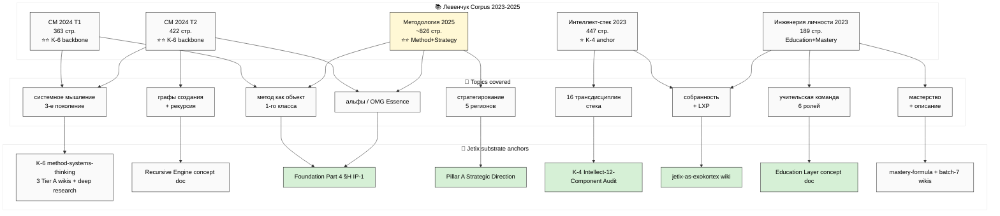

# Corpus Overview — 5 books × topics × Jetix anchors

```mermaid
%%{init: {'theme':'base', 'themeVariables': {'primaryTextColor':'#000000','textColor':'#000000','lineColor':'#333333','primaryBorderColor':'#333333','primaryColor':'#fafafa','noteTextColor':'#000000','noteBkgColor':'#fff8d5','edgeLabelBackground':'#ffffff'}}}%%
graph TB
    subgraph CORPUS["📚 Левенчук Corpus 2023-2025"]
        B1["СМ 2024 Т1<br/>363 стр.<br/>⭐⭐ K-6 backbone"]
        B2["СМ 2024 Т2<br/>422 стр.<br/>⭐⭐ K-6 backbone"]
        B3["Методология 2025<br/>~826 стр.<br/>⭐⭐ Method+Strategy"]
        B4["Интеллект-стек 2023<br/>447 стр.<br/>⭐ K-4 anchor"]
        B5["Инженерия личности 2023<br/>189 стр.<br/>Education+Mastery"]
    end

    subgraph TOPICS["🎯 Topics covered"]
        T1["системное мышление<br/>3-е поколение"]
        T2["графы создания<br/>+ рекурсия"]
        T3["метод как объект<br/>1-го класса"]
        T4["стратегирование<br/>5 регионов"]
        T5["альфы / OMG Essence"]
        T6["16 трансдисциплин<br/>стека"]
        T7["собранность<br/>+ LXP"]
        T8["учительская команда<br/>6 ролей"]
        T9["мастерство<br/>+ описание"]
    end

    subgraph JETIX["🔗 Jetix substrate anchors"]
        J1["K-6 method-systems-thinking<br/>3 Tier A wikis + deep research"]
        J2["Recursive Engine concept doc"]
        J3["Foundation Part 4 §H IP-1"]
        J4["Pillar A Strategic Direction"]
        J5["K-4 Intellect-12-Component Audit"]
        J6["jetix-as-exokortex wiki"]
        J7["Education Layer concept doc"]
        J8["mastery-formula + batch-7 wikis"]
    end

    B1 --> T1 & T3
    B2 --> T1 & T2 & T5
    B3 --> T3 & T4 & T5
    B4 --> T6 & T7
    B5 --> T7 & T8 & T9

    T1 --> J1
    T2 --> J2
    T3 --> J3
    T4 --> J4
    T5 --> J3
    T6 --> J5
    T7 --> J6
    T8 --> J7
    T9 --> J8

    style B3 fill:#fff8d5,color:#000
    style J3 fill:#d6f0d6,color:#000
    style J4 fill:#d6f0d6,color:#000
    style J5 fill:#d6f0d6,color:#000
    style J6 fill:#d6f0d6,color:#000
    style J7 fill:#d6f0d6,color:#000
```

[src: research/levenchuk-books-distillation-2026-05-20/00-SUMMARY-FOR-RUSLAN.md §3]
