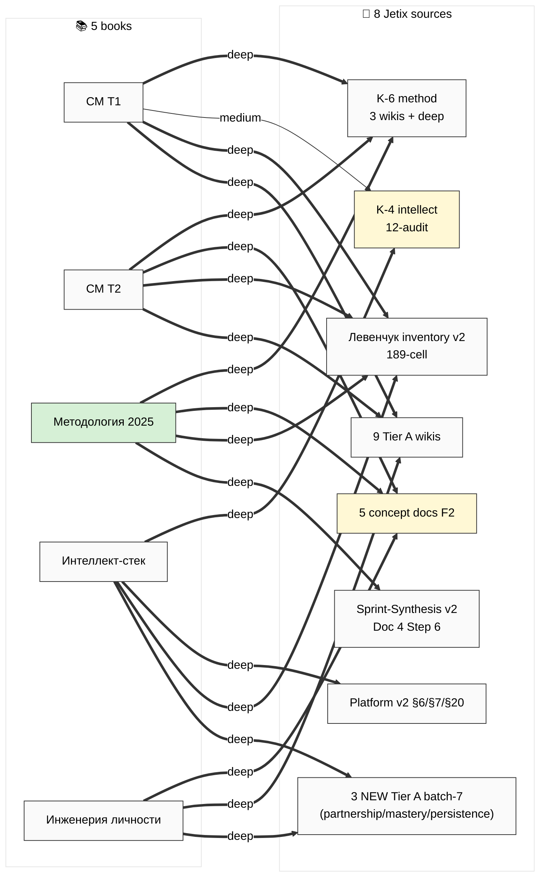

# Cross-link Heatmap — 5 books × 8 sources (Phase 5 distillation)

**Legend:** Bold (==>) = deep / verbatim structural twin; thin (-->) = medium / adjacent overlap. ⭐⭐⭐ central: Methodology 2025 ↔ 5 concept docs.

[src: research/levenchuk-books-distillation-2026-05-20/06-cross-link-к-jetix-substrate.md §1]
