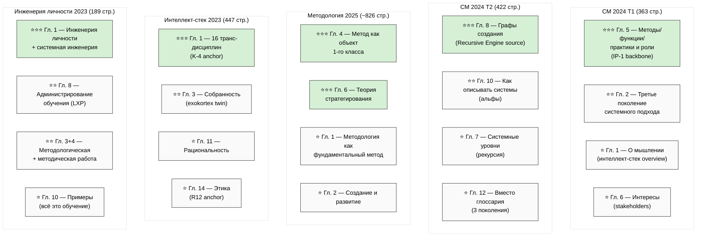

# Chapter Priority Heatmap — 5 books × top chapters (priority for next FPF deep phase)

**Priority legend:**
- ⭐⭐⭐ = highest priority for next FPF deep phase (6 chapters)
- ⭐⭐ = secondary priority
- ⭐ = ancillary / context

**Recommended next FPF deep order:** МG4 → МG6 → T2G8 → T1G5 → IPG1 → ISG1 (6 ⭐⭐⭐ chapters; ~50-100 hours total deep research).

[src: research/levenchuk-books-distillation-2026-05-20/06-cross-link-к-jetix-substrate.md §2]
