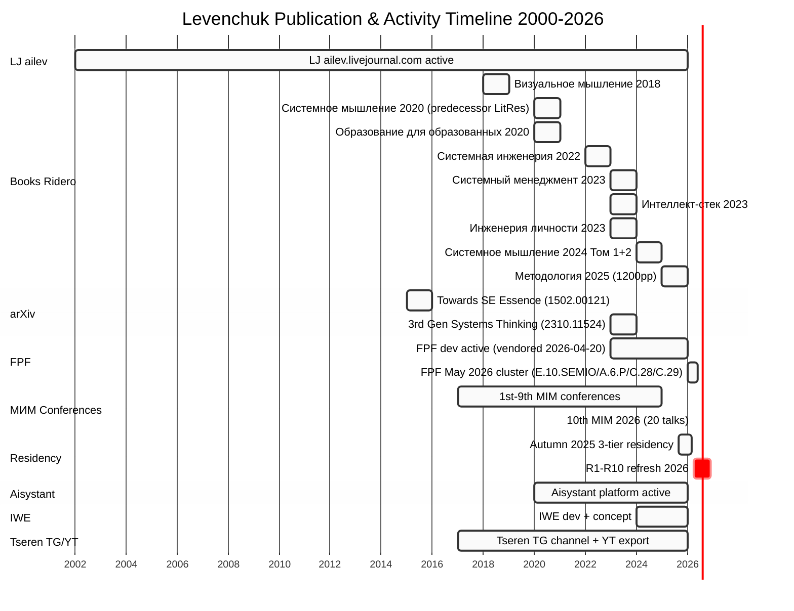

# Diagram 2 — Publication Timeline (Gantt)

**Key events highlighted (critical milestones):**
- 10th МИМ conf 2026-04-18/19 (free; 20 talks; 19 speakers — Phase 2 T1.1.2)
- R1-R10 residency restructure 2026-04 (Phase 2 T1.0 refreshed delta vs R0/R1/R2)

**Publication cadence:** ~1 major Ridero book/year 2022-2025; Системное мышление 2024 = 2-volume 1200pp; Методология 2025 = 1200pp (largest single work).

**Most active LJ years:** 2012 (Essence 73% approval era) → 2024-2026 (FPF dev sprint).
