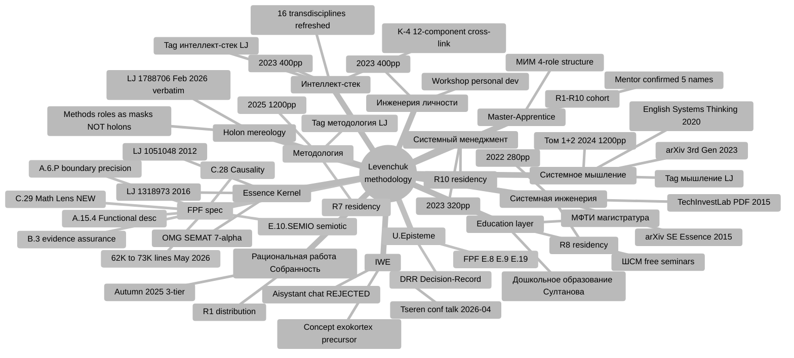

# Diagram 3 — Topic Taxonomy (Mindmap)

**Taxonomy depth:** 13 top-level topic branches × 2-7 sub-elements each.

**New branches surfaced inventory v2:**
- C.28 / C.29 / A.6.P / A.15.4 / E.10.SEMIO (5 new FPF patterns post-2026-04-20 vendored)
- Holon mereology (LJ 1788706 verbatim «методы и роли как маски НА холонах, не сами холоны»)
- 16 transdisciplines (refreshed delta vs «17» assumed previously)
