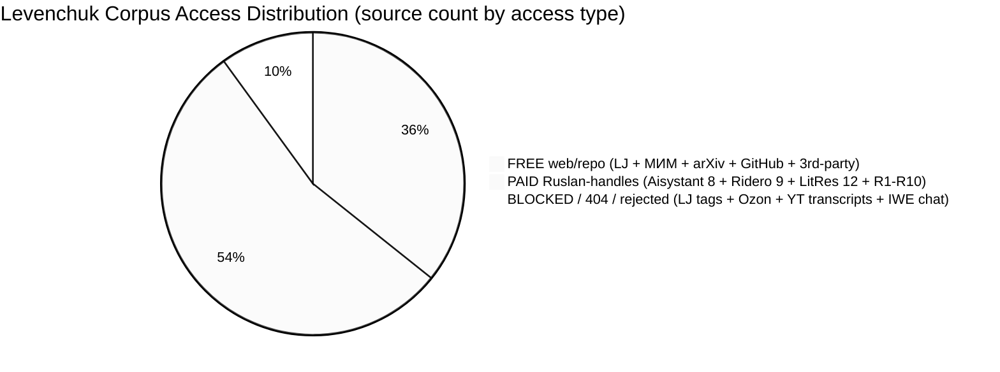
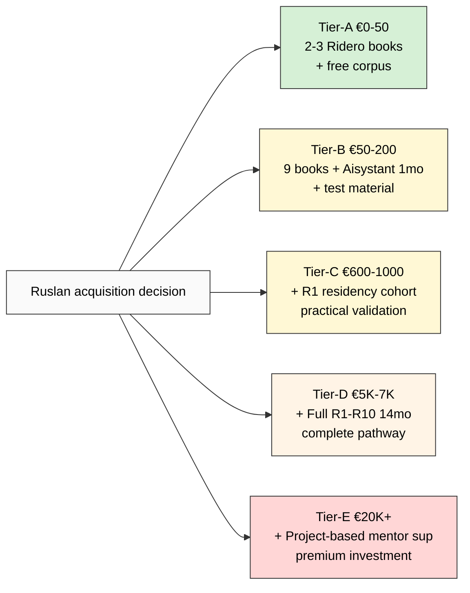

# Diagram 4 — Volume distribution: Paid vs Free vs Blocked

---

## Summary table — volume estimates by access type

| Access type | Source count | Volume estimate | Examples |
|---|---|---|---|
| **FREE (web/repo accessible)** | ~25 | unlimited (web) + 8 MB PDF + 73K FPF lines + 2 arXiv papers | LJ ailev / system-school.ru pages / arXiv abstracts / Psybertron / Habr/vc.ru samples / GitHub FPF / TechInvestLab PDF / in.wiki / inexsu / Tseren systemsworld / TG @ailev_blog |
| **PAID (Ruslan handles)** | ~38 items | ~4080 pp Ridero + 12 LitRes + 8 Aisystant courses + 10 residencies | Ridero 9 / LitRes 12 / Aisystant 8 courses / R1-R10 residencies |
| **BLOCKED** | 7 | n/a | LJ tag pages (4 × 404) / Ozon catalog (geo-redirect) / YT transcripts (infrastructure) / IWE chat interface (REJECTED per memory) |

---

## Cost projection (€ approximate)

**Each tier additive, не replacement.** Ruslan picks; Phase 5 §G surfaces overlap-strength ordering (NOT judgment).
