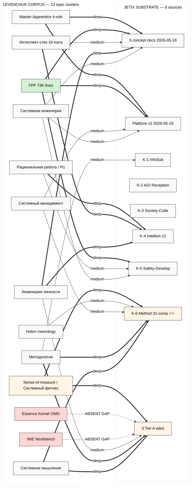

# Diagram 5 — Cross-link к Jetix substrate ⭐

**Legend:**
- `==>` deep overlap (verbatim or near-verbatim cross-citation present)
- `-->` medium / partial overlap
- `-.->` absent / GAP candidate
- Red nodes = topic absent from substrate (IWE / Essence Kernel)
- Light yellow = K-6 + Sense-of-measure = highest-density cross-link cluster
- Green = FPF = wholesale already integrated

---

## Top-5 cross-link clusters by density

1. **K-6 Method × Системное мышление + Методология + Sense-of-measure** ⭐⭐ — direct lineage; K-6 31-component synthesis structurally mirrors Levenchuk's Системное мышление 2024 (1200pp Ridero)
2. **3 Tier A wikis × Method + Sense-of-measure + Personal Engineering** ⭐ — already-acked wiki concepts deeply latent с Levenchuk parallels
3. **FPF × ALL Jetix substrate** ⭐ — wholesale integration (Platform v2 §5 8-layer + concept docs reference + K-5 R13 packet cites)
4. **5 concept docs × Master-Apprentice + Personal Engineering** — Workshop / EDU-LAYER strong overlap
5. **K-4 × Интеллект-стек 16 transdisciplines** ⭐ — 12-component framework parallels 16-transdiscipline structure

## Top-2 absent gaps (red)

- **IWE** (Intelligence Workbench Engine) — absent ALL 8 sources despite Levenchuk's central concept = exokortex precursor
- **Essence Kernel** (OMG SEMAT 7-alpha) — absent despite Levenchuk's 2015 arXiv direct contribution
