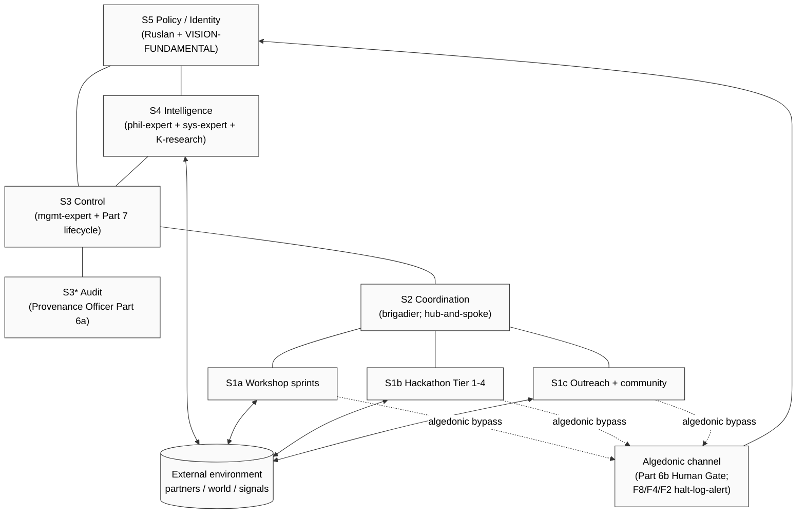

# Phase 2 — Beer VSM deep (Stafford Beer)

> Stafford Beer (1926-2002): British cybernetician; built Cybersyn (Chile 1971-73);
> formulated Viable System Model (VSM); founded management cybernetics. Direct
> intellectual heir к Ashby (requisite variety) + Wiener (control/communication).

---

## §1 Verbatim canonical statements (5 anchors)

1. *«The purpose of a system is what it does»* (acronym POSIWID) [src: Beer, late papers; quoted in Beckford 2002 «Quality: A Critical Introduction» + Beer 1989 «Diagnosing the System for Organizations»]
2. *«The structure of any viable system must include the five necessary and sufficient subsystems interrelated as the model declares.»* [src: Beer 1979 «Heart of Enterprise», ch. 6]
3. *«Variety equates variety, where variety is the count of possible states of the system in question.»* (Ashby restatement, Beer operationalised) [src: Beer 1972 «Brain of the Firm», ch. 3]
4. *«Algedonic signals bypass the management filters when the system is in pain or pleasure.»* [src: Beer 1979 ch. 11 §«Algedonic Channel»]
5. *«It is not necessary to change. Survival is not mandatory.»* (W. Edwards Deming, Beer-quoted) [src: Beer's late lectures; Espejo & Reyes 2011 «Organizational Systems»]

---

## §2 5-system VSM core architecture

Per Beer 1972/1979/1985 (three foundational books):

| System | Function | Variety engineering role | Pillar metaphor |
|---|---|---|---|
| **S1 Operations** | Production / value delivery (multiple parallel operational units, each viable in own right) | Local autonomy + local variety absorption | Hands-and-feet |
| **S2 Coordination** | Anti-oscillation between S1 units; resource scheduling | Variety attenuation (between S1 units) | Reflexes |
| **S3 Control (+ S3*)** | Internal regulation; S3* = audit / sporadic intervention | Synoptic view + tactical command | Operations management |
| **S4 Intelligence** | Outside-and-future awareness; environmental scanning + adaptation modelling | Variety amplification (system → environment) | Strategy / R&D |
| **S5 Policy / Identity** | Closure of the system; defines purpose + balance S3/S4 tension | Ultimate variety arbitration | Constitution / values |

**Algedonic channel** — bypass path from any subsystem to S5 for pain/pleasure signals. Direct cross-link к text_012 §2.9 «sense of measure» (algedonic threshold).

**Recursive structure** — each S1 unit is itself a viable system containing its own S1-S5 → fractal architecture. Direct cross-link к text_013 §2.16-17 (parts decomposition + composite improvement).

[src: Beer 1972 ch. 5-7 + Beer 1979 ch. 6-12 + Espejo & Reyes 2011]

---

## §3 Variety engineering principles

| Principle | Description | K-6 voice anchor |
|---|---|---|
| Requisite variety (Ashby-Beer) | Regulator variety ≥ disturbance variety | text_014 §2.20 «rule-knowledge → survival» |
| Variety attenuation | Reduce upstream variety (filter / abstract / categorise) | text_013 §2.12 (influence discrimination good/bad) + text_014 §2.25 (reconnaissance filter) |
| Variety amplification | Generate downstream variety (delegate / parallelise / autonomise) | text_014 §2.30 (exokortex enables higher-capability interaction) |
| Recursion of viability | Each level S1-S5 mirrors total | text_013 §2.16-17 (parts → composite) + text_013 §2.18 (recursive lifecycle) |
| Algedonic short-circuit | Pain/pleasure signal bypasses hierarchy | text_012 §2.9 (sense of measure trigger) |

[src: Beer 1979 «Heart of Enterprise» ch. 8-10 + Foundation Part 8 health monitoring (algedonic-like signal handler)]

---

## §4 Cybersyn project (Chile, 1971-1973) — historical instantiation

- **Context:** Allende government commission to Beer; goal: real-time cybernetic management of nationalised industry.
- **Components:** (a) Cybernet (telex network linking factories), (b) Cyberstride (variety-attenuation software), (c) CHECO (economic simulator), (d) Operations Room (control room with 7 chairs; algedonic + statistical display).
- **Status at coup (Sep 1973):** partially operational; 70% of state-controlled industry on telex; Operations Room built; survived attempted nationwide strike (Oct 1972) via Cybernet coordination.
- **End:** project destroyed after Pinochet coup; documents disappeared but Beer published «Brain of the Firm» 2nd ed. 1981 reflecting on it.

**Critical lesson:** Cybersyn = first attempt at real-time recursive VSM at country scale. Demonstrated *variety attenuation works* (industrial telex coordination during strike) but also *political viability ≠ technical viability* (regime collapse).

[src: Medina 2011 «Cybernetic Revolutionaries: Technology and Politics in Allende's Chile» MIT Press + Beer 1981 «Brain of the Firm» 2nd ed. afterword]

**Jetix relevance:** Cybersyn = closest historical precedent for FPF-substrate-coordinated workshop network. R12 anti-extraction concern: Cybersyn was state-owned; Jetix Clans = participatory (per H8 People-NS LOCK). Open Q: does Cybersyn architecture inform Workshop Tier 4 governance? [Phase 8 H-MST-6]

---

## §5 Jetix VSM mapping (3 instantiations)

### §5.1 VSM applied to Jetix-as-system (substrate)

| VSM system | Jetix instantiation | Source artefact |
|---|---|---|
| S1 Operations | Workshop sprints + hackathon Tier 1-4 cohorts + outreach engagement | `decisions/JETIX-WORKSHOP-CONCEPT-2026-04-30.md` |
| S2 Coordination | Brigadier (single dispatcher; hub-and-spoke per Part 4) | `swarm/lib/routing-table.yaml` |
| S3 Control | Manager (legacy) + ROY mgmt-expert; project lifecycle Part 7 | Foundation Part 7 |
| S3* Audit | Provenance Officer Part 6a (F-G-R + halt-log-alert) | Foundation Part 6a |
| S4 Intelligence | Phil-expert (epistemology) + Sys-expert (cybernetics) + K-research outputs | ROY swarm Phase A+ |
| S5 Policy / Identity | Ruslan + Pillar A (Strategic Direction) + VISION-FUNDAMENTAL + 8 Octagon LOCKs | `decisions/JETIX-VISION-FUNDAMENTAL-2026-04-27.md` |
| Algedonic | Part 6b Human Gate + halt-log-alert F8/F4/F2 grades | Foundation Part 6b §I.2 |

**Recursion:** each ROY expert is itself a viable system (own S1-S5 internally via 4 role-modes critic/optimizer/integrator/scalability). ✅

### §5.2 VSM applied to human-as-system (self-as-system)

Direct cross-link к **NASA «Astronaut = miniature spaceship»** metaphor (per `research/deepening-2026-05-18/12-cross-domain-fpf-aerospace.md`):

| VSM system | Human instantiation |
|---|---|
| S1 | Daily activities (eat / sleep / move / work) |
| S2 | Habit + routine layer |
| S3 | Daily planning + budget |
| S4 | Reflection + learning + reading (reconnaissance per text_014 §2.25) |
| S5 | Personal values + identity (text_012 §2.7) |
| Algedonic | Body pain / emotional surge (sense of measure trigger per text_012 §2.9) |

Direct cross-link к Education Layer Tier 1 curriculum module candidate (`research/education-layer-deep-2026-05-18/`).

### §5.3 VSM applied to ROY swarm

| VSM system | ROY instantiation | Note |
|---|---|---|
| S1 Operations | 5 experts × 4 role-modes = 20 cells | Per Phase-A canonical |
| S2 Coordination | Brigadier (dispatcher) | Single-dispatcher rule |
| S3 Control | Brigadier provenance-gate §5.5.5 | Phase A protocol |
| S3* Audit | Provenance Officer Part 6a | F-G-R schema enforced |
| S4 Intelligence | K-research outputs + Phase 0 inventory | Substrate for orientation |
| S5 Policy / Identity | Ruslan ack-authority (per FUNDAMENTAL §4.3 corrigibility) | IP-1 STRICT preserved |

**Open Q:** is brigadier S2+S3 conflation a violation of Beer's 5-distinct-systems rule? **Surface as H-MST-5** [Phase 8].

---

## §6 Critiques / opposing views

- **Critique 1 (Espejo + Reyes 2011):** VSM has been applied too schematically; real organisations have political dynamics not modeled (Beer himself was aware — Cybersyn ended for political reasons).
- **Critique 2 (Snowden Cynefin):** VSM presupposes Cynefin «complicated» domain (knowable causation); in «complex» domain (emergent patterns) VSM diagnosis may map non-existent systems.
- **Critique 3 (Stafford-Beer-internal):** Algedonic channel can be overwhelmed by signal floods → S5 noise rather than signal. Direct cross-link к text_012 §2.9 sense-of-measure: when to trigger algedonic = sense-of-measure question.
- **Critique 4 (R1 internal):** VSM applied to humans (§5.2) is metaphorical; care needed not to mechanise self-conception. Per text_013 §2.16 «gradient view»: humans ≠ machines 100%.

---

## §7 Diagram (mermaid)

[mermaid saved standalone: `diagrams/03-jetix-vsm-mapping.md` Phase 8]

---

## §8 Constitutional posture (Phase 2 footer)

- ✅ R1 surface — verbatim quotes attributed
- ✅ R6 — per-claim `[src: ...]`
- ✅ IP-1 STRICT — VSM = pattern (type); Jetix mappings = instances bound to ROY/Ruslan per RUSLAN-LAYER
- ✅ R11 — no novel actions
- ✅ EP-5 — F2/F3 explicit

---

*Phase 2 brigadier-scribe surface. Beer VSM deep with 3 instantiations + algedonic + Cybersyn. Ready for Phase 3 (Senge + Sterman).*
