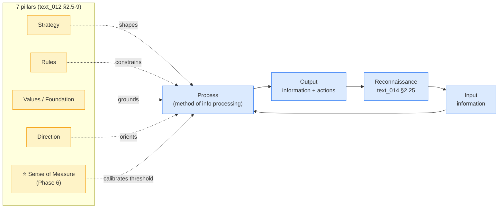

# Method flow × 7 pillars (text_012 §2.4-9)

**Reading:** Input → process → output cycle with 5 «pillar» influences. Sense-of-measure is the threshold-calibrator; rest are framing/grounding/orienting.
