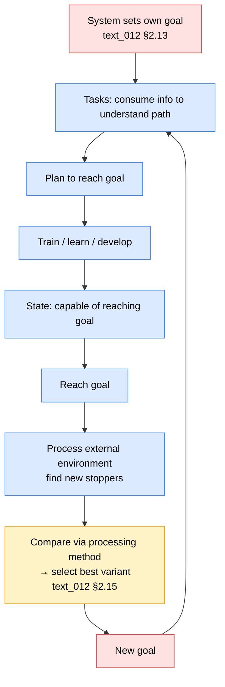

# System self-development cycle (text_012 §2.13-15)

```mermaid
%%{init: {'theme':'base', 'themeVariables': {'primaryTextColor':'#000000','textColor':'#000000','lineColor':'#333333','primaryBorderColor':'#333333','primaryColor':'#fafafa','noteTextColor':'#000000','noteBkgColor':'#fff8d5','edgeLabelBackground':'#ffffff'}}}%%
flowchart TB
    GOAL[System sets own goal<br/>text_012 §2.13]
    TASK[Tasks: consume info to understand path]
    PLAN[Plan to reach goal]
    TRAIN[Train / learn / develop]
    READY[State: capable of reaching goal]
    ACHIEVE[Reach goal]
    SCAN[Process external environment<br/>find new stoppers]
    SELECT["Compare via processing method<br/>→ select best variant<br/>text_012 §2.15"]
    GOAL2[New goal]

    GOAL --> TASK --> PLAN --> TRAIN --> READY --> ACHIEVE --> SCAN --> SELECT --> GOAL2 --> TASK

    classDef goal fill:#fee2e2,stroke:#ef4444
    classDef proc fill:#dbeafe,stroke:#3b82f6
    classDef sel fill:#fef3c7,stroke:#f59e0b
    class GOAL,GOAL2 goal
    class TASK,PLAN,TRAIN,READY,ACHIEVE,SCAN proc
    class SELECT sel
```

**Reading:** classic OODA + Wiener feedback + Senge personal-mastery cycle articulated in Ruslan voice.
