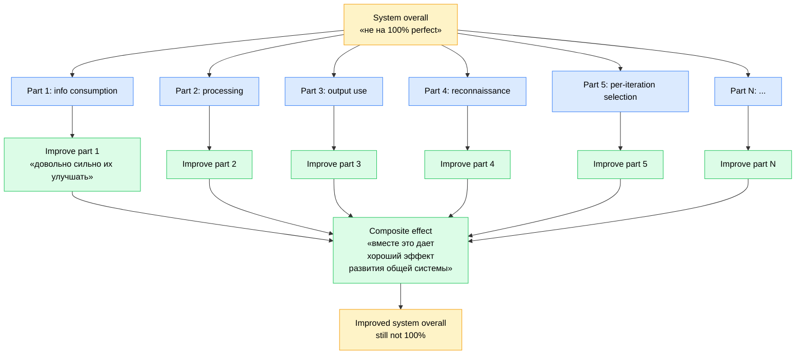

# Gradient view + parts decomposition (text_013 §2.16-17)

**Reading:** decompose system into parts (Meadows / Beer VSM recursion / Boyd destruction-creation) → improve parts (Toyota / Kaizen) → composite improvement (Bertalanffy hierarchical-levels). Gradient ≠ perfection — Ashby ultrastability tolerance.
