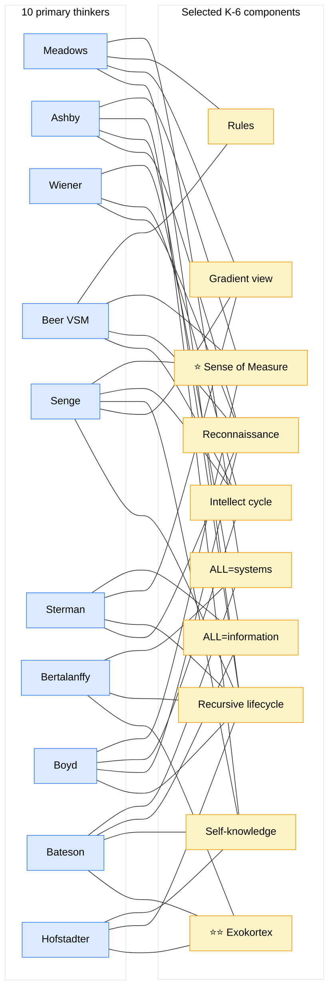

# Cross-precedent corroboration matrix (10 thinkers × selected K-6 components)

**Reading:** 168 corroboration touches across 31 components × 10 thinkers (5.4 thinkers/component avg). Cross-cultural / cross-discipline convergence. Breadth-NOT-selection preserved.
