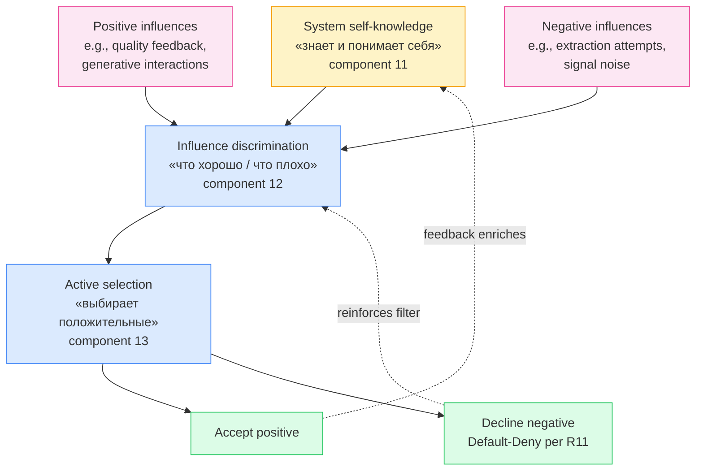

# Self-knowledge + influence + active-selection trio (text_013 §2.11-13)

**Reading:** Boyd OODA Orient + Bateson «difference which makes a difference» + Senge mental models + Beer VSM S4 intelligence + Pillar C R11 Default-Deny. Trio operates iteratively: self-knowledge enriches discrimination enriches selection enriches self-knowledge.
