# 3-stage throughput process — text_014 §2.22-28 (PROCESS not circle)

```mermaid
%%{init: {'theme':'base', 'themeVariables': {'primaryTextColor':'#000000','textColor':'#000000','lineColor':'#333333','primaryBorderColor':'#333333','primaryColor':'#fafafa','noteTextColor':'#000000','noteBkgColor':'#fff8d5','edgeLabelBackground':'#ffffff'}}}%%
flowchart LR
    SELECT["Per-iteration selection<br/>(text_014 §2.28)<br/>• values<br/>• method of processing<br/>• specific info"]

    SELECT --> S1["Stage 1: Input throughput<br/>(text_014 §2.22)<br/>bandwidth-limited<br/>how much info enters"]

    S1 --> S2["Stage 2: Processing<br/>(text_014 §2.23)<br/>method × speed ×<br/>computational capability"]

    S2 --> S3["Stage 3: Output use<br/>(text_014 §2.24)<br/>memory-dependent<br/>how well used"]

    S3 --> LEARN[Learning / training /<br/>improvement]

    LEARN --> RECONN["Reconnaissance<br/>(text_014 §2.25-26)<br/>scan new info<br/>determine next consumption"]

    RECONN -->|NOT circle —<br/>different values/method/info|SELECT

    classDef select fill:#fef3c7,stroke:#f59e0b
    classDef stage fill:#dbeafe,stroke:#3b82f6
    classDef proc fill:#dcfce7,stroke:#22c55e
    class SELECT,RECONN select
    class S1,S2,S3 stage
    class LEARN proc
```

**Reading:** «как будто даже не круг это вот процесс» — each iteration shifts (values, method, info focus) so trajectory is non-repeating. Cross-link Shannon channel capacity + Sterman stock-flow + Boyd OODA + Hofstadter strange-loop (NOT mere recurrence — level-crossing).
