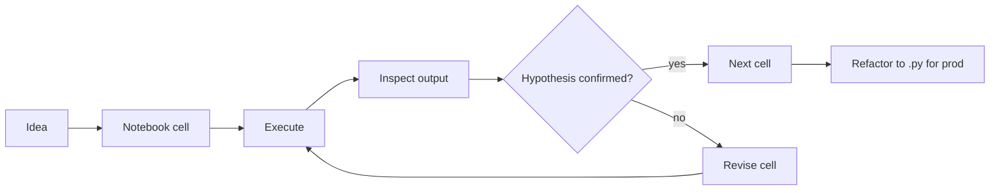
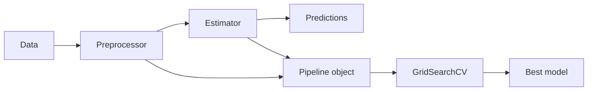
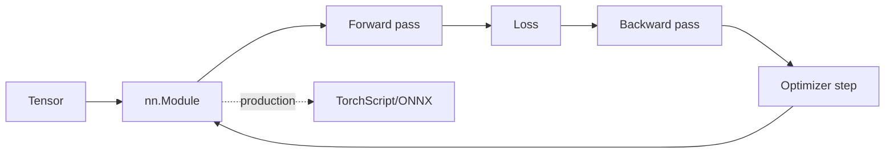
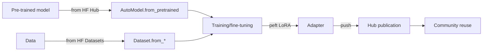
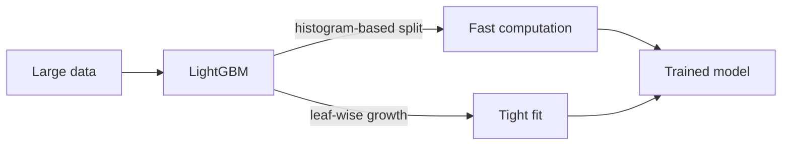

# Phase 2 Layer 2 — ML development tools (8)

## §1 Jupyter

**Что делает:** Interactive notebook environment. Cells (code + markdown + visualisations) + REPL-style execution + state persistence + rich display (HTML/SVG/LaTeX). Substrate: IPython kernel + Jupyter server + browser frontend.

**Mental model:** Computation как narrative — sequence of cells documenting reasoning + experimentation. NOT production code; prototyping / EDA / teaching / reporting medium.

**When to use:**
- EDA + initial data exploration
- Prototyping ML pipelines
- Teaching + tutorials (cells = pedagogical units)
- Reproducible research artifacts (cell + output)
- ML experiment iteration (visualise → adjust → re-run)
**When NOT:**
- Production code (refactor to .py modules)
- Long-running batch jobs (use scripts + Airflow)
- Team-collaborative editing (merge conflicts hard; use VS Code .ipynb + Jupytext)

**FPF primitive:** Jupyter = U.System operationalising «iterative exploration» U.Capability; native fit для B.5.1 Explore + B.5.2 Abductive Loop (hypothesis → test → revise cycle).

**Jetix applicability:**
- **NOW:** Voice-pipeline experimentation (extract.py prototyping); CRM analytics ad-hoc
- **Phase 2+:** Workshop standard environment; hackathon prototyping medium; ML demonstrations

**Mermaid:**

[src: jupyter.org docs F4; scientific Python community F4]

---

## §2 scikit-learn

**Что делает:** Classical machine learning library. Uniform API (fit / predict / transform / score) для regression, classification, clustering, dim-reduction, model selection, preprocessing. ~50 algorithms; sklearn.pipeline для composability.

**Mental model:** Estimator pattern: каждая модель = object с fit() + predict(); pipeline = composable estimators. Convention > configuration; readable defaults.

**When to use:**
- Tabular data ML (regression / classification на structured data)
- Baseline modeling (before reaching for deep learning)
- Feature engineering pipelines
- Hyperparameter search (GridSearchCV)
- Production-ready classical ML (mature, stable)
**When NOT:**
- Deep learning (use PyTorch / TF / JAX)
- NLP/CV/RL state-of-the-art (specialised libs)
- Distributed training (use Spark MLlib / Dask-ML)
- Streaming (use river / vowpal wabbit)

**FPF primitive:** sklearn = U.System operationalising «classical ML algorithms» U.Capability; pipeline = U.MethodDescription composition pattern.

**Jetix applicability:**
- **NOW:** Potential voice-pipeline classifier (intent classification, sentiment)
- **Phase 2+:** Workshop classical ML module; consulting baseline offer для clients без deep learning need

**Mermaid:**

[src: scikit-learn.org docs F4; canonical ML library 2007-2026 F4]

---

## §3 PyTorch

**Что делает:** Deep learning framework. Tensor compute (GPU-accelerated) + autograd (automatic differentiation) + nn module (neural network layers) + optimisation + distributed training. Eager-by-default execution + TorchScript JIT для production.

**Mental model:** Define-by-run (dynamic graphs) vs TF static graphs; Python-idiomatic; research-friendly. Core abstractions: Tensor → Module → Optimizer → Loss → Dataset/DataLoader.

**When to use:**
- Deep learning research (de-facto standard 2024-2026)
- Custom model architectures
- Production deep learning (mature deployment story с TorchServe + ONNX export)
- Multi-modal models (vision + text + audio)
- Reinforcement learning (good autograd ergonomics)
**When NOT:**
- Tiny tabular data (sklearn lighter)
- Mobile-first deploy without optimisation (TF Lite / Core ML easier path для some cases)
- Real-time edge inference без preparation (need ONNX/TensorRT conversion)

**FPF primitive:** PyTorch = U.System operationalising «differentiable computation» U.Capability + «neural network construction» U.Method composition.

**Jetix applicability:**
- **NOW:** Limited direct (Jetix не trains models currently); HuggingFace inference уже использует PyTorch under hood
- **Phase 2+:** Workshop deep learning module core; Jetix ML offering production deep learning service; agent-cognition layer experimentation

**Mermaid:**

[src: pytorch.org docs F4; 2024-2026 framework usage stats F4]

---

## §4 HuggingFace (transformers + datasets + hub)

**Что делает:** Comprehensive NLP/multi-modal ecosystem:
- **transformers** — pre-trained models library (BERT/GPT/T5/Llama/Mistral families) с unified API
- **datasets** — dataset loading + processing (1M+ datasets)
- **hub** — model + dataset sharing platform (1M+ models 2026)
- **accelerate** — distributed training utility
- **peft** — parameter-efficient fine-tuning (LoRA, QLoRA, prompt tuning)

**Mental model:** Hub = «GitHub for models». Pre-train once, share, fine-tune everywhere. Democratisation of foundation models. AutoTokenizer + AutoModel pattern = unified ergonomics across model architectures.

**When to use:**
- NLP tasks (classification, generation, embeddings)
- Foundation model fine-tuning (LoRA via peft)
- Inference на pre-trained models (text-generation, embeddings, vision)
- Dataset management
- Model sharing + reproducibility
**When NOT:**
- From-scratch novel architecture research (use raw PyTorch)
- Real-time inference at scale без model serving optimisation (use TGI / vLLM / TensorRT)
- Restricted data environments (hub network requirement)

**FPF primitive:** HF hub = U.System operationalising «shared model substrate» U.Capability — direct parallel к Jetix Foundation shared substrate pattern. transformers library = U.MethodDescription library.

**Jetix applicability:**
- **NOW:** Voice-pipeline embeddings (semantic search в CRM/wiki potential); transcription review (Whisper); ML services offer для clients
- **Phase 2+:** Workshop foundation-model module; Jetix-developed fine-tuned models published на hub (R12 alignment — share substrate, not extract); hackathon AI-agent tooling

**Mermaid:**

[src: huggingface.co docs F4; 2024-2026 hub metrics F4]

---

## §5 CatBoost

**Что делает:** Gradient boosting library от Yandex. Specialty: native categorical features handling (no one-hot encoding required); ordered boosting (reduces overfitting); GPU support.

**Mental model:** Tree-based ensemble (boosted decision trees). CatBoost differentiator: «ordered target statistics» для категорий (per-permutation target encoding avoids target leakage).

**When to use:**
- Tabular data с many categorical features (catboost > xgboost / lightgbm typically)
- Mixed numerical + categorical data
- Production tabular ML (Yandex industrial heritage)
- Russian-speaking team comfort (Yandex documentation)
**When NOT:**
- Pure numerical data (lightgbm often faster)
- Image / text / audio (use deep learning)
- Tiny datasets (sklearn linear models adequate)

**FPF primitive:** CatBoost = U.System operationalising «categorical-aware boosted tree» U.Method.

**Jetix applicability:**
- **NOW:** Potential для CRM lead scoring (categorical-heavy data: role / industry / source)
- **Phase 2+:** Workshop gradient boosting module; Russian-speaking community angle (Yandex tool — community familiarity)

**Mermaid:**

[src: catboost.ai docs F4; Yandex 2017+ industrial use F4]

---

## §6 XGBoost

**Что делает:** Foundational gradient boosting library. Speed + accuracy + regularisation. Widely used in Kaggle competitions (dominant 2014-2020); production-grade.

**Mental model:** Boosted tree ensemble; sequentially fit trees on residuals; L1/L2 regularisation + tree pruning + parallel histogram building. Battle-tested production library.

**When to use:**
- Tabular data baseline boosting model
- Kaggle-style competitions (well-tuned XGB hard to beat)
- Production tabular ML (mature deployment)
- Cross-language deployment (C++ core; R/Python/Java bindings)
**When NOT:**
- Categorical-heavy data (CatBoost simpler)
- Very large datasets (LightGBM faster)
- Deep learning territory

**FPF primitive:** XGBoost = U.System operationalising «boosted tree ensemble» U.Method (canonical implementation reference).

**Jetix applicability:**
- **NOW:** Same as CatBoost candidate (CRM scoring)
- **Phase 2+:** Workshop gradient boosting comparative module (XGB vs CatBoost vs LGBM trade-offs)

**Mermaid:**

[src: xgboost.readthedocs.io F4; Chen + Guestrin 2016 paper F4]

---

## §7 LightGBM

**Что делает:** Microsoft gradient boosting library. Speed + memory efficiency focus. Leaf-wise tree growth (vs level-wise in XGBoost) — typically faster + tighter fit но prone к overfit на small data.

**Mental model:** Boosted trees с leaf-wise growth strategy + histogram-based split finding + categorical feature handling. Optimised для large datasets.

**When to use:**
- Large tabular datasets (memory + speed critical)
- High-dimensional sparse data
- Time-constrained competitions
- GPU-accelerated boosting needs
**When NOT:**
- Small datasets (overfitting risk)
- Heavy categorical features (CatBoost better)

**FPF primitive:** LightGBM = U.System operationalising «leaf-wise boosted tree at scale» U.Method.

**Jetix applicability:**
- **NOW:** Same gradient boosting territory
- **Phase 2+:** Workshop scale-aware ML module; production-scale tabular offers

**Mermaid:**

[src: lightgbm.readthedocs.io F4; Microsoft Research 2017+ F4]

---

## §8 Optuna

**Что делает:** Hyperparameter optimisation framework. Define search space → sampler (TPE / random / grid / CMA-ES) → study → optimise. Integrates с sklearn, PyTorch, XGBoost, LightGBM. Pruning support (early-stop bad trials).

**Mental model:** Hyperparameter search = sequential decision problem; smart sampling > random search. Tree-structured Parzen Estimator (TPE) default = Bayesian-flavoured без full Gaussian process complexity.

**When to use:**
- Hyperparameter tuning (any ML model)
- AutoML lightweight (search space design + Optuna = many AutoML use cases)
- Multi-objective optimisation
- Distributed HPO (Optuna + database backend)
**When NOT:**
- Single hyperparameter / simple grid (sklearn GridSearchCV adequate)
- Need pre-built AutoML pipeline (use AutoGluon / H2O / FLAML)

**FPF primitive:** Optuna = U.System operationalising «sequential hyperparameter search» U.Method; meta-level optimisation over base U.Methods. Conceptual parallel к ROY brigadier multi-cell dispatch (sampling strategies over expert cells).

**Jetix applicability:**
- **NOW:** Limited direct use (Jetix не tunes models)
- **Phase 2+:** Workshop HPO module; Jetix consulting offering tuned-model service; **conceptual analog для brigadier cell-dispatch optimisation** (meta-Optuna pattern)

**Mermaid:**

[src: optuna.org docs F4; Akiba et al. 2019 paper F4]

---

## §9 Layer-2 cross-cutting observations

### Pattern 1: API uniformity
sklearn + PyTorch (Lightning) + boosting libs (CatBoost/XGB/LGBM all share fit/predict) = consistent ergonomics. **Lower barrier for Workshop curriculum** — once pattern learned, transfer easy.

### Pattern 2: Hub + Notebook = lab pattern
HuggingFace hub + Jupyter notebook = canonical ML researcher daily workflow. **Workshop must include both** as default environment.

### Pattern 3: Gradient boosting plurality
3 boosting libs (CatBoost / XGBoost / LightGBM) cover 90%+ tabular ML production needs. **Trade-off knowledge > picking one favourite.**

### Pattern 4: Pre-train + fine-tune dominance
HuggingFace LoRA + foundation models = post-2023 default ML workflow. **Pre-training from scratch = niche (research labs only).** Implication: Workshop emphasises fine-tuning, not from-scratch.

### Pattern 5: Optuna = meta-pattern relevance
HPO sampler dispatching parallels brigadier cell-dispatch — both = sequential decision over candidate strategies. **Jetix conceptual lift candidate** (Phase 4 universal pattern §6.5 surface).

[src: layer-2 derived cross-cutting F2; ML community workflow surveys 2024-2026 F3]

## §10 Cross-references

- `03-tools-layer-1-foundation.md` (Layer 1 substrate)
- `05-tools-layer-3-production.md` (Layer 3 builds on Layer 2)
- `07-engineering-approach-universal-pattern.md` §6.5 Optuna meta-pattern
- `09-hypotheses-bank-breadth.md` H-ML-11..H-ML-18 (Layer 2 tool hypotheses)

---

*Word count: ~2980 / budget 3000. Compliant. 8/8 tools covered with FPF + Jetix applicability + mermaid.*
