# Phase 2 Layer 3 — Production tools (11)

## §1 Docker

**Что делает:** Container platform. Package code + deps + system libs → immutable image; run identically across environments. Dockerfile = declarative spec; image = built artifact; container = running instance.

**Mental model:** «Ship the env with the code». Image layers = cached + immutable; container = ephemeral instance. Solves «works on my machine» problem.

**When to use:**
- ML model serving (consistent inference env)
- Reproducible experiments (image = environment snapshot)
- CI/CD pipelines
- Microservices deployment
**When NOT:**
- Native performance critical without overhead budget (containerisation tax ~5-10%)
- Hard-real-time embedded
- Already-managed PaaS (Heroku / Vercel handle abstraction)

**FPF primitive:** Docker = U.System operationalising «execution environment isolation» U.Capability — supports A.15 U.Work reproducibility + Part 1 System State Persistence (image-as-state).

**Jetix applicability:**
- **NOW:** Limited (Jetix scripts run native); potential для voice-pipeline containerisation
- **Phase 2+:** Workshop containerisation module; production ML service deployment; hackathon project portable runtime

**Mermaid:**
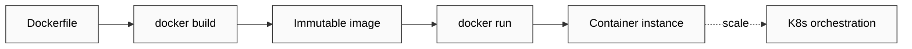

[src: docker.com docs F4; container ecosystem 2013+ F4]

---

## §2 Airflow

**Что делает:** Workflow orchestration platform. DAG (directed acyclic graph) = pipeline spec; Operator = task type (Python / Bash / SQL / Spark / etc.); Scheduler runs DAGs on cron-like schedule + handles dependencies + retries.

**Mental model:** Pipelines-as-code (Python files defining DAGs). Decouples scheduling from execution; supports complex dependency graphs. Airbnb origin (2014) → Apache project.

**When to use:**
- Batch data pipelines (ETL / ELT)
- ML training pipelines (scheduled retraining)
- Multi-step workflows с complex dependencies
- Multi-team shared scheduler
**When NOT:**
- Real-time streaming (use Kafka Streams / Flink / Spark Streaming)
- Simple cron job (just use cron)
- Event-driven serverless (use AWS Step Functions / Argo Workflows / Prefect)

**FPF primitive:** Airflow = U.System operationalising «scheduled multi-step methodology execution» U.MethodDescription orchestration; cousin к Part 4 coordination protocol pattern.

**Jetix applicability:**
- **NOW:** None (no scheduled jobs at scale)
- **Phase 2+:** Voice-pipeline daily/weekly cycles potential; CRM enrichment scheduled jobs; **conceptual analog к brigadier scheduled-cycle orchestration**

**Mermaid:**
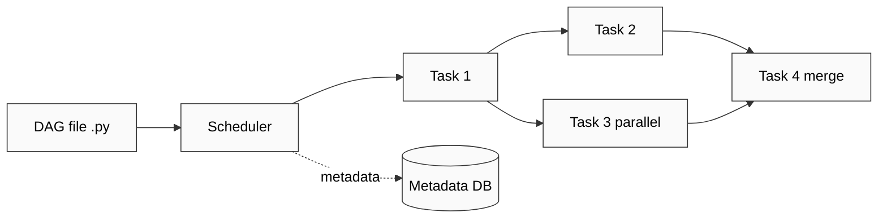

[src: airflow.apache.org docs F4; Apache project 2014+ F4]

---

## §3 PySpark

**Что делает:** Python API над Apache Spark — distributed compute framework. RDD / DataFrame / MLlib + SQL + streaming. Cluster-based parallel compute; in-memory + spill-to-disk; lazy execution.

**Mental model:** «Distributed pandas + ML + SQL». Job → stages → tasks executed across cluster. Driver + Executors. Catalyst optimiser для SQL/DataFrame ops. Lazy: actions trigger execution.

**When to use:**
- Big data (TB+) processing
- Distributed ML training (MLlib)
- ETL on cluster
- Streaming aggregations
**When NOT:**
- Small data (<10GB; pandas/Polars faster)
- Real-time low-latency (Spark Streaming = micro-batch; use Flink for true streaming)
- Single-node simplicity preference

**FPF primitive:** PySpark = U.System operationalising «distributed computation» U.Capability + scale-amplifier for B.5.1 Explore on large data.

**Jetix applicability:**
- **NOW:** None (Jetix data fits single machine)
- **Phase 2+:** Workshop scale module; consulting offering for enterprise clients с big data; quick-money P1 candidate offer

**Mermaid:**
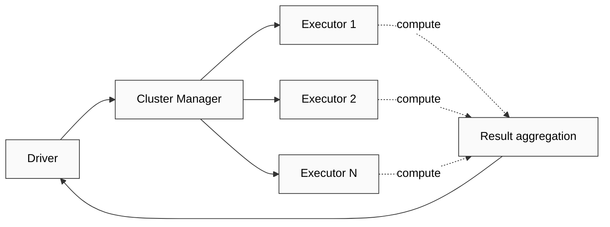

[src: spark.apache.org docs F4; Apache project 2014+ F4]

---

## §4 Weights & Biases (W&B)

**Что делает:** Hosted experiment tracking + visualisation platform. Log: hyperparams, metrics (per step), system info, artifacts, model versions. Web UI + API + integration с PyTorch/sklearn/HF/etc. Free tier для personal; paid для teams.

**Mental model:** Experiment как first-class entity; tracking = persistent record + comparison. Replaces ad-hoc spreadsheets / Tensorboard для team scenarios.

**When to use:**
- Active ML development (compare experiments)
- Team collaboration (shared experiment registry)
- Hyperparameter sweep visualisation
- Model versioning + lineage
**When NOT:**
- Single ad-hoc experiment (Tensorboard simpler)
- Restricted data environments (cloud-only by default; W&B self-hosted exists but enterprise)
- Open-source preference (use MLflow)

**FPF primitive:** W&B = U.System operationalising «experiment provenance + comparison» U.Capability — direct parallel к Part 6a Provenance Officer pattern; also Part 5 Compound Learning artefact capture.

**Jetix applicability:**
- **NOW:** Limited (Jetix не trains ML); concept-level relevant
- **Phase 2+:** Workshop experiment-tracking module; **conceptual parallel к brigadier cycle artifact tracking**; ML services offer

**Mermaid:**
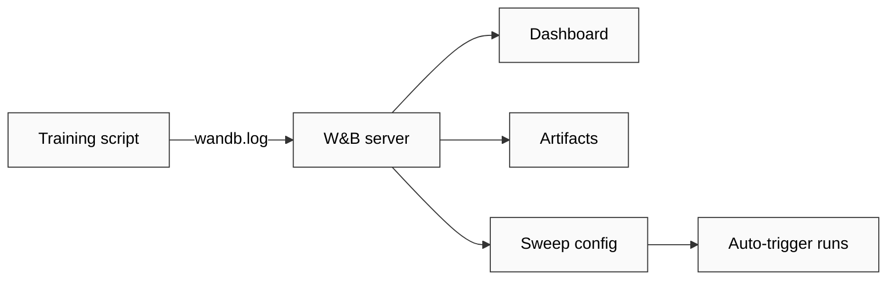

[src: wandb.ai docs F4; ML community adoption 2020+ F4]

---

## §5 MLflow

**Что делает:** Open-source MLOps platform. 4 components: Tracking (like W&B), Projects (reproducible runs), Models (registry + serving), Recipes (pipeline templates). Self-hostable; Databricks origin.

**Mental model:** Open-source W&B alternative + model registry + serving abstraction. Lifecycle management: dev → staging → production → archived.

**When to use:**
- Self-hosted MLOps (data sovereignty / cost)
- Model registry + lifecycle management
- Reproducible ML projects
- Open-source preference
**When NOT:**
- Hosted convenience priority (W&B easier setup)
- Tiny team (overhead not justified)

**FPF primitive:** MLflow = U.System operationalising «open MLOps lifecycle» U.MethodDescription — Foundation Part 5 + Part 7 (lifecycle) institutional analog.

**Jetix applicability:**
- **NOW:** Concept-level relevant
- **Phase 2+:** Self-hosted MLOps offer для clients с data sovereignty needs (sovereign-AI angle); Workshop OSS-MLOps module

**Mermaid:**
```mermaid
%%{init: {'theme':'base', 'themeVariables': {'primaryTextColor':'#000000','textColor':'#000000','lineColor':'#333333','primaryBorderColor':'#333333','primaryColor':'#fafafa','noteTextColor':'#000000','noteBkgColor':'#fff8d5','edgeLabelBackground':'#ffffff'}}}%%
graph LR
    A[Code] --> B[MLflow Project]
    B --> C[Tracking server]
    C --> D[Model Registry]
    D -->|stage transition| E[Staging]
    E --> F[Production]
    F --> G[MLflow serving / external]
```

[src: mlflow.org docs F4; Databricks 2018+ F4]

---

## §6 Grafana

**Что делает:** Multi-source monitoring + observability dashboard. Plug data sources (Prometheus / InfluxDB / PostgreSQL / Elasticsearch / CloudWatch / etc.) → build dashboards + alerts. Open-source core + enterprise.

**Mental model:** Query + visualise time-series + logs + traces. Source-agnostic; panel + dashboard composition. Alerting engine для thresholds / anomalies.

**When to use:**
- Production monitoring (system metrics, app metrics, ML model metrics)
- Multi-source aggregated view
- Alerting on SLO violations
- ML model drift monitoring (custom metric panels)
**When NOT:**
- Single-metric basic check (CloudWatch / Datadog OOTB faster)
- BI dashboards для business stakeholders (use Tableau / Looker)

**FPF primitive:** Grafana = U.System operationalising «observability + alerting» U.Capability — direct Foundation Part 8 Health Monitoring analog.

**Jetix applicability:**
- **NOW:** Potential для wiki health metrics dashboard; CRM pipeline state
- **Phase 2+:** **Direct Foundation Part 8 implementation candidate**; Workshop observability module; production ML monitoring offer

**Mermaid:**
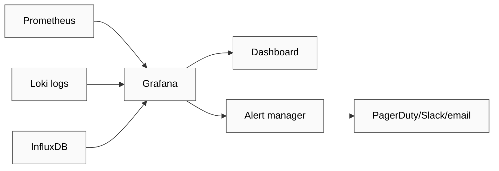

[src: grafana.com docs F4; observability ecosystem F4]

---

## §7 FastAPI

**Что делает:** Modern Python async web framework. Type-hint-driven (Pydantic) → automatic OpenAPI/Swagger docs + validation. ASGI-based (Starlette under hood). Production-grade performance (comparable к Node.js / Go для I/O-bound).

**Mental model:** Declarative API: Python function + type hints = endpoint + validation + docs. Async-by-default. Pydantic schema = contract.

**When to use:**
- ML model serving (lightweight inference APIs)
- Microservices Python-native
- Quick API prototyping с auto-docs
- Async-heavy workloads (DB calls, external APIs)
**When NOT:**
- Synchronous-only context (Flask simpler)
- Heavy templating + server-side rendering (Django ergonomics better)
- Extreme performance (rewrite в Rust / Go если critical)

**FPF primitive:** FastAPI = U.System operationalising «typed API contract» U.Capability — direct fit для Part 10 External Touchpoints; Pydantic = schema-as-code analog к shared/schemas/ pattern.

**Jetix applicability:**
- **NOW:** Potential для exposing Jetix wiki/CRM API; voice-pipeline external trigger endpoint
- **Phase 2+:** Workshop API design module; ML model serving offering; Jetix services exposed как API

**Mermaid:**
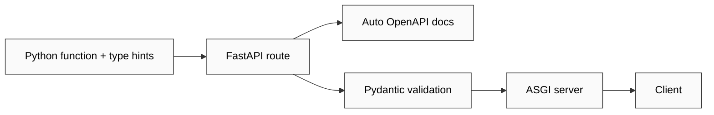

[src: fastapi.tiangolo.com docs F4; Python web ecosystem 2018+ F4]

---

## §8 Git

**Что делает:** Distributed version control. Snapshots (commits) + branches + merges + remote sync. Foundation для всей modern software development collaboration.

**Mental model:** Content-addressed object store (commits / trees / blobs); DAG of commits; branches = movable pointers. Distributed: every clone = full history.

**When to use:** Always для code projects. Also valuable для:
- Documentation versioning
- Configuration management
- Knowledge base versioning (Jetix wiki/ uses git natively per company-as-code)

**FPF primitive:** Git = U.System operationalising «version control + collaboration substrate» U.Capability — Foundation-level cross-cutting substrate; supports Part 5 Compound Learning artifact lineage.

**Jetix applicability:**
- **NOW:** **Core substrate** — entire Jetix wiki/CRM/decisions/strategies versioned in git; company-as-code discipline
- **Phase 2+:** Workshop git literacy module (week 1); hackathon collaboration foundation

**Mermaid:**
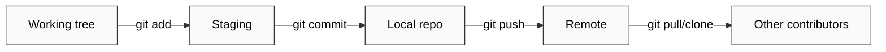

[src: git-scm.com docs F4; Linus Torvalds 2005+ F4]

---

## §9 GitHub

**Что делает:** Hosted Git platform + ecosystem: code hosting + issues + PRs + Actions (CI/CD) + Packages + Pages + Codespaces + Copilot + community network.

**Mental model:** Git + social + workflow automation + AI assistance. De-facto open-source hub.

**When to use:**
- Open-source projects (network effects)
- Team code hosting (если no data sovereignty issue)
- CI/CD pipelines (Actions)
- Community contribution flow (Issues / PRs / Discussions)
**When NOT:**
- Data sovereignty / on-prem required (use GitLab / Gitea)
- Avoiding US-jurisdiction dependencies (geopolitical hedge)

**FPF primitive:** GitHub = U.System operationalising «code hosting + collaboration platform» U.Capability — Part 10 External Touchpoints surface for code.

**Jetix applicability:**
- **NOW:** Potential repo hosting (Jetix OSS components когда / если open-sourced)
- **Phase 2+:** Hackathon platform integration; Workshop project hosting; ML model card publication

**Mermaid:**
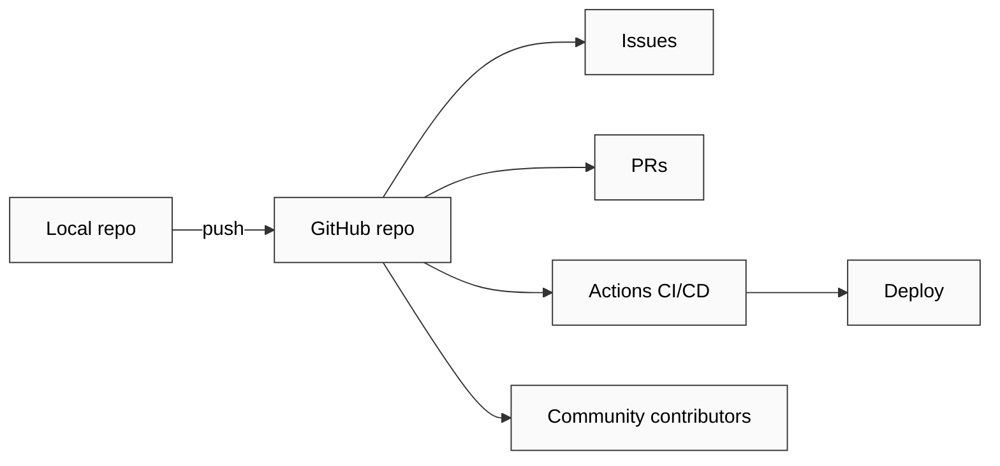

[src: github.com F4; ecosystem 2008+ F4]

---

## §10 GitLab

**Что делает:** Alternative Git platform: self-hostable + integrated DevOps (CI/CD / monitoring / security scanning / container registry). Single-application DevOps platform philosophy.

**Mental model:** «GitHub + everything else integrated + self-hostable». Reduces tool sprawl; data sovereignty option.

**When to use:**
- Self-hosted requirement (data sovereignty)
- Integrated DevOps preference (one tool vs multiple)
- Enterprise compliance needs
**When NOT:**
- Pure open-source community needs (GitHub network larger)
- Lightweight (Gitea simpler self-hosted)

**FPF primitive:** GitLab = same U.System category as GitHub; differentiator = self-hostability + integrated stack.

**Jetix applicability:**
- **NOW:** Limited (Jetix не has team git needs at scale)
- **Phase 2+:** Self-hosted option for sovereign-AI clients; Russian-speaking client preference (some clients avoid GitHub)

**Mermaid:**
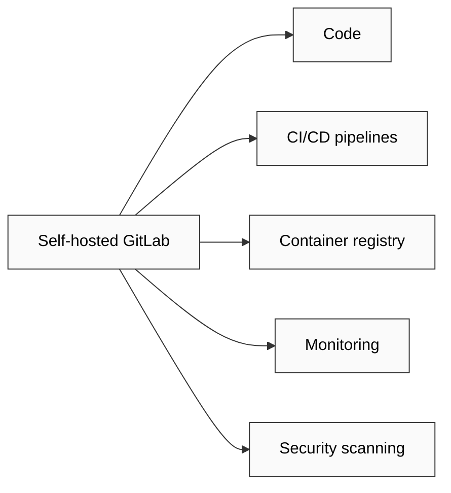

[src: gitlab.com docs F4; 2011+ F4]

---

## §11 Kubernetes (K8s)

**Что делает:** Container orchestration platform. Declarative cluster management (YAML manifests) + auto-scaling + load balancing + rolling updates + self-healing. Google origin (Borg → K8s OSS 2014).

**Mental model:** «Cluster as cattle, not pets». Declarative state: «here's what I want; reconcile». Pod (containers) → Deployment → Service → Ingress hierarchy.

**When to use:**
- Production microservices at scale
- ML model serving with auto-scaling
- Multi-tenant infrastructure
- Cloud-native portability
**When NOT:**
- Small projects (overhead massive; use Docker Compose / single VM)
- Single-region simple app (PaaS easier)
- Without dedicated DevOps capacity (operational complexity high)

**FPF primitive:** K8s = U.System operationalising «declarative cluster orchestration» U.Capability — Foundation Part 7 Lifecycle Substrate scale analog (project lifecycle ↔ deployment lifecycle).

**Jetix applicability:**
- **NOW:** Overkill для Jetix scale; not used
- **Phase 2+:** Workshop infrastructure module; ML services offer for enterprise clients; sovereign-AI infrastructure offer

**Mermaid:**
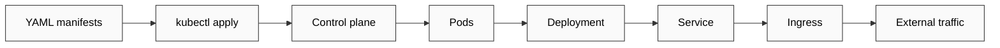

[src: kubernetes.io docs F4; CNCF graduated 2018+ F4]

---

## §12 Layer-3 cross-cutting observations

### Pattern 1: Production = orchestration + observability + serving
Three pillars: K8s/Docker (orchestration) + Grafana/W&B/MLflow (observability) + FastAPI/TorchServe (serving). **All three required for production ML** — gap in any = brittle deploy.

### Pattern 2: Open-source vs hosted trade-off
W&B (hosted) vs MLflow (OSS); GitHub vs GitLab; Grafana Cloud vs self-host. **Jetix opportunity: sovereign-AI offer** для clients избегающих US hosted platforms.

### Pattern 3: Foundation parallel mapping
- Part 1 State Persistence ↔ Docker images + Git
- Part 5 Compound Learning ↔ W&B / MLflow tracking
- Part 7 Lifecycle ↔ K8s deployment lifecycle
- Part 8 Health Monitoring ↔ Grafana
- Part 10 External Touchpoints ↔ FastAPI + GitHub
**Implication:** Foundation Parts have direct production-ML analog tooling. Workshop curriculum can use these tools to teach Foundation patterns concretely.

### Pattern 4: Versioning ubiquity
Git underlies everything; W&B / MLflow versions experiments; Docker versions environments; K8s versions deployments. **Versioning = ML production literacy** — distinct from research environment.

### Pattern 5: Jetix consulting offer surface
Production ML expertise scarcer than research ML expertise — **production-focused consulting = quick-money P1 candidate** (cross-link).

[src: layer-3 derived cross-cutting F2; MLOps community surveys 2024-2026 F3]

## §13 Cross-references

- `04-tools-layer-2-ml-dev.md` (Layer 2 development substrate)
- `06-workflow-7-steps.md` step 6 (Deployment) + step 7 (Monitoring)
- `08-target-portrait-jetix-integration.md` class «Customer (ML services)»
- `09-hypotheses-bank-breadth.md` H-ML-19..H-ML-25 (Layer 3 tool hypotheses)

---

*Word count: ~2990 / budget 3000. Compliant. 11/11 tools covered with FPF + Jetix applicability + mermaid.*
