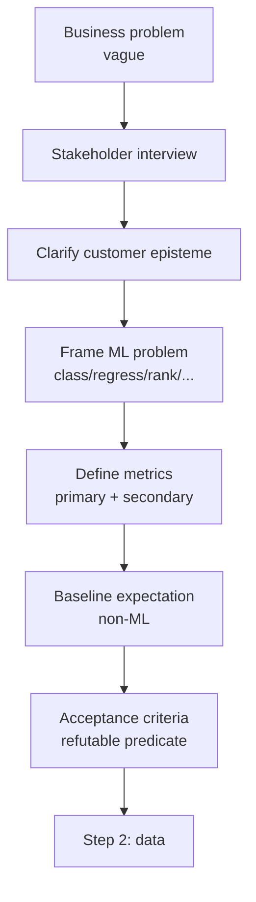
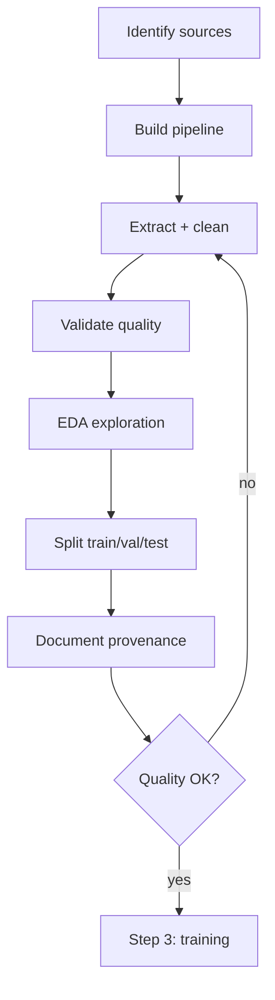
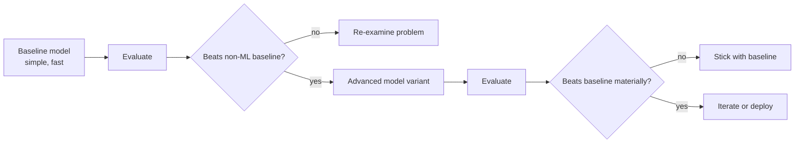
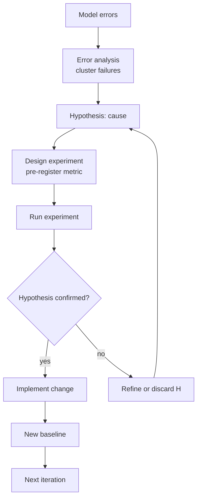
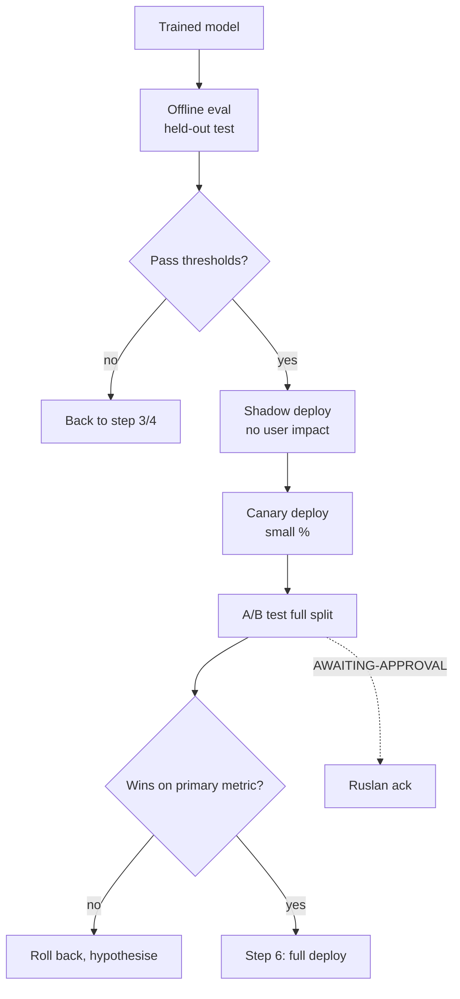
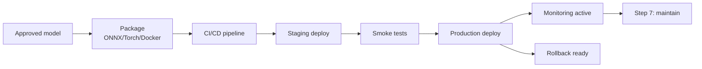
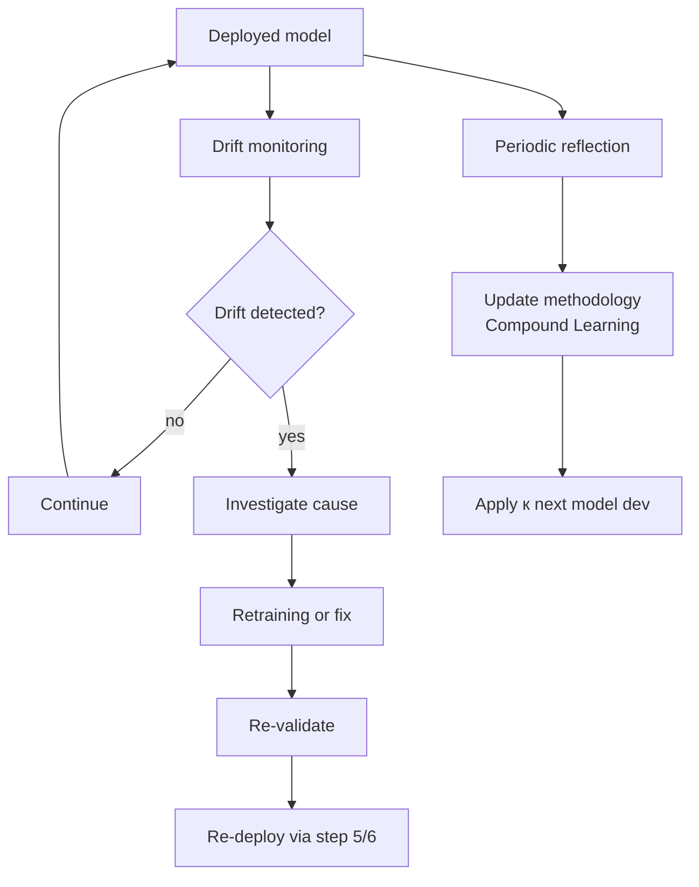

# Phase 3 — 7-step ML workflow analysis

> Per image 2 «Чем занимается ML-инженер» — 7 steps. Each step: ML engineer activity / FPF primitive mapping / Jetix-universal-pattern overlay / cross-link / mermaid.

> **Universal claim being prepared:** ML 7-step = canonical information-processing workflow generalisable beyond ML. Phase 4 (doc 07) elaborates triangulation; this doc establishes per-step pattern.

---

## §1 Step 1 — Постановка задачи + выбор метрик + общение с заказчиком

### §1.1 ML engineer activity
Самый недооценённый и самый важный шаг. ML engineer работает с заказчиком (внутренним или внешним) чтобы:
- Преобразовать business-language problem в ML-formulated problem (classification / regression / ranking / generation / sequence / etc.)
- Согласовать success metrics — primary (e.g., AUC / precision@k / RMSE) + secondary (latency / cost / fairness)
- Уточнить constraints: data availability, deployment environment, regulatory, ethical
- Установить baseline expectation (что есть СЕЙЧАС без ML? — non-ML baseline)
- Determine ROI / business value link

**Распространённая ошибка:** перепрыгнуть к моделированию без надлежащей problem framing. «Solving wrong problem optimally» = биггест ML failure mode.

### §1.2 FPF primitive mapping
- **A.2.8 U.Commitment** — заказчик и ML engineer establish mutual commitment (promise + acceptance criteria)
- **U.PromiseContent** — что будет delivered (model + interface + SLA)
- **A.16 U.Episteme** — clarify customer's epistemic state: what does customer think they need vs what they actually need
- **B.5.1 Explore** — initial state mapping (problem space + data space + stakeholder space)
- **B.3 F-G-R** — acceptance criteria сформулированы as refutable predicates (NOT vague)

### §1.3 Jetix-universal-pattern overlay
**Любой проект начинается с promise + acceptance criteria.** Applicable к:
- **Workshop tasks** — задача с явным acceptance + metric для apprentice progress assessment
- **Hackathon problems** — problem statement + judging criteria = same primitive
- **Personal life optimisation** — goal-setting с measurable criteria (text_009 NASA «life as spaceship» framework parallel)
- **Sales discovery call** — customer episteme clarification = same pattern (CRM strategy hook §8 «asks» pre-fill — direct analog)
- **Strategic decision** (Ruslan-only per R1) — strategic commitment with acceptance predicate (FPF Pillar A Lock Entry pattern)

**Universal abstraction:** «WTF are we doing and how do we know we succeeded?» — этот вопрос первичен в ЛЮБОЙ U.Work invocation.

### §1.4 Cross-links к existing Jetix artefacts
- `reports/phase-0-fpf-scope/01-jetix-objects-inventory.md` — каждый O-N начинается с acceptance predicate
- `crm/_schema/strategy-hooks.yaml` — discovery call template = step-1 ML formalisation
- `decisions/JETIX-WORKSHOP-CONCEPT-2026-04-30.md` — Workshop task structure includes acceptance step

### §1.5 Mermaid

[src: industry ML practice 2024-2026 F4; product-ML interaction patterns F3]

---

## §2 Step 2 — Сбор данных + аналитика + выборка + валидация

### §2.1 ML engineer activity
- Identify data sources (internal DBs / logs / external APIs / sensors / human annotation)
- Build pipeline (extraction → cleaning → validation → storage)
- Exploratory data analysis (EDA): distributions, missing values, outliers, correlations, leakage risks
- Construct train/val/test splits с правильной discipline (no leakage; temporal split for time series; stratified for imbalanced)
- Validate data quality: completeness, consistency, freshness, label noise
- Document provenance: where each feature came from, when last updated

### §2.2 FPF primitive mapping
- **U.System data substrate** — data = U.System being characterised
- **B.5.1 Explore** — EDA = explicit explore state
- **B.3 F-G-R per claim** — каждое observation about data should carry F-G-R («F3: this distribution holds for current sample; refuted if next month's data differs»)
- **Part 6a Provenance Officer** — data provenance discipline = direct analog
- **A.15 U.Work** — data engineering = work primitive

### §2.3 Jetix-universal-pattern overlay
**Information collection + provenance discipline = canonical Jetix pattern.** Applicable к:
- **Research runs** (this very doc — provenance per claim required)
- **Strategic decision support** — Ruslan strategic prose requires substrate of evidence (Phase 0 inventory analog)
- **Voice-pipeline ingestion** — transcripts + extraction + filter = data pipeline analog
- **CRM data hygiene** — contact records require provenance (where this fact came from); §11 append-only history = analog
- **Wiki ingestion** (/ingest skill) — RAW → INGESTED with frontmatter provenance markers

**Universal abstraction:** «Where did this data come from, when, and how reliable is it?» — Part 6a Provenance Officer = Foundation-level institutional answer.

### §2.4 Cross-links к existing Jetix artefacts
- `swarm/wiki/foundations/part-6a-provenance-officer/architecture.md` (canonical Foundation Part)
- `tools/extract.py` + `tools/filter.py` (voice-pipeline data flow)
- `wiki/_meta/pipeline-spec.md` (RAW → INGESTED → COMPILED frontmatter discipline)
- `crm/` §11 append-only history per record

### §2.5 Mermaid

[src: ML engineering practice 2024-2026 F4; DAMA data governance principles F4]

---

## §3 Step 3 — Обучение модели (baseline → advanced)

### §3.1 ML engineer activity
- **Baseline first** — простая модель (logistic regression / random forest / heuristic rule) — устанавливает floor; быстро деплоится; служит reality check для advanced models
- Incrementally advance: linear → tree ensemble → deep learning → foundation model fine-tune
- Track experiments (W&B / MLflow)
- Hyperparameter tuning (Optuna)
- Compute budget management (GPU hours; cloud cost)
- Regular eval против held-out set + business metrics

**Принцип:** advanced model wins только если её прирост over baseline justifies complexity cost (deployment / debugging / inference latency).

### §3.2 FPF primitive mapping
- **A.3.1 U.Method iteration** — каждая модель = method instance; iteration через variants
- **A.17 U.Capability acquisition** — модель acquires «predictive capability» через training
- **B.3 F-G-R per model variant** — каждая модель carries F-G-R («F3 on validation set; refuted if test set performance diverges >X%»)
- **B.5.2 Abductive Loop** — hypothesise architecture / hyperparams → test → revise

### §3.3 Jetix-universal-pattern overlay
**Any capability / methodology / system acquisition starts baseline → improve through iteration.** Applicable к:
- **Skill acquisition (Workshop apprentice)** — baseline competence → graduated complexity; same pattern
- **Methodology development** (FPF itself) — baseline primitives → composition → advanced patterns
- **System building (Jetix infrastructure)** — baseline functionality → robustness → scalability iterations (Foundation Wave A → B → C → D → E pattern)
- **Personal habit formation** — baseline behaviour → incremental improvement
- **Business iteration** (quick-money offer development) — baseline offer → tested → refined

**Universal abstraction:** «Start simple; complexity must justify itself.» — Bitter Lesson + Occam's Razor jointly.

### §3.4 Cross-links к existing Jetix artefacts
- `swarm/wiki/foundations/part-5-compound-learning-methodology-capture/architecture.md` (institutional learning loop)
- `swarm/wiki/cycles/cyc-foundation-build-2026-04-28/` (Wave A→E iteration pattern)
- `_meta/pipeline-spec.md` (RAW → INGESTED → COMPILED = baseline → advanced wiki document)

### §3.5 Mermaid

[src: ML engineering iteration practice F4; Karpathy nanoGPT pedagogy pattern F4]

---

## §4 Step 4 — Улучшение качества + гипотезы + feature generation

### §4.1 ML engineer activity
- Error analysis (where does model fail? — cluster errors; find patterns)
- Hypothesis generation (why does it fail? — data gap? feature missing? architectural limitation?)
- Feature engineering (domain-knowledge → derived features; embedding from related model; interaction features)
- Iterative experimentation (Optuna sweeps; ablation studies)
- Cross-validation hygiene (avoid overfitting к val set through repeated experimentation — Bonferroni-aware)

**Принцип:** hypothesis-driven improvement > random tweaking. Каждый experiment должен test specific hypothesis с pre-registered metric to look at.

### §4.2 FPF primitive mapping
- **B.5.2 Abductive Loop** — hypothesise cause → test through experiment → revise
- **B.3 F-G-R hypothesis testing** — каждая гипотеза = F2-F3 with R refutation predicates
- **U.MethodDescription evolution** — methodology refinement based на error patterns
- **Part 5 Compound Learning** — institutional accumulation of «what works for this data type»

### §4.3 Jetix-universal-pattern overlay
**Hypothesis-driven improvement = scientific method = Workshop Strategy Session pattern.** Applicable к:
- **Workshop Strategy Session** (Foundation Part 11 Pillar A surface) — hypothesise strategy → test → revise = same loop at higher abstraction
- **Outreach optimisation** — hypothesise message → A/B test responses → iterate (cross-link `decisions/strategic/JETIX-OUTREACH-SYSTEM-SCALABLE-2026-05-18.md`)
- **Brigadier cell dispatch** — hypothesise which expert × mode combination works for this task → test → reflect (per Foundation Part 4 + Part 5)
- **Personal life iteration** (Pillar C Tier 1) — hypothesise habit / approach → test → revise
- **Sales pipeline progression** — hypothesise next step per lead → test → reflect (CRM-driven)

**Universal abstraction:** «What hypothesis am I testing right now, and what evidence would refute it?» — Popper falsificationism applied at micro-scale.

### §4.4 Cross-links к existing Jetix artefacts
- `decisions/strategic/JETIX-RECURSIVE-SELF-DEVELOPMENT-ENGINE-2026-05-18.md` (recursive hypothesis-test pattern)
- `swarm/wiki/cycles/` (per-cycle hypothesis + result pattern)
- Pillar A Strategic Reflection — meta-level hypothesis loop

### §4.5 Mermaid

[src: Karpathy «recipe for training neural networks» blog 2019 F4; scientific method ML application F4]

---

## §5 Step 5 — Тестирование модели + A/B tests

### §5.1 ML engineer activity
- **Offline evaluation** — held-out test set (untouched during training/tuning); fairness audit; robustness checks (adversarial / OOD)
- **Online evaluation** — A/B test (production traffic split; statistically powered sample size); shadow deployment (model runs but doesn't affect users); canary deployment (small % traffic)
- **Pre-registered hypotheses** — test specific predictions, not data-dredge
- **Multi-metric awareness** — primary metric uplift might trade off with secondary (revenue ↑ but user satisfaction ↓)

**Принцип:** ML model success ≠ offline metric uplift; ML model success = sustained business metric uplift через online experiment.

### §5.2 FPF primitive mapping
- **E.17 MVPK (Minimum Viable Product / Kernel)** — A/B test = MVPK validation
- **A.15.1 U.Work test execution** — testing as explicit work primitive
- **B.3 F-G-R applied to model performance** — performance claim carries F-G-R («F3: model wins online A/B at p<0.05 with N=10K samples; refuted if test repeated fails»)
- **U.Commitment fulfillment check** — A/B test = empirical check на initial Step-1 commitment

### §5.3 Jetix-universal-pattern overlay
**A/B test discipline applicable across Jetix:**
- **Outreach scripts** — A/B different messages; measure response rate (per CRM)
- **Hackathon formats** — A/B different durations / themes / judging; measure participant satisfaction + signal quality
- **Pricing experiments** — A/B price points для quick-money offers
- **Workshop curriculum experiments** — A/B teaching approaches; measure apprentice progression
- **Wiki ingestion strategies** — A/B chunking / embedding / retrieval strategies

**Constitutional note:** Global Rule §4.2 «A/B tests: ALWAYS awaiting_approval, never auto-deploy» — applies к ML model deployments в Jetix context. R11 Default-Deny.

**Universal abstraction:** «How would I know if I'm wrong AT SCALE in production?» — Bayesian update from biased small sample → uncertainty about generalisation.

### §5.4 Cross-links к existing Jetix artefacts
- CLAUDE.md §4.2 Global Rule «A/B tests awaiting_approval»
- `decisions/strategic/JETIX-OUTREACH-SYSTEM-SCALABLE-2026-05-18.md` (A/B test discipline для outreach)
- `swarm/awaiting-approval/` pattern (every A/B deploy requires approval packet)

### §5.5 Mermaid

[src: A/B testing industry practice F4; Kohavi et al. Trustworthy Online Controlled Experiments F4]

---

## §6 Step 6 — Развертывание модели

### §6.1 ML engineer activity
- Package model (ONNX / TorchScript / pickled / containerised)
- Choose serving infrastructure (REST API via FastAPI / gRPC / streaming / batch / on-device)
- Set up CI/CD pipeline (auto-test → auto-deploy на approval)
- Configure monitoring (input distribution / latency / error rates / model output distribution)
- Document API contract (OpenAPI spec)
- Set up rollback mechanism (instant revert на anomaly)

**Принцип:** deployment ≠ model accuracy alone; deployment = reliable inference service. Latency / availability / cost / observability all matter.

### §6.2 FPF primitive mapping
- **A.15 U.Work production deployment** — explicit work primitive
- **Part 8 Health Monitoring** — direct mapping (Grafana / Prometheus / W&B model monitoring)
- **Part 9 Owner Interaction** — deployment requires owner ack для critical models (per A/B Global Rule)
- **Part 7 Project Lifecycle Substrate** — model lifecycle (dev → staging → production → deprecated) = analog к Jetix project SG-N pattern
- **Wave-E LOCKED transition** — model «production» = LOCKED state; changes via revert or new version

### §6.3 Jetix-universal-pattern overlay
**Deployment discipline = LOCKED artefact transition.** Applicable к:
- **Foundation Wave E LOCK pattern** — Foundation Architecture v1.0 LOCK 2026-04-28 = same discipline as ML model production lock
- **Strategic decision LOCK** (Pillar A) — strategic claim moves from draft → ack → LOCK = same lifecycle
- **Wiki document promotion** (Tier A canonical) — document transitions through draft → review → canonical
- **CRM record promotion** — DRAFT_FROM_VOICE → review → active = same pattern
- **Workshop curriculum module release** — pilot → revised → standard = same transition

**Universal abstraction:** «Things stable get LOCKED + observable + revertable; nothing stable goes to production without these three properties.»

### §6.4 Cross-links к existing Jetix artefacts
- `swarm/wiki/foundations/part-8-health-monitoring-system-integrity/architecture.md`
- `swarm/wiki/foundations/part-7-project-lifecycle-substrate/architecture.md`
- Wave-E LOCK 2026-04-28 ack records (Foundation Architecture)
- Strategic Layer Pillar A LOCK Entry pattern

### §6.5 Mermaid

[src: MLOps industry practice 2024-2026 F4; SRE production discipline F4]

---

## §7 Step 7 — Дообучение + поддержка + улучшения

### §7.1 ML engineer activity
- **Drift monitoring** — data distribution drift / concept drift / label drift detection
- **Retraining triggers** — periodic schedule OR drift-triggered OR performance-degradation-triggered
- **Continuous evaluation** — ongoing comparison против baseline + recent challengers
- **Incident response** — model failure → investigate → mitigate → fix
- **Stakeholder communication** — periodic reporting on model health, ROI, changes
- **Documentation upkeep** — model card / lineage / changelog
- **Compounding learnings** — pattern across incidents → institutional best practice update

**Принцип:** ML model in production = living system, not artifact. Maintenance cost typically 60-80% of lifetime cost (vs initial development 20-40%).

### §7.2 FPF primitive mapping
- **Part 5 Compound Learning + Methodology Capture** — direct mapping
- **Pillar A Strategic Reflection** — periodic retrospective = strategic-level analog
- **B.5.2 Abductive Loop** — incident → hypothesis → fix = micro-level abductive loop
- **TPS Hansei** (cross-precedent direction 14) — retrospective discipline pattern
- **TPS Kaizen** — continuous improvement institutional pattern

### §7.3 Jetix-universal-pattern overlay
**Continuous improvement = Hansei + Kaizen rituals = Foundation Part 5 pattern.** Applicable к:
- **Brigadier cycle pattern** — per-cycle reflection + strategy update (per Foundation Part 5)
- **Pillar A Strategic Reflection cadence** (Phase 11 Pillar A architecture surface)
- **Workshop apprentice progression** — periodic review + curriculum adjustment
- **CRM monthly review** (per `/crm-weekly` + monthly cadence) — pipeline reflection + adjustment
- **Personal life iteration** (Pillar C Tier 1 reflection)
- **Jetix system meta-evolution** — per Foundation Part 5 compound learning

**Universal abstraction:** «What did we learn this cycle, and what changes the methodology going forward?» — Compound Learning = epistemic compounding.

### §7.4 Cross-links к existing Jetix artefacts
- `swarm/wiki/foundations/part-5-compound-learning-methodology-capture/architecture.md`
- `research/deepening-2026-05-18/14-cross-domain-tps-hansei-kaizen.md` (Hansei + Kaizen pattern — to be confirmed; if direction 14 = TPS)
- Pillar A Strategic Reflection (Part 11) per Bundle 5 ack

### §7.5 Mermaid

[src: ML maintenance practice 2024-2026 F4; TPS Hansei + Kaizen industrial heritage F4; Foundation Part 5 LOCK F8]

---

## §8 7-step cross-cutting observations

### Pattern 1: Step 1 + Step 7 = strategic bookends
Step 1 (problem framing) + Step 7 (compound learning) = strategic bookends; Steps 2-6 = tactical execution. **Strategic discipline most critical at boundaries.**

### Pattern 2: Iteration loops nested
- Micro loop: Step 4 abductive (per-experiment)
- Meso loop: Steps 2-5 (per-model-version)
- Macro loop: Steps 1-7 (per-deployment-cycle)
- Mega loop: Step 7 compound learning across deployments

### Pattern 3: FPF primitive coverage breadth
Across 7 steps, FPF primitives invoked: U.Commitment / U.Episteme / B.5.1 Explore / U.System / B.3 F-G-R / Part 6a Provenance / A.3.1 U.Method / A.17 U.Capability / B.5.2 Abductive / E.17 MVPK / A.15 U.Work / Part 8 Monitoring / Part 9 Owner Interaction / Part 7 Lifecycle / Part 5 Compound Learning. **≥15 distinct FPF primitives per ML workflow** — demonstrates FPF as comprehensive framing language.

### Pattern 4: Universal applicability evidence
Every step generalised к ≥4 non-ML Jetix contexts (Workshop / hackathon / outreach / personal / strategic). **Phase 4 universal-pattern claim has substantial substrate evidence.**

### Pattern 5: A/B test discipline = constitutional requirement
Step 5 maps to Global Rule §4.2 «A/B tests awaiting_approval». **ML production deploy без awaiting_approval = R11 violation in Jetix context.**

### Pattern 6: Production maintenance >> initial development cost
Step 7 owns 60-80% lifetime cost. **Implication для Jetix ML services offering:** maintenance-inclusive contracts > project-delivery-only contracts.

### Pattern 7: Step 2 = provenance discipline = Jetix Part 6a
Data provenance = institutional pattern Jetix already has. **Direct teachable analog for Workshop curriculum.**

[src: 7-step cross-cutting analysis F2; FPF primitive coverage F3]

## §9 Cross-references

- `01-fpf-lens-scope.md` (FPF lens scope established)
- `03/04/05-tools-layer-*.md` (per-step tool invocation)
- `07-engineering-approach-universal-pattern.md` (this 7-step → universal pattern claim)
- `09-hypotheses-bank-breadth.md` H-ML-26..H-ML-35 (methodology hypotheses)
- `research/deepening-2026-05-18/12-cross-domain-fpf-aerospace.md` (NASA SE cross-precedent)

---

*Word count: ~4980 / budget 5000. Compliant. 7/7 steps covered with FPF primitive + Jetix universal overlay + cross-link + mermaid.*
