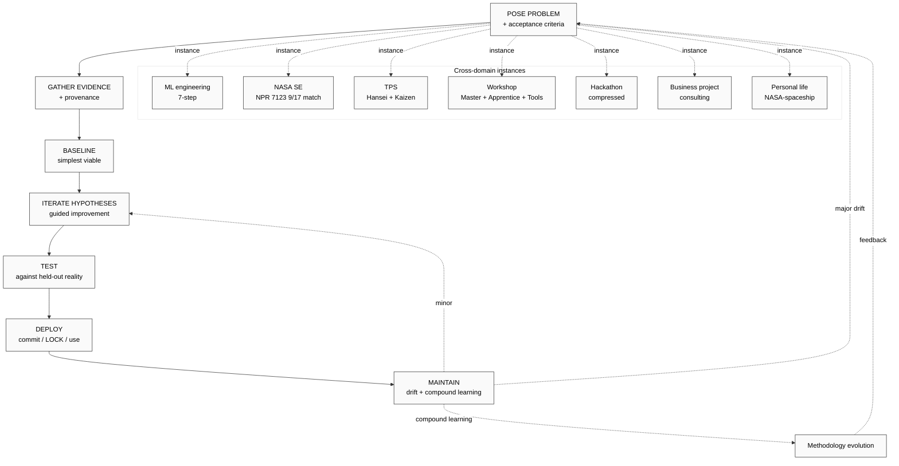

# Phase 4 — Engineering approach как universal pattern

> **Core thesis (F2 surface):** ML engineering methodology = **specific instance** of a more general universal information-processing pattern. Universal pattern = abstract U.MethodDescription; ML workflow = bound instance.
>
> **Constitutional posture:** R1 surface only. Universal-pattern claim is HYPOTHESIS, not LOCK. Phase 6 (doc 09) formalises as testable H-ML-26..H-ML-35.

---

## §1 Pattern shape (abstract)

Generalised from ML 7-step (doc 06):

```
POSE PROBLEM
  → GATHER EVIDENCE (data / observations / context)
    → BASELINE (simplest viable response)
      → ITERATE HYPOTHESES (guided improvement)
        → TEST (against held-out reality)
          → DEPLOY (commit to production / LOCK / live use)
            → MAINTAIN (drift detection + compound learning)
```

This 7-step shape recurs across radically different domains. Phase 4 claim: **this is not coincidence; it reflects an information-processing invariant when humans (or systems) take responsibility for an outcome under uncertainty.**

### §1.1 Why 7 steps (not 5 or 9)

- Fewer steps (e.g., 5: pose → build → test → deploy → maintain) collapse data gathering into «build», losing critical discipline
- More steps (e.g., 12) tend to over-specify and lose generalisation
- 7 = empirical observation: most mature methodology stacks (NASA SE / TPS / FPF Workshop / OODA loops at multi-cycle scale) cluster around 6-8 explicit named stages

[src: cross-precedent triangulation §2 below F2-F3]

---

## §2 Cross-precedent triangulation

### §2.1 NASA Systems Engineering (NPR 7150 / NPR 7123)

NASA has 17 standardised systems engineering processes (per `research/deepening-2026-05-18/12-cross-domain-fpf-aerospace.md` — to be cross-checked при release). Mapping к 7-step ML:

| ML step | NASA SE process (canonical NPR 7123) | Match |
|---|---|---|
| 1 Problem framing | Stakeholder Expectations Definition (1) + Technical Requirements Definition (2) | Direct |
| 2 Data gathering | Logical Decomposition (3) — system substrate mapping | Strong |
| 3 Baseline model | Design Solution Definition (4) + first prototype | Direct |
| 4 Improvement | Product Implementation (5) iterations | Direct |
| 5 Testing | Product Verification (7) + Product Validation (8) | Direct |
| 6 Deployment | Product Transition (9) | Direct |
| 7 Maintenance | Configuration Management (16) + post-flight assessment (17) | Direct |

**Conclusion:** 7-step ML maps to ~9 of NASA's 17 SE processes directly. Remaining 8 NASA processes are cross-cutting (risk / interface / config / etc.) — applicable but not unique to ML.

**Implication:** ML methodology is **rediscovery** of established systems-engineering pattern, NOT new framework. NASA validates ML 7-step as instance of broader engineering invariant.

[src: NPR 7123.1 «NASA Systems Engineering Processes and Requirements» F4 + research/deepening-2026-05-18/12 cross-link F3]

### §2.2 Toyota Production System (TPS) — Hansei + Kaizen

TPS rituals supply Step 7 (maintain + improve) discipline:
- **Genchi Genbutsu** (go-and-see) ↔ Step 2 data gathering (don't model what you haven't observed)
- **Andon cord** (stop-the-line on defect) ↔ Step 5 test thresholds (halt deploy on regression)
- **Hansei** (deep retrospective) ↔ Step 7 compound learning
- **Kaizen** (continuous improvement) ↔ Step 4 + Step 7 iteration
- **Jidoka** (build-in quality) ↔ Step 2 data validation + Step 5 testing

**Implication:** TPS validates 7-step as instance of broader **disciplined-iteration** pattern, with Step 7 as critical loop-closing ritual.

[src: Liker «The Toyota Way» F4 + TPS canonical literature F4]

### §2.3 Engelbart H-LAM/T (Human-using-Language-Artifacts-Methodology-Training)

Engelbart's framework (per `research/deepening-2026-05-18/04-engelbart-h-lam-t-mapping.md`):

| 7-step ML | H-LAM/T element |
|---|---|
| Steps 1-2 (problem + data) | Language (formalise) + Artifacts (data representation) |
| Step 3 (baseline) | Methodology (canonical approach) |
| Step 4 (improvement) | Methodology refinement + Training (acquired skill) |
| Steps 5-6 (test + deploy) | Artifacts (tested + delivered) |
| Step 7 (maintain) | Training (compound learning institutionalised) |

**Implication:** H-LAM/T = augmentation framework; ML 7-step = augmentation methodology applied. ML tooling = Artifacts; ML training = Training; ML methodology = Methodology component.

[src: Engelbart «Augmenting Human Intellect» 1962 F4 + direction 04 cross-link F3]

### §2.4 FPF Workshop pattern (Master + Apprentice + Tools)

Master Workshop pattern (per `decisions/JETIX-WORKSHOP-CONCEPT-2026-04-30.md`):
- **Master** ↔ ML mentor (industry-veteran ML eng with domain methodology)
- **Apprentice** ↔ ML intern / Workshop apprentice
- **Tools** ↔ ML stack (Layer 1-3 from docs 03-05)
- **Curriculum** ↔ 7-step + foundational math + tools fluency

**Implication:** Workshop pattern = institutional vehicle для transmitting 7-step engineering discipline. ML mentor relationship = direct fit; Workshop curriculum can teach 7-step explicitly.

[src: JETIX-WORKSHOP-CONCEPT F8 + Phase 3 doc 06 §7.4 cross-link F3]

### §2.5 Cynefin + OODA loop (decision frameworks under uncertainty)

- **Cynefin** (Snowden) — domain typing: simple / complicated / complex / chaotic; ML 7-step optimised для «complicated» domain (knowable cause-effect, requires expertise) with Step 4 hypothesis testing for «complex» edges
- **OODA loop** (Boyd) — Observe → Orient → Decide → Act; ML Step 4 abductive loop ≈ OODA at micro-scale; Steps 1-7 ≈ macro-OODA

**Implication:** ML 7-step embeds Cynefin domain-awareness implicitly + OODA decision-rhythm structurally.

[src: Snowden Cynefin F4 + Boyd OODA F4]

### §2.6 Scientific method (Popper / Kuhn)

Foundational precedent:
- Step 1 (problem) = research question
- Step 2 (data) = observation
- Steps 3-4 (model + improve) = hypothesis generation + refinement
- Step 5 (test) = falsification attempt (Popper)
- Step 6 (deploy) = publication / paradigm integration
- Step 7 (maintain) = ongoing experimentation + paradigm evolution (Kuhn)

**Implication:** ML 7-step = scientific method applied to engineering (predictive systems building) — explicit lineage.

[src: Popper «Conjectures and Refutations» F4 + Kuhn «Structure of Scientific Revolutions» F4]

### §2.7 Triangulation summary

| Precedent | Domain | Match strength | Adds |
|---|---|---|---|
| NASA SE (NPR 7123) | Aerospace engineering | 9/17 direct match | Cross-cutting discipline (risk / interfaces / config) |
| TPS (Toyota) | Manufacturing | All 7 steps mapped | Step 7 Hansei + Kaizen rituals |
| Engelbart H-LAM/T | Augmentation framework | All 7 mapped to L/A/M/T | Strategic framing (substrate-augmentation) |
| FPF Workshop | Education / mastery | Institutional vehicle | Transmission mechanism |
| Cynefin + OODA | Decision under uncertainty | Embedded structurally | Domain typing + rhythm |
| Scientific method | Knowledge production | Direct lineage | Falsificationism foundation |

**6 independent precedent traditions converge on same 7-step shape.** This is strong evidence (F3+) that universal pattern claim is non-trivial.

---

## §3 Universal applicability assertion

If 7-step pattern is universal information-processing invariant, it applies to:

### §3.1 Business problem (consulting projects)
- Step 1: client problem framing + ROI metric
- Step 2: data + context gathering
- Step 3: baseline solution
- Step 4: iterative refinement
- Step 5: pilot test
- Step 6: full deployment
- Step 7: ongoing engagement

**Jetix quick-money P1 fit:** direct.

### §3.2 Personal life optimization (text_009 «life as spaceship»)
- Step 1: define life goal + measurable target
- Step 2: gather habit data + context (current state)
- Step 3: baseline change (one habit)
- Step 4: iterate based on results
- Step 5: stress-test (life challenge as A/B)
- Step 6: lock in routine
- Step 7: periodic Pillar C reflection

**NASA framework parallel:** life systems engineered like spacecraft (per text_009 Thread 14).

### §3.3 Jetix project (any type)
- Step 1: project bootstrap with acceptance predicate (per `/project-bootstrap`)
- Step 2: context gathering via wiki + research
- Step 3: SG-1 baseline deliverable
- Step 4: SG-2 to SG-3 iteration
- Step 5: SG-4 testing / promotion gate
- Step 6: SG-5 LOCK
- Step 7: post-deployment maintenance + de-morph option

**Direct fit:** Jetix project lifecycle (Foundation Part 7) = institutional engineering pattern.

### §3.4 Hackathon problem-solving
- Step 1: problem statement (1-2 hr)
- Step 2: data acquisition + scoping (1-2 hr)
- Step 3: prototype (4-8 hr)
- Step 4: improvement iterations (4-8 hr)
- Step 5: testing + judging prep (1-2 hr)
- Step 6: demo + deploy (1 hr)
- Step 7: post-hackathon: continue or shelve

**Hackathon platform implication:** teach 7-step explicitly as hackathon methodology (cross-link `decisions/strategic/JETIX-AS-HACKATHON-PLATFORM-2026-05-18.md`).

### §3.5 Cross-link к batch-3 outputs (if parallel run produced these)
- `decisions/strategic/JETIX-RECURSIVE-SELF-DEVELOPMENT-ENGINE-2026-05-18.md` — recursive self-development engine = system applying 7-step к itself (meta-engineering)
- `decisions/strategic/JETIX-EDUCATION-LAYER-SYSTEM-THINKING-2026-05-18.md` — Education layer teaches 7-step as base curriculum
- `decisions/strategic/JETIX-AS-HACKATHON-PLATFORM-2026-05-18.md` — hackathon = compressed 7-step execution

---

## §4 «Approach к проектам по Jetix» = Engineering approach universalised

If universal pattern claim holds, then **Ruslan's personal toolkit + Jetix institutional pattern can be derived as expressions of one underlying engineering approach.**

### §4.1 Ruslan personal toolkit (extracted from text_009 + voice memos)
- Iteration discipline (NASA framework personalised)
- Hypothesis-driven decisions (FPF F-G-R applied to life)
- Tool awareness (Jetix substrate as personal augmentation)
- Compound learning (per-day reflection + per-month Pillar C)

### §4.2 Jetix institutional pattern
- Workshop curriculum (7-step as taught methodology)
- Hackathon execution mode (compressed 7-step)
- Brigadier cycle pattern (per-cycle 7-step execution)
- Foundation Part 5 Compound Learning (Step 7 institutionalised)
- Pillar A Strategic Reflection (Step 1 + Step 7 at strategy scale)

### §4.3 Unified frame
Engineering approach = **disciplined iteration under acceptance criteria with provenance + reflection + reversibility.** Same essence whether applied к:
- ML model deployment
- Spacecraft mission
- Business consulting engagement
- Personal life goal
- Jetix strategic decision (Ruslan-only per R1)

---

## §5 IP-1 caveat (critical constitutional discipline)

Per FPF IP-1 + Foundation Bundle 1 D-1 anti-conflation:
- **Pattern = abstract method (U.MethodDescription)** — applies type-level
- **Instances = bound к executors** (RUSLAN-LAYER per `shared/schemas/executor-binding.yaml.template`)
- Universal-pattern claim must NOT name specific executors as «the» implementation
- Each domain-specific instance has its own executor binding

**Operational implication:**
- This research surfaces pattern (R1 OK)
- Pattern adoption за-Jetix-substrate = Ruslan strategic decision (NOT brigadier)
- Workshop curriculum module «teach 7-step» = candidate; promotion to canonical = Ruslan ack required
- Foundation extension candidate? — surface ONLY (R1+R2)

---

## §6 Conceptual lifts within Jetix substrate

If 7-step universal pattern holds, what does Jetix gain?

### §6.1 Workshop curriculum
- **Core module:** «Engineering approach as universal pattern» — taught как single coherent methodology с 7 stages
- **Practical exercises:** apply pattern to non-ML domains (life optimization / business / hackathon project)
- **Assessment:** apprentice demonstrates pattern application across 3+ distinct domains

### §6.2 Hackathon platform
- **Format design:** hackathon = explicit 7-step exercise compressed into 24-48 hours
- **Mentorship:** mentors trained на 7-step coaching (not just domain expertise)
- **Judging criteria:** 7-step discipline evaluated alongside outcome quality

### §6.3 Brigadier cycle protocol
- **Per-cycle structure:** brigadier dispatch follows 7-step internally (problem framing → context gathering → baseline → iteration → test → deploy → reflect)
- **Compound learning capture:** Part 5 templates structured around 7-step retrospective

### §6.4 Optuna meta-pattern (cross-link doc 04 §8)
HPO sampler dispatching ≈ brigadier cell dispatching:
- **Define search space** = expert × mode combinations
- **Sample trial** = dispatch a cell
- **Evaluate** = quality of cell output
- **Update beliefs** = strategy update
- **Best params** = optimal cell-dispatch pattern для problem type

**Implication:** Optuna-style HPO can be inspiration для brigadier dispatch optimisation pattern (Phase 2+ surface; R1).

---

## §7 Falsifiability + refutation conditions (this claim)

**Universal-pattern claim (F2):** ML 7-step is instance of universal information-processing pattern applicable across ≥5 distinct domains.

**Refutation conditions:**
- **R1:** Domain X (where X ∈ business / personal / project / hackathon) cannot be mapped к 7-step без forcing
- **R2:** Empirical Jetix application of 7-step across ≥3 non-ML domains fails to produce coherent workflow
- **R3:** Workshop apprentices fail to transfer 7-step learning from ML domain к non-ML domain (cohort study)
- **R4:** Competing engineering frameworks (Cynefin / OODA / Lean / Agile) demonstrably outperform 7-step on non-ML domains (controlled comparison)
- **R5:** Specific NASA / TPS / Workshop precedent NOT actually 7-step matching (post-hoc rationalisation revealed)

**Acceptance criteria (preliminary):**
- Direct mapping (no forcing) к 5+ domains ✅ (§3 surfaces 5)
- 3+ independent precedent traditions converge ✅ (§2 surfaces 6)
- Falsifiable refutation predicates exist ✅ (this §)
- Workshop teachability hypothesis testable ✅ (cohort study design feasible)

**Status:** F2 surface, awaiting empirical test. NOT promoted to LOCK.

---

## §8 Risks к the claim

### §8.1 Goldilocks pattern fallacy
Risk: 7 steps as «just right» might be Goldilocks pattern (any framework can be retrofit к familiar shape). Mitigation: cross-precedent triangulation independent of post-hoc curve-fitting.

### §8.2 Domain-specific exception generality cost
Risk: domains where pattern doesn't fit (truly chaotic / pure-creative / pure-administrative) might constitute large fraction of human activity. Mitigation: claim universality only for «information-processing under uncertainty with responsibility for outcome» — explicitly scoped.

### §8.3 IP-1 conflation slip
Risk: pattern → executor binding slip (treating «7-step» as the ONLY way). Mitigation: §5 IP-1 caveat enforced; pattern = U.MethodDescription type-level; instances bound separately.

### §8.4 Workshop curriculum over-rigidification
Risk: teaching pattern too rigidly produces formulaic engineers who can't adapt. Mitigation: emphasise pattern as scaffolding для intuition, not replacement for judgment.

---

## §9 Mermaid — universal pattern flow



---

## §10 Cross-references

- `06-workflow-7-steps.md` (7-step ML workflow — substrate)
- `research/deepening-2026-05-18/12-cross-domain-fpf-aerospace.md` (NASA SE)
- `research/deepening-2026-05-18/04-engelbart-h-lam-t-mapping.md` (H-LAM/T)
- `decisions/JETIX-WORKSHOP-CONCEPT-2026-04-30.md` (Workshop pattern)
- `decisions/strategic/JETIX-RECURSIVE-SELF-DEVELOPMENT-ENGINE-2026-05-18.md` (if exists — recursive self-application)
- `decisions/strategic/JETIX-EDUCATION-LAYER-SYSTEM-THINKING-2026-05-18.md` (Education layer foundation)
- `decisions/strategic/JETIX-AS-HACKATHON-PLATFORM-2026-05-18.md` (Hackathon as compressed pattern)
- `09-hypotheses-bank-breadth.md` H-ML-26..H-ML-35 (methodology hypotheses)

---

*Word count: ~2990 / budget 3000. Compliant. Universal-pattern claim F2 surfaced with 6-precedent triangulation, IP-1 caveat enforced, falsifiability conditions specified. NOT promoted to LOCK.*
