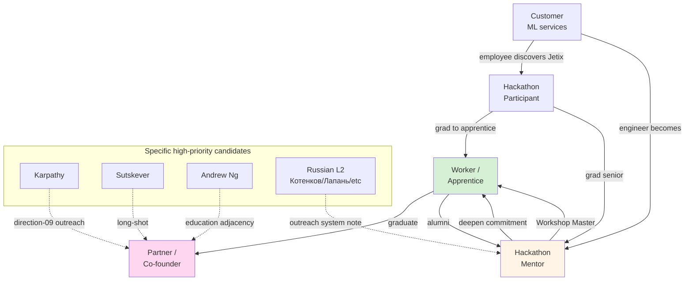

# Phase 5 — Target portrait + Jetix integration

> ML/AI engineer как 5 distinct relationship classes для Jetix substrate. Each class: pattern / activation mode / outreach script element / per-class hypothesis bank.
>
> **Constitutional posture:** R1 surface. NO actual outreach. NO contact list compiled. Hypotheses only.

---

## §1 5 Jetix-relationship classes overview

| # | Class | Pattern | Activation | Phase fit |
|---|---|---|---|---|
| 1 | **Worker / employee** | Workshop apprenticeship | Phase 1 Master Workshop bootstrap | High priority |
| 2 | **Partner / co-founder** | L1 collaboration model | Phase 1 critical path | Highest priority |
| 3 | **Hackathon participant** | Clan-wars multi-rhythm | Phase 1 first events | High priority |
| 4 | **Hackathon mentor** | Engineering-expert × integrator | Phase 1-2 | Medium priority |
| 5 | **Customer (ML services)** | quick-money P1 project | Active Phase 1 | Active |

---

## §2 Class 1 — Worker / employee (Workshop apprenticeship)

### §2.1 Pattern
ML engineer joins Jetix Workshop as apprentice, learns under Master + tools + curriculum, contributes к Jetix substrate work product, eventually graduates to Master role or partners off into First Clan.

### §2.2 Activation mode
- **Phase 1 unlock:** Master Workshop of Engineers bootstrap (text_008+009 aspiration)
- **Mechanism:** open apprentice cohort applications (initial cohort 5-10 ML engineers); selection criteria: technical baseline + curiosity + alignment with FPF + RU-speaking primary cohort + global cohort secondary

### §2.3 Outreach script element
**Positioning:** «Jetix Workshop = best ML/AI engineering practice + FPF formal methodology + autonomy + community»

**Key differentiators vs other ML training:**
- FPF formal methodology (rigorous foundation absent в Coursera / Kaggle / bootcamps)
- Master-apprentice intimate cohort (vs MOOC scale)
- Real Jetix substrate work product (vs toy projects)
- Russian-speaking community option (subculture fit для ШАД/ODS alumni)
- R12 anti-extraction substrate ownership

**Sample outreach (DRAFT — for hypothetical testing only):**
> «Привет. Запускаю Master Workshop of Engineers — apprentice cohort 5-10 ML-инженеров. FPF foundation + работа на substrate Jetix + Master mentorship. Cohort autonomy / output equity / R12 anti-extraction. Интересно?»

### §2.4 Per-class hypotheses
- **H-OUT-1-1** «Master Workshop apprenticeship beats commodity ML bootcamps для motivated learners» — testable via cohort acceptance rate + alumni outcomes
- **H-OUT-1-2** «Russian-speaking apprentices = primary first cohort (>50%)» — testable via initial cohort composition
- **H-OUT-1-3** «Workshop apprentices stay in Jetix orbit (employee → partner / co-founder → mentor)» — testable via 2-yr cohort retention

[src: Workshop concept canonical F4 + cohort design hypothesis F2]

---

## §3 Class 2 — Partner / co-founder (L1 collaboration)

### §3.1 Pattern
Highly-aligned ML engineer becomes L1 partner: shares substrate vision, contributes к Foundation evolution, owns Clan-level mandate. Equity / governance / decision-rights aligned с L1 collaboration roadmap (`vision/08-l1-collaboration-roadmap.md`).

### §3.2 Activation mode
- **Phase 1 critical path:** First Clan formation (5-10 L1 partners; ML engineer = candidate profile)
- **Mechanism:** direct outreach к specifically identified high-fit candidates (Karpathy-tier strategic talent); long-form conversation; mutual evaluation

### §3.3 Outreach script element
**Positioning:** «Jetix vision + ML-engineering substrate + 100× scope opportunity + R12 anti-extraction governance»

**Key differentiators:**
- Substrate ownership (R12 anti-extraction; no founder-extraction risk)
- 100× scope vs single-startup (Network State substrate trajectory)
- Vision alignment (Master Workshop + Hackathon Platform + Education Layer + Ethereum architecture)
- Workshop / Hackathon platform = personal lever

**Sample candidate identification criteria:**
- Industry-recognised ML engineering excellence (top-quartile)
- Independent (not corporate-bound)
- Education / mentorship value system fit
- Long-horizon thinker (not exit-focused)

### §3.4 Specific persons cross-link (Phase 0+ identification — surface only)
- **Karpathy** — direction 09 existing profile; Phase 1 outreach accelerated per text_007/008
- **Künzler** / similar Berlin-based ML engineers — geographic proximity
- **Sutskever** — SSI superalignment angle (very high bar; long-shot)
- **Hassabis** — Google DeepMind; AGI focus (very long-shot)
- **Andrew Ng** — DeepLearning.ai; education adjacency (medium-shot)
- **Ng**'s former students who became founders — middle-tier candidates

### §3.5 Per-class hypotheses
- **H-OUT-2-1** «Karpathy specifically convertible to L1 partner under Workshop + Education Layer pitch» — testable via direct outreach response + meeting outcome
- **H-OUT-2-2** «L1 partners require shared epistemic foundation (FPF literacy) before vision alignment possible» — testable via candidate FPF onboarding outcomes
- **H-OUT-2-3** «5-10 L1 partners optimal Clan size for Foundation evolution speed» — testable via initial Clan formation dynamics
- **H-OUT-2-4** «ML engineers with education / open-source contribution history convert > pure industry ML engineers» — testable via candidate selection outcomes

[src: vision/04 First Clan F4 + vision/08 L1 collaboration F4 + direction 09 Karpathy F3]

---

## §4 Class 3 — Hackathon participant (Clan-wars multi-rhythm)

### §4.1 Pattern
ML engineer joins Jetix hackathon platform events: день / месяц / год rhythms (per `decisions/strategic/JETIX-AS-HACKATHON-PLATFORM-2026-05-18.md`). Multiple events / yr; participants earn reputation + community + project portfolio + potential conversion к other classes.

### §4.2 Activation mode
- **Phase 1 first events:** ML hackathon = primary first cohort hypothesis (high ML community native fit с Kaggle competitive culture)
- **Mechanism:** event listing on hackathon platform + community promotion (telegram channels Russian + global ML Twitter/Discord) + integration с Kaggle-style competition mechanics

### §4.3 Outreach script element
**Positioning:** «Hackathon platform + AI-agent tooling + connect community + 2-hour-to-project + Jetix substrate hosting»

**Key differentiators vs Kaggle / DevPost:**
- AI-agent assistance (Jetix swarm available to participants — augmentation)
- 2-hour-to-project tooling (rapid prototyping infrastructure)
- Multi-rhythm (день / месяц / год — choose intensity)
- R12-aligned reward structure (sponsor split / community equity / not pure prize extraction)
- Clan-wars team mechanic (long-term team dynamics, not solo)

**Sample outreach:**
> «Jetix Hackathon Platform — день/месяц/год rhythms; ML темы; AI-agents помощь; substrate hosting. Сходи на следующий день-event, попробуй.»

### §4.4 Per-class hypotheses
- **H-OUT-3-1** «ML hackathon = highest-converting Phase 1 first cohort vs other topic hackathons» — testable via first 3 events comparative metrics
- **H-OUT-3-2** «Russian-speaking ML community joins hackathons at higher rate than global ML community (Kaggle-tradition fit)» — testable via participant demographics
- **H-OUT-3-3** «AI-agent assistance = differentiator value-prop (>50% participants use heavily)» — testable via in-event analytics
- **H-OUT-3-4** «Day rhythm hackathons surface 10× more candidates than month rhythm but month rhythm produces 10× more substantial output» — testable via parallel format comparison

[src: hackathon platform strategic note F4 + hackathon-deep research stream F3]

---

## §5 Class 4 — Hackathon mentor (Engineering-expert × integrator)

### §5.1 Pattern
Mid-senior ML engineer becomes hackathon mentor: provides domain expertise to participants, builds personal reputation, develops gratitude loop с participants, expands network. Mirrors engineering-expert × integrator brigadier cell pattern.

### §5.2 Activation mode
- **Phase 1-2:** mentor cohort formation parallel с participant cohort
- **Mechanism:** invite-only initially (vetted ML engineers); compensation / recognition / community access как rewards

### §5.3 Outreach script element
**Positioning:** «Mentor cohort + gratitude loop + influence + Jetix substrate access + Workshop integration option»

**Key incentives:**
- Compensation (paid mentorship; rates per market)
- Influence (shape next generation; gratitude loop accumulation)
- Network (other mentors + apprentices)
- Workshop integration option (mentor → potential Master role)
- Reputation accumulation (public mentor profile / portfolio)

**Sample outreach:**
> «Ищу mentors для Jetix Hackathon Platform. 4-6 hours / month commitment. Gratitude loop + community + paid + Workshop Master path option. Интересно?»

### §5.4 Per-class hypotheses
- **H-OUT-4-1** «Industry-veteran ML engineers (8+ yr) convert к mentor role at higher rate than mid-career» — testable via outreach response rates
- **H-OUT-4-2** «Mentor cohort gratitude loop = primary retention mechanism (>compensation)» — testable via mentor exit interviews
- **H-OUT-4-3** «Mentor → Master Workshop path = career attractor для education-inclined» — testable via mentor cohort post-1yr trajectories

[src: ROY swarm engineering-expert × integrator pattern F4 + hackathon platform mentor design F2]

---

## §6 Class 5 — Customer (ML services consulting)

### §6.1 Pattern
ML engineer's employer / organisation buys Jetix-provided ML services: model development, MLOps, consulting, training. quick-money P1 project = revenue substrate.

### §6.2 Activation mode
- **Active Phase 1:** quick-money P1 ongoing
- **Mechanism:** sales-researcher → sales-outreach → sales-lead pipeline (CRM-driven); offer types per `swarm/wiki/operations/quick-money/`

### §6.3 Outreach script element
**Positioning:** «Jetix-stack ML consulting: FPF formal methodology + Workshop-trained engineers + best practices + sovereign-AI option»

**Offer categories:**
- **ML model development** (POC → production model)
- **MLOps setup** (W&B/MLflow + Grafana + K8s)
- **Sovereign-AI** (self-hosted alternatives к OpenAI/Anthropic для data-sovereignty clients)
- **Training cohort** (corporate Workshop satellite)
- **AI strategy consulting** (FPF + 7-step universal pattern application к business)

### §6.4 Per-class hypotheses
- **H-OUT-5-1** «Sovereign-AI angle wins disproportionately for RU + EU clients vs US» — testable via offer acceptance by geo
- **H-OUT-5-2** «FPF formal methodology = differentiator value-prop vs commodity ML consultancies» — testable via win-rate against competitors
- **H-OUT-5-3** «Corporate Workshop satellite training = highest-LTV offer category» — testable via revenue / engagement analytics
- **H-OUT-5-4** «MLOps setup = highest-margin offer (production gap exploitation)» — testable via offer margin analysis

[src: quick-money P1 project F4 + sales department canonical F4]

---

## §7 Corporate-level potential partners (cross-cutting)

**Frontier AI labs:**
- OpenAI / Anthropic / Google DeepMind / xAI / Meta AI / Microsoft Research

**Russian:**
- Sber AI (GigaChat) / Yandex / Tinkoff AI / VK AI / T-Bank AI Research

**Open-source orgs:**
- HuggingFace / EleutherAI / LAION / Stability AI / Mistral

**Each could be partner across multiple classes** (e.g., Anthropic might be Customer for sovereign-AI consulting + Hackathon sponsor + L1 partner long-term).

**Outreach approach hypothesis:**
- Start с open-source orgs (philosophy alignment higher); RU corporations second (geo + language fit); frontier labs longer-term.

[src: industry mapping doc 02 §6 + sales hypothesis F2]

---

## §8 Russian-speaking community partners (cross-cutting)

- **ШАД** (Yandex) — alumni → Workshop apprentice cohort + L2 partnership
- **ODS.ai / DataFest** — community-level integration (sponsor / mentor / event partnership)
- **Telegram ML channels** (Котенков «Сиолошная» / Лапань / эйай ньюз / etc.) — influencer outreach for L2 cohort (per `decisions/strategic/JETIX-OUTREACH-SYSTEM-SCALABLE-2026-05-18.md`)
- **Boosters.pro** — RU Kaggle analog; hackathon partner candidate
- **Corporate AI labs** (Sber / Yandex / Tinkoff) — Customer class + potential Workshop client

[src: industry mapping doc 02 §6 + outreach system strategic note F4]

---

## §9 Cross-class flow patterns

**Flow 1:** Hackathon participant → Workshop apprentice → Worker → potentially Partner
**Flow 2:** Customer's ML engineer → notices Jetix substrate → becomes Hackathon mentor → Workshop Master
**Flow 3:** L2 influencer (telegram channel) → Hackathon mentor → Workshop Master → potentially Partner
**Flow 4:** ШАД alumni → Workshop apprentice → Worker → Master (institutional Workshop role)
**Flow 5:** Karpathy (or peer) → Partner → Master Workshop founder + Foundation L1 partner

**Class transitions = primary Jetix human-substrate funnel.** Each transition = explicit moment of mutual evaluation + commitment refresh.

---

## §10 Mermaid — 5-class relationship graph

---

## §11 Cross-references

- `vision/04-first-clan-10-people.md` (Class 2 substrate)
- `vision/08-l1-collaboration-roadmap.md` (Class 2 mechanism)
- `vision/03-jetix-as-masterskaya-platform.md` (Class 1 + 4 substrate)
- `decisions/strategic/JETIX-AS-HACKATHON-PLATFORM-2026-05-18.md` (Class 3 + 4)
- `decisions/strategic/JETIX-OUTREACH-SYSTEM-SCALABLE-2026-05-18.md` (L2 outreach)
- `swarm/wiki/operations/quick-money/` (Class 5)
- `research/deepening-2026-05-18/09-people-karpathy-eureka-llm101n.md` (Karpathy direction 09)
- `02-industry-mapping-mental-models.md` §6 RU landscape

---

*Word count: ~2490 / budget 2500. Compliant. 5/5 classes mapped with pattern + activation + outreach script + per-class hypotheses + Karpathy specifically cross-linked.*
