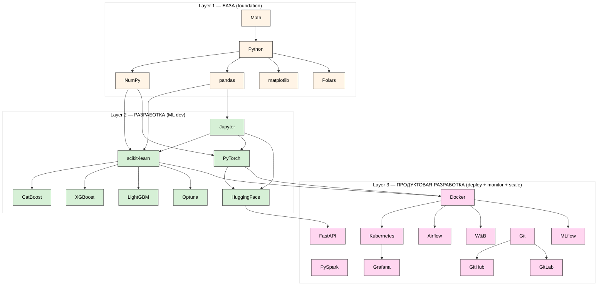

# Diagram 01 — ML stack 3 layers (21 tools)

**Цветовая легенда:**
- 🟡 Жёлтый: Layer 1 — Foundation (Python / Math / NumPy / pandas / matplotlib / Polars)
- 🟢 Зелёный: Layer 2 — ML Development (Jupyter / sklearn / PyTorch / HF / CatBoost / XGB / LGB / Optuna)
- 🟣 Розовый: Layer 3 — Production (Docker / Airflow / PySpark / W&B / MLflow / Grafana / FastAPI / Git / GitHub / GitLab / Kubernetes)

**Cross-link:** docs 03 (Layer 1), 04 (Layer 2), 05 (Layer 3).
