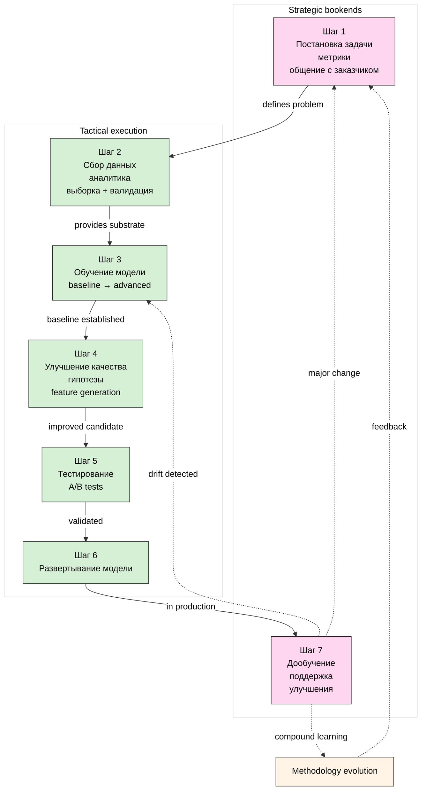

# Diagram 02 — ML workflow 7 steps

**Цветовая легенда:**
- 🟣 Strategic bookends: Step 1 (framing) + Step 7 (compound learning)
- 🟢 Tactical execution: Steps 2-6
- 🟡 Methodology evolution: compound learning feedback loop

**Cross-link:** doc 06 (per-step analysis) + doc 07 (universal pattern claim).
