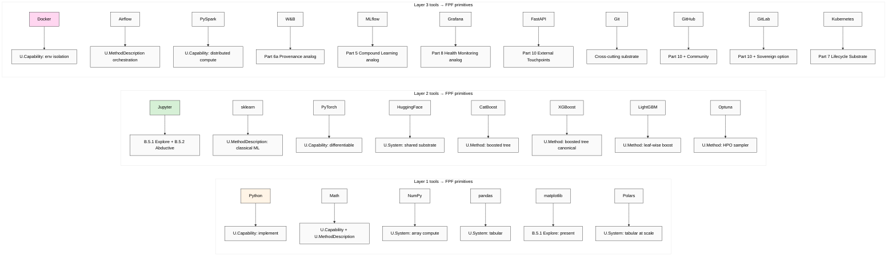

# Diagram 03 — Tool × FPF primitive matrix

**Key cross-cutting insight:** Foundation Parts (5/6a/7/8/10) have direct production-ML tooling analogs. **Workshop curriculum can use these tools to teach Foundation patterns concretely.**

**Cross-link:** docs 03 / 04 / 05 (per-tool deep dive); doc 07 §6 (universal pattern lifts).
