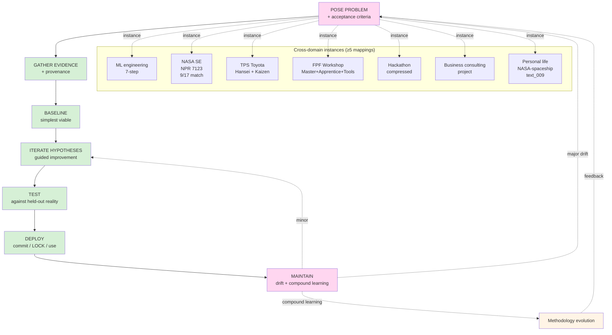

# Diagram 04 — Universal pattern flow + cross-domain instances

**F-grade:** F2 claim (Phase 4 surface) — refutation conditions per doc 07 §7. Awaiting empirical test.

**Cross-link:** doc 07 entire + H-ML-26 / H-ML-27.
